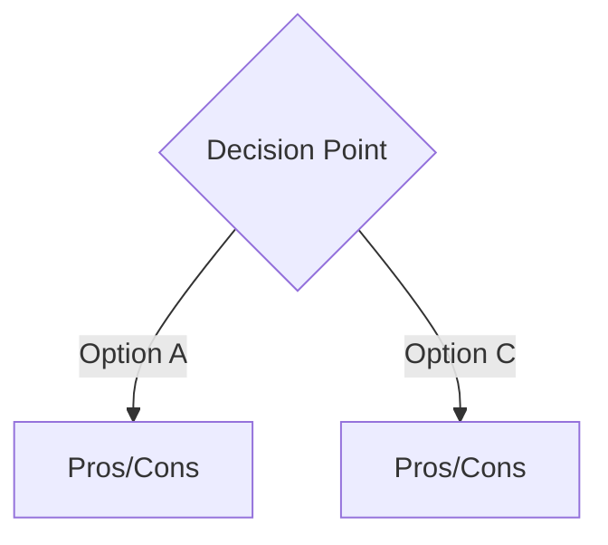

# Decision: [Title]

> **Date:** YYYY-MM-DD
> **Status:** Proposed | Accepted | Deprecated | Superseded by [ADR-XXX](link)

---

## Context

What is the issue that we're seeing that is motivating this decision or change?

## Decision

What is the change that we're proposing and/or doing?

### Option A: [Name]

**Pros:**
- Pro 1
- Pro 2

**Cons:**
- Con 1
- Con 2

### Option B: [Name]

**Pros:**
- Pro 1
- Pro 2

**Cons:**
- Con 1
- Con 2

## Consequences

What becomes easier or more difficult to do because of this change?

## Alternatives Considered

What other options were evaluated?

## References

- [Link 1](URL) - Description
- [Link 2](URL) - Description
