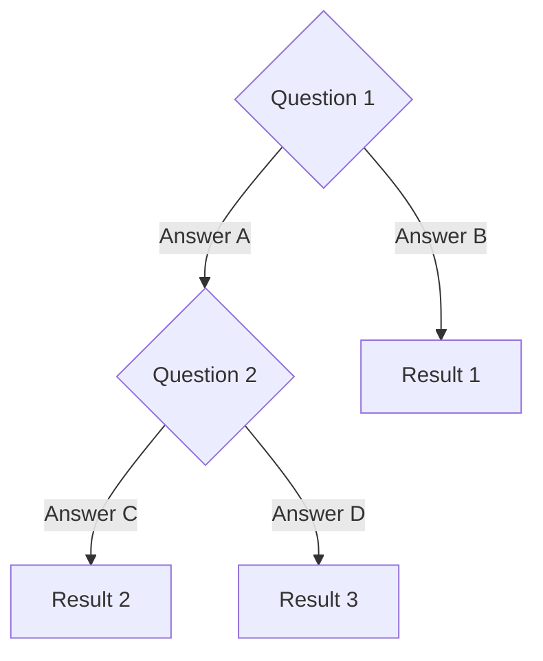

# Decision Tree: [Title]

---

## How to Use

1. Start at the top
2. Answer each question
3. Follow the path to your recommendation

## Options Compared

| Option | Best For | Pros | Cons |
|--------|----------|------|------|
| Option A | Scenario 1 | Pro 1, Pro 2 | Con 1, Con 2 |
| Option B | Scenario 2 | Pro 1, Pro 2 | Con 1, Con 2 |

## Recommendation

**For most cases:** Use [Option A] because [reason].

---

> **Related:** [Option A Details](../XX-section/option-a.md) | [Option B Details](../XX-section/option-b.md)
