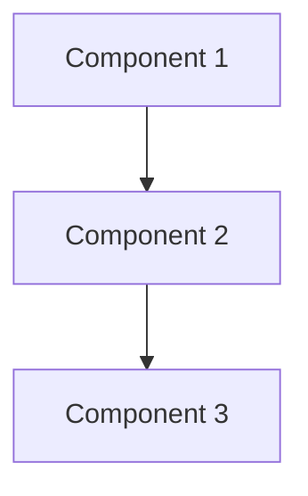
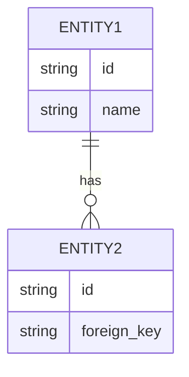

# Design Document: [Feature/System Name]

> **Author:** [Name]
> **Date:** YYYY-MM-DD
> **Status:** Draft | Review | Approved
> **Reviewers:** [Names]

---

## Overview

What are we building and why?

## Goals & Non-Goals

### Goals

- Goal 1
- Goal 2

### Non-Goals

- Explicitly excluded 1
- Explicitly excluded 2

## Architecture



### Component Descriptions

| Component | Responsibility | Technology |
|-----------|---------------|------------|
| | | |

## Data Model



## API Design

### Endpoint 1

```
POST /api/v1/resource
```

**Request:**
```json
{
    "field": "value"
}
```

**Response:**
```json
{
    "id": "123",
    "field": "value"
}
```

## Security Considerations

- Authentication method
- Authorization rules
- Data validation

## Performance Requirements

| Metric | Target |
|--------|--------|
| Response time | < 200ms |
| Throughput | 1000 req/s |

## Testing Strategy

- Unit tests for
- Integration tests for
- End-to-end tests for

## Rollout Plan

1. Phase 1: 
2. Phase 2: 
3. Phase 3: 

## Open Questions

- [ ] Question 1
- [ ] Question 2
