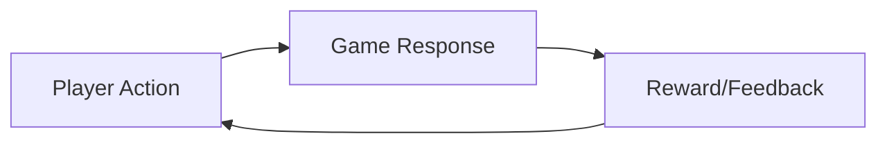
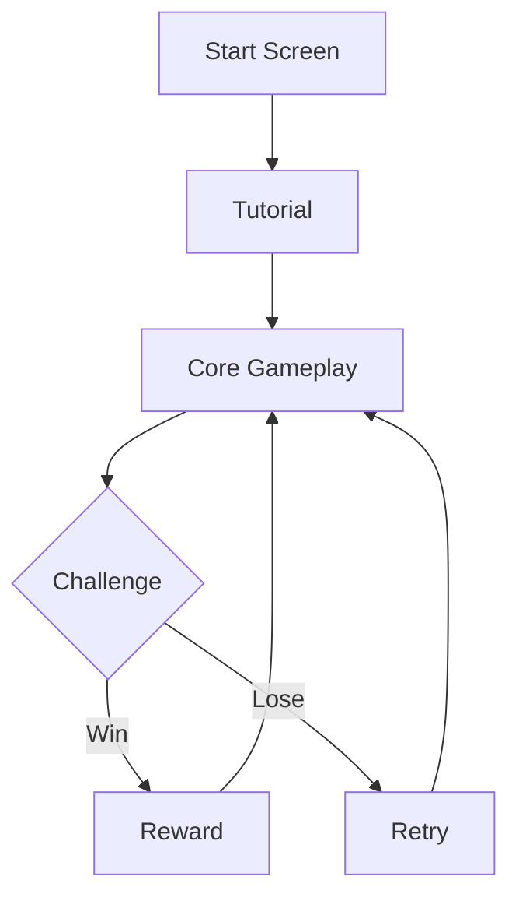

# Game Design Document: [Game Name]

> **Author:** [Name]
> **Date:** YYYY-MM-DD
> **Status:** Concept | Pre-Production | Production | Polish

---

## Elevator Pitch

One sentence describing the game.

## Core Concept

What makes this game fun? What is the core loop?

## Genre & Inspiration

| Aspect | Description |
|--------|-------------|
| Genre | |
| Perspective | 2D / 3D / Top-down / Side-scrolling |
| Platform | PC / Mobile / Web / Console |
| Inspiration 1 | |
| Inspiration 2 | |

## Core Mechanics

### Mechanic 1: [Name]

**Description:** What the player does.

**Controls:**
- Key/Button: Action

**Rules:**
- Rule 1
- Rule 2

### Mechanic 2: [Name]

**Description:** What the player does.

## Player Experience

### Flow

### Emotional Journey

| Phase | Emotion | Design Goal |
|-------|---------|-------------|
| Start | Curiosity | Mystery, intrigue |
| Early | Engagement | Quick wins, learning |
| Mid | Challenge | Escalating difficulty |
| End | Satisfaction | Payoff, accomplishment |

## Art Style

- **Visual Style:** Pixel art / Low poly / Hand-drawn / Realistic
- **Color Palette:** 
- **References:** [Art references]

## Audio

- **Music Style:** 
- **Sound Effects:** 

## Levels / Content

| Level | Name | Theme | Difficulty |
|-------|------|-------|------------|
| 1 | | | Easy |
| 2 | | | Medium |
| 3 | | | Hard |

## UI/UX

### HUD Elements

- Health bar
- Score
- Minimap

### Menus

- Main menu
- Pause menu
- Settings

## Technical Requirements

| Requirement | Specification |
|-------------|--------------|
| Engine | Unity / Godot / Unreal |
| Language | C# / GDScript / C++ |
| Target FPS | 60 |
| Resolution | 1920x1080 |

## Save System

- Auto-save frequency
- Save data structure
- Cloud saves?

## Monetization (if applicable)

- Free / Premium / F2P
- DLC plans
- Microtransactions

## Milestones

| Milestone | Deliverable | Target Date |
|-----------|------------|-------------|
| Prototype | Core mechanic working | |
| Alpha | All mechanics implemented | |
| Beta | Content complete | |
| Launch | Polished and tested | |

## Risks

| Risk | Impact | Mitigation |
|------|--------|------------|
| Scope creep | High | Strict MVP definition |
| | | |

---

> **Related:** [Game Development Section](../14-game-development/README.md)
