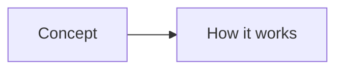
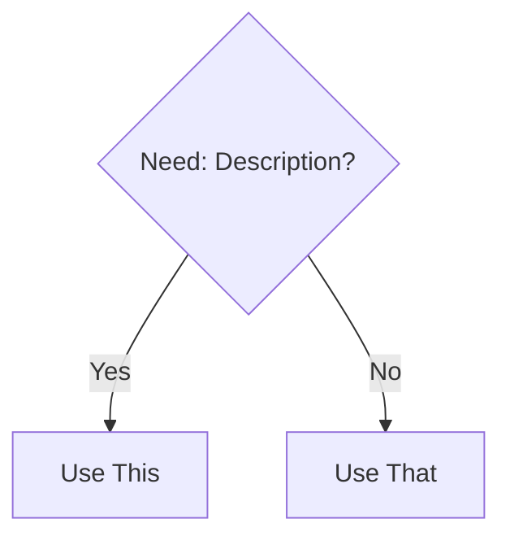

# Page Title

Brief one-line description of what this page covers.

> **Related:** [Link to related page](../XX-section/related-page.md)

---

## What Is It?

Clear, concise definition. No jargon without explanation.

## Why Does It Exist?

The problem it solves. The motivation behind it.

## Mental Model

How to think about this concept. Use analogies.



## When Should I Use It?

Decision criteria. Include a decision tree when multiple options exist.



## Cheat Sheet

Quick reference table of the most important information.

| Command | Description | Example |
|---------|-------------|---------|
| `cmd` | Does something | `cmd --flag` |

## Step-by-Step Workflow

Numbered steps for common tasks.

1. **Step one** - Description
2. **Step two** - Description

## Real Project Examples

Concrete examples from real-world usage.

```bash
# Example: Setting up a project
command --flag
```

## Best Practices

- Do this
- Avoid that
- Prefer this over that

## Common Mistakes

> **Warning:** Common pitfall description and how to avoid it.

| Mistake | Problem | Solution |
|---------|---------|----------|
| Doing X | Causes Y | Do Z instead |

## Troubleshooting

| Problem | Cause | Solution |
|---------|-------|----------|
| Error message | Why it happens | How to fix |

## Related Topics

- [Related Page 1](../XX-section/page1.md) - Why it's related
- [Related Page 2](../XX-section/page2.md) - Why it's related

## Further Learning

- [Resource Name](URL) - Brief description

---

## Personal Notes

> Add your own notes, reminders, and experiences here.
