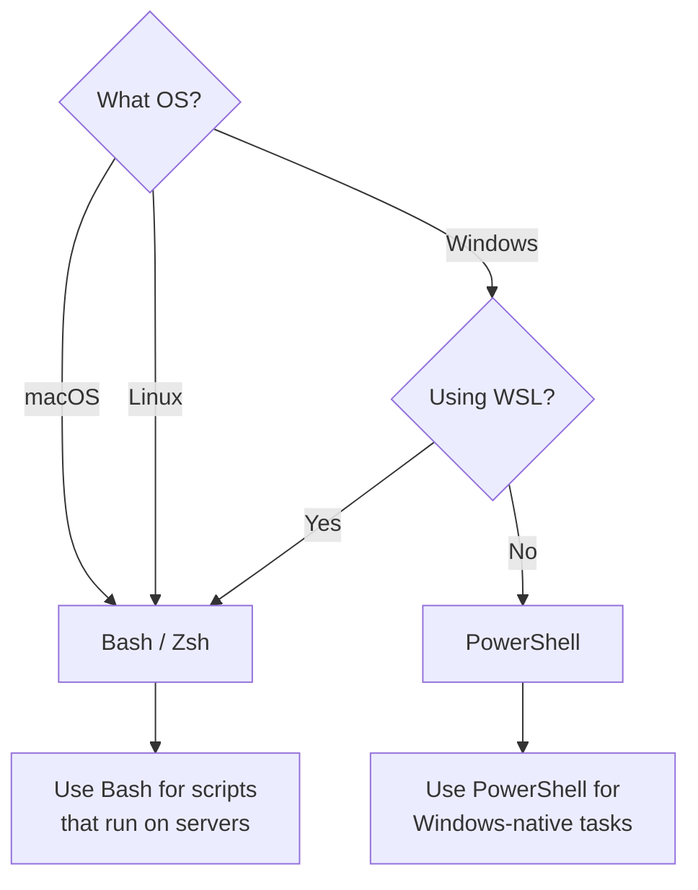

# Terminal

> Commands, navigation, shells, and power-user workflows.

The terminal is your direct line to the computer. While GUIs are great for visual tasks, the terminal is faster, more powerful, and essential for development. This section covers everything from basic navigation to advanced workflows.

---

## Prerequisites

No prior terminal experience required. Start with [What Is a Terminal?](what-is-a-terminal.md) and work through the pages in order.

---

## Pages in This Section

| Page | Description |
|------|-------------|
| [What Is a Terminal?](what-is-a-terminal.md) | Mental model, GUI vs CLI, why terminals matter |
| [PowerShell](powershell.md) | Full PowerShell deep dive - syntax, profiles, cmdlets |
| [Bash](bash.md) | Full Bash deep dive - syntax, .bashrc, builtins |
| [PowerShell vs Bash](powershell-vs-bash.md) | Side-by-side comparison and command mapping |
| [Navigation](navigation.md) | cd, pwd, ls, dir, paths, directory structure |
| [File Management](file-management.md) | Create, copy, move, rename, delete files and folders |
| [Searching](searching.md) | grep, Select-String, find, fd, ripgrep |
| [Pipes and Redirection](pipes-and-redirection.md) | Pipes, stdout, stderr, stdin, data flow |
| [Text Processing](text-processing.md) | cat/type, head/tail, sort, awk, cut, string manipulation |
| [Processes](processes.md) | ps, top, kill, background/foreground jobs |
| [Networking](networking.md) | ping, curl, wget, netstat, ss |
| [SSH](ssh.md) | Remote access, key management, SCP |
| [Environment Variables](environment-variables.md) | $env:, export, PATH, system configuration |
| [Terminal Cheat Sheet](terminal-cheat-sheet.md) | One-page command summary |
| [Troubleshooting](terminal-troubleshooting.md) | Common errors and solutions |

---

## Decision Tree: Which Shell Should I Use?

**Rule of thumb:** Learn both. Use PowerShell on Windows, Bash on Linux/macOS/WSL. Most development happens in Bash-compatible environments.

---

## Quick Reference

| Task | PowerShell | Bash |
|------|------------|------|
| List files | `Get-ChildItem` | `ls` |
| Change directory | `Set-Location` | `cd` |
| Copy file | `Copy-Item` | `cp` |
| Move file | `Move-Item` | `mv` |
| Delete file | `Remove-Item` | `rm` |
| Find text | `Select-String` | `grep` |
| See running processes | `Get-Process` | `ps` |

> **Full comparison:** [PowerShell vs Bash](powershell-vs-bash.md)

---

> **Next:** [What Is a Terminal?](what-is-a-terminal.md) | **Previous:** [Foundations](../01-foundations/README.md)
