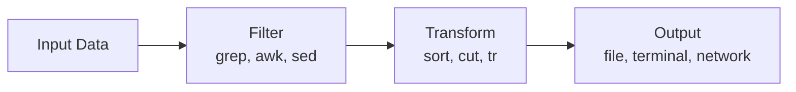

# Bash

> Bash (Bourne Again Shell) is the standard command-line shell on most Linux distributions and macOS. It's the lingua franca of server administration and development.

---

## What Is It?

Bash is a Unix shell and command language. It's the default shell on most Linux distributions and was the default on macOS until Catalina (which switched to Zsh). Bash is what you'll encounter on most servers, Docker containers, and CI/CD pipelines.

| Feature | Bash | PowerShell |
|---------|------|------------|
| Input/Output | Text streams | Objects (.NET) |
| Naming | Short commands (`ls`, `grep`) | Verb-Noun (`Get-ChildItem`) |
| Configuration | `.bashrc`, `.bash_profile` | `Profile.ps1` |
| Platform | Linux, macOS, WSL | Windows, macOS, Linux |
| Default on | Most servers, Docker | Windows |

## Why Does It Exist?

1. **Universal availability** - Installed on virtually every Unix system
2. **Scripting** - Powerful scripting language for automation
3. **Piping** - Connect commands together with `|`
4. **Job control** - Manage background/foreground processes
5. **Shell expansion** - Globbing, brace expansion, variable substitution
6. **Server standard** - What you'll SSH into on most servers

## Mental Model

Think of Bash as a **Swiss Army knife** - each command is a specialized tool, and you combine them to accomplish complex tasks:



Bash deals in **text streams**. Commands take text in, process it, and output text. The pipe `|` connects the output of one command to the input of the next.

## When Should I Use It?

| Use Bash When | Use Something Else When |
|--------------|-----------------------|
| Working on Linux/macOS | Automating Windows tasks (use PowerShell) |
| Managing servers via SSH | Working with .NET objects (use PowerShell) |
| Running Docker containers | Complex structured data (use Python) |
| CI/CD pipelines | Simple Windows automation (use cmd) |
| Shell scripting | macOS-specific tasks (use Zsh) |
| Quick text processing | |

## Cheat Sheet

### Essential Commands

| Task | Command | Description |
|------|---------|-------------|
| List files | `ls` | List directory contents |
| List all files | `ls -la` | Include hidden files, long format |
| Change dir | `cd` | Change current directory |
| Copy | `cp` | Copy files/folders |
| Move/rename | `mv` | Move or rename files |
| Delete | `rm` | Remove files |
| Delete dir | `rm -r` | Remove directory recursively |
| Create dir | `mkdir` | Create a directory |
| Read file | `cat` | Display file contents |
| Partial read | `head`, `tail` | First/last lines of file |
| Find text | `grep` | Search for patterns |
| Count lines | `wc -l` | Count lines in input |
| See processes | `ps aux` | List all running processes |
| Kill process | `kill` | Terminate a process |
| Environment var | `echo $VAR` | Read an env var |
| Set env var | `export VAR=value` | Set an env var |

### Command Syntax

```bash
# Basic command
command

# With options (flags)
command -l              # Short option
command --long-option   # Long option
command -abc            # Combined short options

# With arguments
command argument1 argument2

# With pipe
command1 | command2     # Output of 1 goes to input of 2

# With redirection
command > file.txt      # Output to file (overwrite)
command >> file.txt     # Output to file (append)
command 2> errors.txt   # Errors to file
command < input.txt     # Read from file
```

### Common Patterns

```bash
# Find files by name
find . -name "*.py"

# Find files by content
grep -r "TODO" .

# Count files
ls | wc -l

# Sort and unique
sort file.txt | uniq

# Chain commands
mkdir project && cd project && git init

# Run command if previous succeeded
command1 && command2

# Run command if previous failed
command1 || command2

# Run in background
command &
```

## Step-by-Step Workflow

### 1. Explore Your Environment

```bash
pwd                    # Where am I?
ls -la                 # What's here?
echo $HOME             # Home directory
echo $PATH             # Where shells looks for commands
which bash             # Where is bash installed?
```

### 2. Navigate the File System

```bash
cd /                   # Go to root
cd ~                   # Go to home
cd ..                  # Go up one level
cd ../..               # Go up two levels
cd -                   # Go to previous directory
pushd /some/dir        # Push current dir, go to new dir
popd                   # Return to previous dir
```

### 3. Create a Script

```bash
#!/bin/bash
# save as hello.sh

echo "Hello, $USER!"
echo "Today is $(date)"
echo "You are in $(pwd)"
```

### 4. Make It Executable and Run

```bash
chmod +x hello.sh      # Make executable
./hello.sh             # Run it
```

### 5. Use Shell Features

```bash
# Brace expansion
echo {1..5}            # 1 2 3 4 5
echo file{1..3}.txt    # file1.txt file2.txt file3.txt

# Globbing
ls *.py                # All Python files
ls project/*/src       # src dirs one level deep

# Command substitution
echo "Current dir: $(pwd)"
files=$(ls)
echo "$files"
```

## Real Project Examples

### Find and Replace Across Files

```bash
grep -rl "old_function" --include="*.py" . | xargs sed -i 's/old_function/new_function/g'
```

### Monitor Log Files

```bash
tail -f /var/log/syslog           # Follow log in real time
tail -f app.log | grep --color "ERROR"  # Highlight errors
```

### Batch Rename with Pattern

```bash
for f in *.txt; do
    mv "$f" "${f%.txt}.md"
done
```

### Quick Backup

```bash
tar -czf backup_$(date +%Y%m%d).tar.gz /path/to/dir
```

### Count Lines of Code

```bash
find . -name "*.py" -exec wc -l {} + | sort -n
```

### Disk Usage Summary

```bash
du -sh */ | sort -rh | head -10
```

## Best Practices

- **Use double quotes around variables** - `"$var"` prevents word splitting
- **Always check with `echo` first** - Test expansions before executing
- **Use `shellcheck`** - Lint your bash scripts for errors
- **Quote paths with spaces** - `"my folder"` not `my folder`
- **Use `set -euo pipefail`** - Make scripts fail on errors
- **Prefer `[[ ]]` over `[ ]`** - More robust conditional expressions
- **Use `$(command)` over backticks** - More readable, nestable

## Common Mistakes

> **Warning:** `rm -rf /` will delete everything on your system. Always double-check destructive commands. Use `rm -i` for interactive deletion.

| Mistake | Problem | Solution |
|---------|---------|----------|
| Unquoted variables | Breaks on spaces in filenames | Always use `"$var"` |
| `rm -rf` without care | Permanent deletion | Double-check path, use `-i` |
| Forgetting `chmod +x` | Script won't run | `chmod +x script.sh` |
| Wrong shebang | Wrong interpreter | Use `#!/bin/bash` or `#!/usr/bin/env bash` |
| Using `echo` for output | Can't pipe to other commands | Use `printf` or variables |
| Not quoting globs | Expands in unexpected ways | Quote when storing: `files=*.txt` |

## Troubleshooting

| Problem | Cause | Solution |
|---------|-------|----------|
| "Permission denied" | Not executable | `chmod +x script.sh` |
| "No such file or directory" | Wrong path | Check with `ls` and `pwd` |
| "Command not found" | Not in PATH | Check `echo $PATH`, use full path |
| "Unexpected end of file" | Unclosed quote or brace | Check matching quotes and braces |
| "Ambiguous redirect" | Wildcard matches multiple files | Use `echo *` to preview matches |

## Related Topics

- [PowerShell](powershell.md) - Windows shell comparison
- [PowerShell vs Bash](powershell-vs-bash.md) - Side-by-side comparison
- [Pipes and Redirection](pipes-and-redirection.md) - Data flow in Bash
- [Text Processing](text-processing.md) - grep, awk, sed, and more
- [SSH](ssh.md) - Remote Bash sessions
- [What Is a Terminal?](what-is-a-terminal.md) - Terminal fundamentals

## Further Learning

- [The Linux Command Line](https://linuxcommand.org/tlcl.php) - Free book, excellent for beginners
- [Bash Guide](https://guide.bash.academy/) - Conceptual approach to Bash
- [shellcheck](https://www.shellcheck.net/) - Static analysis for shell scripts
- [Explainshell](https://explainshell.com/) - Paste a command, get an explanation
- [Commandlinefu](https://commandlinefu.com/) - Community-submitted one-liners

---

## Personal Notes

> Add your own notes, reminders, and experiences here.
