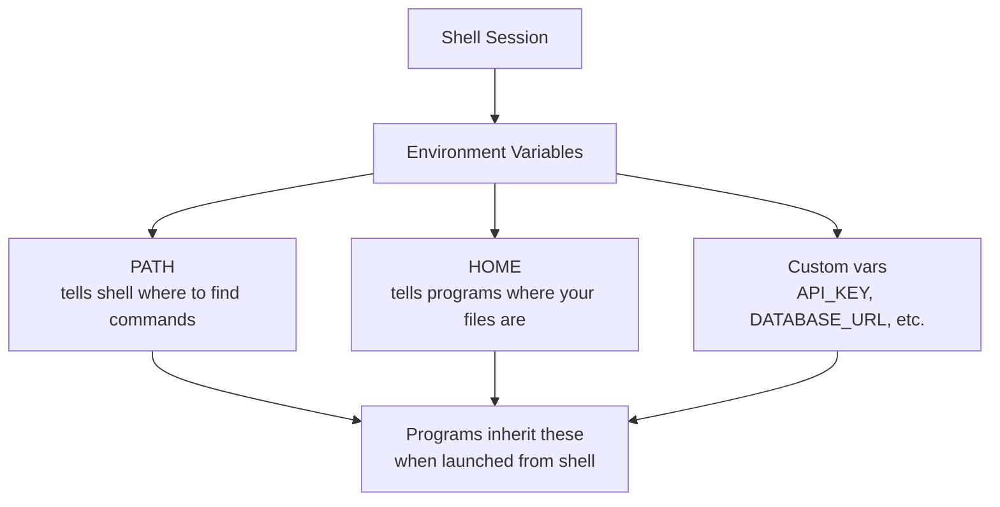

# Environment Variables

> Environment variables are key-value pairs that configure your system's behavior. They control paths, secrets, language settings, and more.

---

## What Is It?

Environment variables are dynamic values that affect how programs run. They're stored in your shell's environment and passed to every program you launch.

| Variable | Typical Value | Purpose |
|----------|--------------|---------|
| `PATH` | `/usr/bin:/usr/local/bin:...` | Where to find executables |
| `HOME` | `/home/you` or `C:\Users\you` | Your home directory |
| `USER` | `yourname` | Current username |
| `SHELL` | `/bin/bash` | Default shell |
| `EDITOR` | `vim` or `code` | Default text editor |

## Why Does It Exist?

- **Configuration** - Set options without hardcoding in scripts
- **Secrets** - Store API keys, passwords outside of code
- **Portability** - Same code works on different machines
- **Shell behavior** - Customize your terminal experience
- **PATH** - Tell the system where to find programs

## Mental Model

Think of environment variables as **settings for your terminal session**:



Every program you launch from the terminal inherits these variables.

## When Should I Use It?

| Use Case | Example Variable |
|----------|-----------------|
| Store API keys | `API_KEY=sk-abc123` |
| Set database URL | `DATABASE_URL=postgres://...` |
| Configure proxy | `HTTP_PROXY=http://proxy:8080` |
| Set language/locale | `LANG=en_US.UTF-8` |
| Add to PATH | `PATH=$PATH:/new/dir` |
| Enable debug mode | `DEBUG=true` |

## Cheat Sheet

### Reading Variables

| Task | PowerShell | Bash |
|------|------------|------|
| Read variable | `$env:VAR_NAME` | `echo $VAR_NAME` |
| Read with default | `$env:VAR_NAME ?? "default"` | `${VAR_NAME:-default}` |
| List all variables | `Get-ChildItem Env:` | `env` or `printenv` |
| Check if set | `Test-Path Env:VAR_NAME` | `[ -n "$VAR" ]` |

### Setting Variables

| Task | PowerShell | Bash | Scope |
|------|------------|------|-------|
| Set for session | `$env:VAR = "value"` | `VAR="value"` | Current shell |
| Set permanently (user) | `[Environment]::SetEnvironmentVariable("VAR","value","User")` | Add to `~/.bashrc` | User level |
| Set permanently (system) | `[Environment]::SetEnvironmentVariable("VAR","value","Machine")` | Add to `/etc/environment` | System level |
| Export for child processes | N/A (automatic) | `export VAR="value"` | Current + children |

### PATH Manipulation

| Task | PowerShell | Bash |
|------|------------|------|
| View PATH | `$env:PATH` | `echo $PATH` |
| Add to PATH | `$env:PATH += ";C:\new\path"` | `export PATH="$PATH:/new/path"` |
| Add permanently | Use System Properties > Environment Variables | Add to `~/.bashrc` |

### Common Variables

| Variable | Description | Example |
|----------|-------------|---------|
| `PATH` | Executable search paths | `/usr/bin:/usr/local/bin` |
| `HOME` | Home directory | `/home/user` |
| `USER` | Current username | `john` |
| `SHELL` | Current shell | `/bin/bash` |
| `EDITOR` | Default editor | `vim` |
| `LANG` | Language/locale | `en_US.UTF-8` |
| `TEMP` / `TMPDIR` | Temp directory | `/tmp` |
| `NODE_ENV` | Node.js environment | `development` |

## Step-by-Step Workflow

### 1. Read an Environment Variable

```powershell
# PowerShell
$env:PATH
$env:HOME
$env:API_KEY
```

```bash
# Bash
echo $PATH
echo $HOME
echo $API_KEY
```

### 2. Set a Temporary Variable

```powershell
# PowerShell - lasts for this session only
$env:MY_VAR = "hello"
echo $env:MY_VAR
```

```bash
# Bash - lasts for this session only
MY_VAR="hello"
echo $MY_VAR
```

### 3. Set a Permanent Variable

```powershell
# PowerShell - user level (persists across sessions)
[Environment]::SetEnvironmentVariable("MY_VAR", "hello", "User")

# Restart PowerShell to see it
```

```bash
# Bash - add to ~/.bashrc
echo 'export MY_VAR="hello"' >> ~/.bashrc
source ~/.bashrc  # Apply changes
```

### 4. Add a Directory to PATH

```powershell
# PowerShell - temporarily
$env:PATH += ";C:\tools\mybin"

# PowerShell - permanently
$currentPath = [Environment]::GetEnvironmentVariable("PATH", "User")
[Environment]::SetEnvironmentVariable("PATH", "$currentPath;C:\tools\mybin", "User")
```

```bash
# Bash - temporarily
export PATH="$PATH:/opt/mybin"

# Bash - permanently (add to ~/.bashrc)
echo 'export PATH="$PATH:/opt/mybin"' >> ~/.bashrc
source ~/.bashrc
```

### 5. Use Variables in Scripts

```powershell
# PowerShell script
if ($env:API_KEY) {
    Write-Host "API key is set"
} else {
    Write-Host "Please set API_KEY environment variable"
}
```

```bash
# Bash script
if [ -z "$API_KEY" ]; then
    echo "Please set API_KEY environment variable"
    exit 1
fi
echo "Using API key: ${API_KEY:0:8}..."
```

## Real Project Examples

### Python Virtual Environment

```powershell
# PowerShell
python -m venv .venv
.\.venv\Scripts\Activate.ps1
# PATH is modified, prompt changes

# Deactivate
deactivate
```

```bash
# Bash
python3 -m venv .venv
source .venv/bin/activate
# PATH is modified, prompt changes

# Deactivate
deactivate
```

### Docker Environment Variables

```bash
# Pass env vars to Docker container
docker run -e API_KEY=sk-abc123 -e DEBUG=true myapp

# Or from a file
docker run --env-file .env myapp
```

### Node.js Project

```bash
# .env file (use dotenv package)
NODE_ENV=development
PORT=3000
DATABASE_URL=postgres://localhost/mydb
API_KEY=sk-abc123

# Never commit .env to git!
echo ".env" >> .gitignore
```

### Loading .env Files

```bash
# Bash - load from file
export $(grep -v '^#' .env | xargs)

# PowerShell
Get-Content .env | ForEach-Object {
    if ($_ -match "^([^#=]+)=(.*)$") {
        [Environment]::SetEnvironmentVariable($matches[1], $matches[2], "Process")
    }
}
```

## Best Practices

- **Never commit secrets to Git** - Use `.env` files and add `.env` to `.gitignore`
- **Use `.env.example`** - Document required variables without secrets
- **Use descriptive names** - `DATABASE_URL` not `DB`
- **Set defaults in scripts** - `${VAR:-default}` pattern
- **Use lowercase for custom vars** - Reserve uppercase for system vars
- **Restart your shell** - After changing `~/.bashrc` or profile

## Common Mistakes

> **Warning:** Environment variables can contain sensitive data. Never echo or log them. Use `***` masking when displaying.

| Mistake | Problem | Solution |
|---------|---------|----------|
| Committing `.env` to Git | Secrets exposed | Add `.env` to `.gitignore` |
| Spaces around `=` | Shell interprets as command | `VAR=value` not `VAR = value` |
| Forgetting `export` in Bash | Variable not visible to child processes | Use `export VAR=value` |
| Not restarting shell | Changes don't take effect | `source ~/.bashrc` or restart |
| Using env vars for large config | Messy, hard to maintain | Use config files for complex settings |

## Troubleshooting

| Problem | Cause | Solution |
|---------|-------|----------|
| "Variable not found" | Not set in current session | Check with `env` or `printenv` |
| Variable lost after restart | Not set permanently | Add to profile/`.bashrc` |
| PATH changes not taking effect | Shell not reloaded | `source ~/.bashrc` |
| Different values in scripts | Child process inherits parent | Check where variable is set |

## Related Topics

- [What Is a Terminal?](what-is-a-terminal.md) - Shell fundamentals
- [PowerShell vs Bash](powershell-vs-bash.md) - Variable syntax differences

## Further Learning

- [Environment Variables Wiki](https://en.wikipedia.org/wiki/Environment_variable) - Comprehensive overview
- [dotenv](https://github.com/motdotla/dotenv) - Load .env files in Node.js
- [direnv](https://direnv.net/) - Auto-load env vars per directory

---

## Personal Notes

> Add your own notes, reminders, and experiences here.
