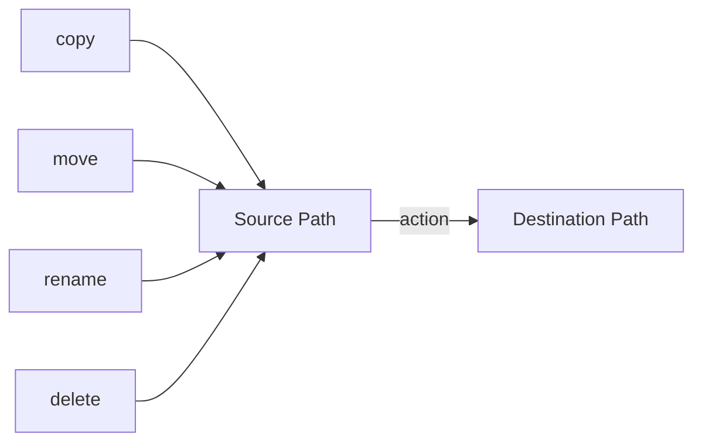

# File Management

> Creating, copying, moving, renaming, and deleting files and folders from the terminal.

---

## What Is It?

File management is the set of operations you perform on files and directories: creating them, organizing them, copying them, and removing them.

## Why Does It Exist?

While file managers (Explorer, Finder) work for casual use, the terminal is faster for batch operations, automation, and working with many files at once.

## Mental Model

Think of files as **objects** that live at specific **addresses** (paths). Every operation is essentially:

1. **Locate** the file (path)
2. **Act** on it (copy, move, delete, rename)



## Cheat Sheet

### Create

| Task | PowerShell | Bash |
|------|------------|------|
| Create file | `New-Item file.txt` | `touch file.txt` |
| Create directory | `New-Item -ItemType Dir -Path name` | `mkdir name` |
| Create nested dirs | `mkdir -Force a\b\c` | `mkdir -p a/b/c` |
| Create with content | `Set-Content file.txt "text"` | `echo "text" > file.txt` |

### Copy

| Task | PowerShell | Bash |
|------|------------|------|
| Copy file | `Copy-Item src dest` | `cp src dest` |
| Copy directory (recursive) | `Copy-Item src dest -Recurse` | `cp -r src dest` |
| Copy with new name | `Copy-Item src dest\newname` | `cp src dest/newname` |
| Copy all of type | `Copy-Item *.txt dest` | `cp *.txt dest` |

### Move / Rename

| Task | PowerShell | Bash |
|------|------------|------|
| Move file | `Move-Item src dest` | `mv src dest` |
| Rename file | `Rename-Item old.txt new.txt` | `mv old.txt new.txt` |
| Move + rename | `Move-Item src dest\newname` | `mv src dest/newname` |
| Move all of type | `Move-Item *.txt dest` | `mv *.txt dest/` |

### Delete

| Task | PowerShell | Bash |
|------|------------|------|
| Delete file | `Remove-Item file.txt` | `rm file.txt` |
| Delete directory | `Remove-Item -Recurse dir` | `rm -r dir` |
| Force delete | `Remove-Item -Force file` | `rm -f file` |
| Interactive delete | `Remove-Item -WhatIf file` | `rm -i file` |
| Delete by pattern | `Remove-Item *.log` | `rm *.log` |

### Inspect

| Task | PowerShell | Bash |
|------|------------|------|
| File size | `(Get-Item file).Length` | `ls -lh file` |
| Last modified | `(Get-Item file).LastWriteTime` | `stat file` |
| File type | `(Get-Item file).Extension` | `file file` |
| Count files | `(Get-ChildItem).Count` | `ls | wc -l` |
| Count by type | `Group-Object Extension` | `ls | sed 's/.*\.//' | sort | uniq -c` |

## Step-by-Step Workflow

### 1. Create a Project Structure

```powershell
# PowerShell
New-Item -ItemType Directory -Path "project\src" -Force
New-Item -ItemType Directory -Path "project\tests" -Force
New-Item -ItemType Directory -Path "project\docs" -Force
New-Item -ItemType File -Path "project\README.md"
```

```bash
# Bash
mkdir -p project/src project/tests project/docs
touch project/README.md
```

### 2. Create Files with Content

```powershell
# PowerShell
"Hello World" | Out-File -FilePath "greeting.txt"
Set-Content -Path "config.json" -Value '{"key": "value"}'
```

```bash
# Bash
echo "Hello World" > greeting.txt
echo '{"key": "value"}' > config.json
```

### 3. Copy Files for Backup

```powershell
# PowerShell
Copy-Item -Path "config.json" -Destination "config.json.bak"
```

```bash
# Bash
cp config.json config.json.bak
```

### 4. Organize Files by Extension

```powershell
# PowerShell - Move all .txt files to a text/ folder
New-Item -ItemType Directory -Path "text" -Force
Get-ChildItem "*.txt" | Move-Item -Destination "text/"
```

```bash
# Bash
mkdir -p text
mv *.txt text/
```

### 5. Clean Up Old Files

```powershell
# PowerShell - Delete files older than 7 days
Get-ChildItem "*.log" | Where-Object { $_.LastWriteTime -lt (Get-Date).AddDays(-7) } | Remove-Item
```

```bash
# Bash
find . -name "*.log" -mtime +7 -delete
```

## Real Project Examples

### Initialize a Git Project

```powershell
# PowerShell
New-Item -ItemType Directory -Path "myproject\src" -Force
Set-Location "myproject"
git init
"node_modules/" | Out-File ".gitignore"
"*.log" | Out-File -Append ".gitignore"
```

```bash
# Bash
mkdir -p myproject/src && cd myproject
git init
echo "node_modules/" > .gitignore
echo "*.log" >> .gitignore
```

### Batch Rename with Pattern

```powershell
# PowerShell - Add date prefix to files
Get-ChildItem "*.jpg" | Rename-Item -NewName { "2024-01_" + $_.Name }
```

```bash
# Bash
for f in *.jpg; do mv "$f" "2024-01_$f"; done
```

### Find and Delete Empty Directories

```bash
# Bash
find . -type d -empty -delete
```

## Best Practices

- **Use `-p` / `-Force` for nested creation** - Creates parent directories automatically
- **Quote paths with spaces** - `"My Documents"` not `My Documents`
- **Use `-WhatIf` / `-i` before destructive operations** - Preview before deleting
- **Back up before bulk operations** - Copy files before mass renaming
- **Use patterns carefully** - Test with `ls *.txt` before `rm *.txt`
- **Use `tree` to visualize** - See directory structure at a glance

## Common Mistakes

> **Warning:** `rm -rf` will delete everything in the target directory without confirmation. Always double-check the path.

| Mistake | Problem | Solution |
|---------|---------|----------|
| `rm -rf /` | Deletes entire system | Never do this |
| Unquoted spaces | Files moved to wrong places | Always quote paths |
| Forgetting `-Recurse` / `-r` | Only copies/ deletes top level | Add recursive flag for directories |
| Moving a file onto itself | Error or overwrite | Check source != destination |
| Wrong glob pattern | Affects unintended files | Test with `ls` first |

## Troubleshooting

| Problem | Cause | Solution |
|---------|-------|----------|
| "Directory not empty" | Can't delete non-empty dir | Use `-Recurse` / `-r` |
| "Access denied" | Insufficient permissions | Run as admin if needed |
| "No such file" | Wrong path | Verify with `ls` / `Get-ChildItem` |
| "Invalid argument" | Special characters in name | Quote the filename |
| Files moved to wrong place | Glob matched unexpectedly | Preview glob results first |

## Related Topics

- [Navigation](navigation.md) - Moving between directories
- [Searching](searching.md) - Finding files and content
- [Text Processing](text-processing.md) - Working with file contents

## Further Learning

- [GNU Core Utilities](https://www.gnu.org/software/coreutils/) - Unix file utilities
- [PowerShell File Operations](https://learn.microsoft.com/en-us/powershell/scripting/samples/working-with-files-and-folders) - Official docs

---

## Personal Notes

> Add your own notes, reminders, and experiences here.
