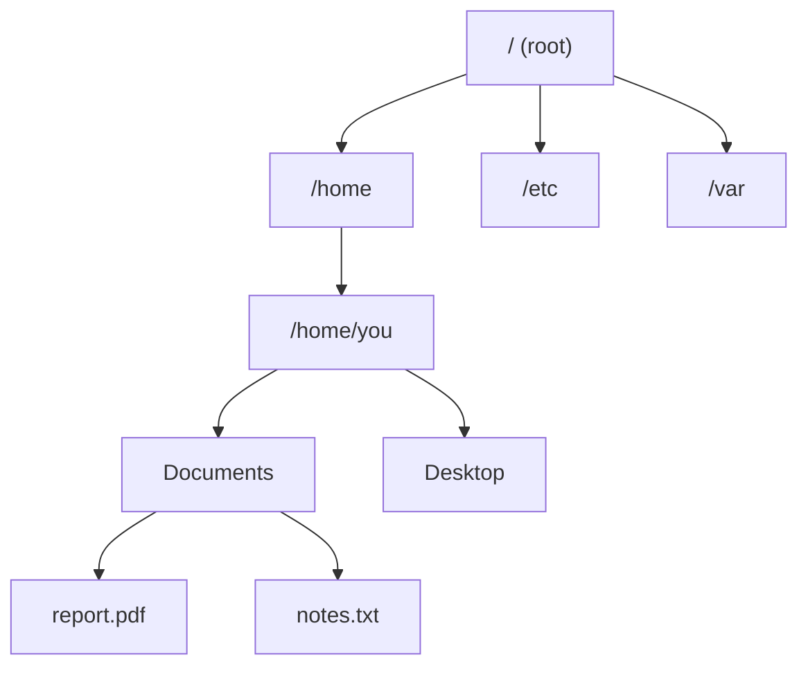

# Navigation

> Moving around the file system is the most fundamental terminal skill. Master it and everything else becomes easier.

---

## What Is It?

Navigation means moving between directories (folders) in the terminal. You need to know where you are, where you want to go, and how to get there.

## Why Does It Exist?

Every command operates on the **current directory** unless you specify otherwise. If you're in the wrong directory, your commands will affect the wrong files.

## Mental Model

Think of the file system as a **tree**:



- **Root (`/`)** - The top of the tree
- **Home (`~`)** - Your personal directory
- **Current directory (`.`)** - Where you are now
- **Parent directory (`..`)** - One level up

## Cheat Sheet

### Navigation Commands

| Task | PowerShell | Bash |
|------|------------|------|
| Show current path | `Get-Location` / `pwd` | `pwd` |
| Change directory | `Set-Location path` / `cd path` | `cd path` |
| Go to home | `cd ~` | `cd ~` or `cd` |
| Go up one level | `cd ..` | `cd ..` |
| Go up two levels | `cd ..\..` | `cd ../..` |
| Go to previous dir | `cd -` | `cd -` |
| List contents | `Get-ChildItem` / `ls` | `ls` |
| List all (incl. hidden) | `ls -Force` | `ls -la` |

### Path Types

| Type | PowerShell | Bash | Example |
|------|------------|------|---------|
| Absolute | `C:\Users\you` | `/home/you` | Full path from root |
| Relative | `Documents\file` | `Documents/file` | From current dir |
| Parent | `..\file` | `../file` | One level up |
| Home | `~\file` | `~/file` | From home directory |
| Current | `.\file` | `./file` | Explicit current dir |

## Step-by-Step Workflow

### 1. Find Out Where You Are

```powershell
# PowerShell
Get-Location
# or simply:
pwd
```

```bash
# Bash
pwd
```

Output:
```
/home/you/Documents
```

### 2. See What's in the Current Directory

```powershell
# PowerShell - basic listing
Get-ChildItem

# PowerShell - detailed listing with hidden files
Get-ChildItem -Force
```

```bash
# Bash - basic listing
ls

# Bash - detailed listing with hidden files
ls -la
```

### 3. Navigate to a Directory

```powershell
# From /home/you to /home/you/Documents
cd Documents

# From /home/you/Documents to /home/you
cd ..

# Absolute path - works from anywhere
cd C:\Users\you\Documents
```

```bash
# From /home/you to /home/you/Documents
cd Documents

# From /home/you/Documents to /home/you
cd ..

# Absolute path - works from anywhere
cd /home/you/Documents
```

### 4. Go Back to Previous Directory

```powershell
# Both shells
cd -
```

This toggles between your current and previous location.

### 5. Navigate to Home from Anywhere

```powershell
# Both shells
cd ~
# or just:
cd
```

## Real Project Examples

### Quick Project Navigation

```bash
# Create shortcuts (Bash)
alias proj1="cd ~/Projects/project1"
alias proj2="cd ~/Projects/project2"

# Use them
proj1
proj2
```

```powershell
# PowerShell function
function goto-proj1 { Set-Location ~/Projects/project1 }
Set-Alias gp1 goto-proj1
```

### Find and Navigate to a Directory

```bash
# Find a directory by name
find / -type d -name "myproject" 2>/dev/null

# Navigate to it
cd $(find /home -type d -name "myproject" 2>/dev/null | head -1)
```

### Navigate to Git Repository Root

```bash
# From anywhere in a git repo
cd $(git rev-parse --show-toplevel)
```

```powershell
# PowerShell
Set-Location (git rev-parse --show-toplevel)
```

## Best Practices

- **Always know where you are** - Run `pwd` before important commands
- **Use tab completion** - Press `Tab` to auto-complete paths
- **Use `ls` liberally** - Check directory contents before acting
- **Use relative paths** - More portable than absolute paths
- **Bookmark common directories** - Use aliases or shell functions

## Common Mistakes

| Mistake | Problem | Solution |
|---------|---------|----------|
| Wrong directory | Commands affect wrong files | Run `pwd` first |
| Forgetting spaces in paths | Shell splits the path | Quote: `"My Documents"` |
| Using `\` in Bash | Escapes next character | Use `/` in Bash |
| Not using tab completion | Slow, typo-prone | Press `Tab` to auto-complete |

## Troubleshooting

| Problem | Cause | Solution |
|---------|-------|----------|
| "No such file or directory" | Path doesn't exist | Check with `ls` |
| "Not a directory" | Trying to cd into a file | Check the path |
| "Permission denied" | No read permission | Use `sudo` if needed |
| Tab completion not working | Directory doesn't exist or ambiguous | Type more characters, then Tab |

## Related Topics

- [File Management](file-management.md) - Creating, copying, moving, deleting
- [What Is a Terminal?](what-is-a-terminal.md) - Terminal fundamentals
- [PowerShell vs Bash](powershell-vs-bash.md) - Command differences
- [Environment Variables](environment-variables.md) - HOME and PATH

## Further Learning

- [Mastering Tab Completion](https://www.gnu.org/software/bash/manual/html_node/Readline.html) - Bash readline docs
- [PowerShell Tab Completion](https://learn.microsoft.com/en-us/powershell/scripting/learn/shell-tab-completion) - Official docs

---

## Personal Notes

> Add your own notes, reminders, and experiences here.
