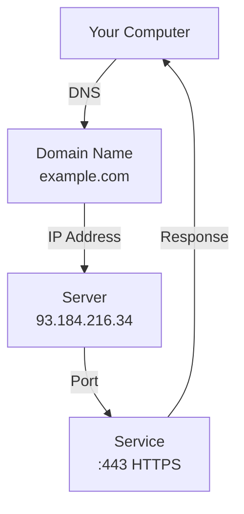

# Networking

> Network commands let you test connectivity, transfer files, debug connections, and understand what your computer is doing on the network.

---

## What Is It?

Terminal networking commands let you interact with networks directly: test if a server is reachable, download files, check open ports, and debug connectivity issues.

## Why Does It Exist?

As a developer, you'll constantly need to:

- Test if a server is running
- Download files or APIs
- Debug why a connection fails
- Check if a port is open
- Transfer files to remote machines

## Mental Model



Every network connection needs: **IP address** + **Port** + **Protocol** (TCP/UDP).

## Cheat Sheet

### Connectivity Testing

| Task | PowerShell | Bash | Description |
|------|------------|------|-------------|
| Ping | `Test-Connection host` | `ping host` | Test reachability |
| DNS lookup | `Resolve-DnsName host` | `nslookup host` | Query DNS records |
| Traceroute | `Test-Connection -TraceRoute host` | `traceroute host` | Trace network path |
| Port check | `Test-NetConnection host -Port 80` | `nc -zv host 80` | Test specific port |

### HTTP Requests

| Task | PowerShell | Bash | Description |
|------|------------|------|-------------|
| GET request | `Invoke-WebRequest url` | `curl url` | Fetch a URL |
| POST request | `Invoke-WebRequest -Method POST -Body $data url` | `curl -X POST -d 'data' url` | Send data |
| Download file | `Invoke-WebRequest -OutFile file url` | `curl -O url` | Save to file |
| Follow redirects | `-MaximumRedirection 5` | `-L` | Follow HTTP redirects |
| Custom headers | `-Headers @{Key="Value"}` | `-H "Key: Value"` | Send custom headers |

### Network Info

| Task | PowerShell | Bash | Description |
|------|------------|------|-------------|
| IP address | `Get-NetIPAddress` | `ip addr` or `ifconfig` | Show network interfaces |
| DNS servers | `Get-DnsClientServerAddress` | `cat /etc/resolv.conf` | DNS configuration |
| Open ports | `Get-NetTCPConnection` | `ss -tlnp` | List listening ports |
| Connections | `Get-NetTCPConnection` | `ss -tnp` | Active connections |
| Hostname | `$env:COMPUTERNAME` | `hostname` | Machine name |

### File Transfer

| Task | PowerShell | Bash | Description |
|------|------------|------|-------------|
| Download | `Invoke-WebRequest -OutFile f url` | `wget url` or `curl -O url` | Download a file |
| Upload | | `curl -T file url` | Upload a file |
| FTP | | `ftp host` | FTP client |

## Step-by-Step Workflow

### 1. Test if a Server is Reachable

```powershell
# PowerShell
Test-Connection google.com -Count 4
```

```bash
# Bash
ping -c 4 google.com
```

### 2. Check if a Port is Open

```powershell
# PowerShell
Test-NetConnection -ComputerName localhost -Port 3000
```

```bash
# Bash
nc -zv localhost 3000
# or
curl -s localhost:3000 > /dev/null && echo "Open" || echo "Closed"
```

### 3. Make an HTTP Request

```powershell
# PowerShell - GET
Invoke-WebRequest -Uri "https://api.github.com" | Select-Object StatusCode, Content

# PowerShell - POST with JSON
Invoke-WebRequest -Method POST -Uri "https://api.example.com/data" -ContentType "application/json" -Body '{"key":"value"}'
```

```bash
# Bash - GET
curl https://api.github.com

# Bash - POST with JSON
curl -X POST -H "Content-Type: application/json" -d '{"key":"value"}' https://api.example.com/data
```

### 4. Download a File

```powershell
# PowerShell
Invoke-WebRequest -Uri "https://example.com/file.zip" -OutFile "file.zip"
```

```bash
# Bash
wget https://example.com/file.zip
# or
curl -O https://example.com/file.zip
```

### 5. Find What's Using a Port

```powershell
# PowerShell
Get-NetTCPConnection -LocalPort 3000 | Select-Object LocalPort, OwningProcess, State
Get-Process -Id (Get-NetTCPConnection -LocalPort 3000).OwningProcess
```

```bash
# Bash
lsof -i :3000
# or
ss -tlnp | grep :3000
```

## Real Project Examples

### Test API Endpoint

```bash
# Check if API returns 200
curl -s -o /dev/null -w "%{http_code}" https://api.example.com/health

# Pretty-print JSON response
curl -s https://api.example.com/data | jq .

# Time a request
curl -w "@curl-format.txt" -o /dev/null -s https://example.com
```

### Download Latest Release

```bash
# Download from GitHub releases
VERSION=$(curl -s https://api.github.com/repos/user/repo/releases/latest | jq -r .tag_name)
curl -LO "https://github.com/user/repo/releases/download/$VERSION/binary"
```

### Monitor a Service

```bash
# Check if service is running every 5 seconds
while true; do
    if curl -s http://localhost:3000/health > /dev/null; then
        echo "$(date): OK"
    else
        echo "$(date): DOWN"
    fi
    sleep 5
done
```

### Check DNS Resolution

```powershell
# PowerShell
Resolve-DnsName google.com
Resolve-DnsName google.com -Type MX  # Mail exchange records
```

```bash
# Bash
dig google.com
dig google.com MX  # Mail exchange records
```

## Best Practices

- **Use `curl` over `wget`** - More flexible, better output options
- **Always check exit codes** - `curl` returns non-zero on failure
- **Use `-s` for scripts** - Silent mode, no progress bar
- **Test with `-v` for debugging** - Verbose output shows what's happening
- **Use `-o /dev/null -w "%{http_code}"`** - Just get the status code

## Common Mistakes

| Mistake | Problem | Solution |
|---------|---------|----------|
| Not checking port AND host | Confusing which is down | Test both separately |
| Using `http://` when `https://` needed | Redirects or fails | Use the correct protocol |
| Forgetting `-L` with curl | Redirects not followed | Add `-L` to follow redirects |
| No timeout specified | Hangs forever | Add `--connect-timeout 5` |

## Troubleshooting

| Problem | Cause | Solution |
|---------|-------|----------|
| "Connection refused" | Port not open / service not running | Check service status |
| "Name resolution failed" | DNS issue | Try IP address directly |
| "Connection timed out" | Firewall or network issue | Check firewall rules |
| "SSL certificate problem" | Expired or invalid cert | Use `-k` for testing (not production) |

## Related Topics

- [SSH](ssh.md) - Remote connections
- [Processes](processes.md) - Network-related processes
- [PowerShell vs Bash](powershell-vs-bash.md) - Command differences

## Further Learning

- [curl Documentation](https://curl.se/docs/) - Complete curl reference
- [curl Cookbook](https://curl.se/co/) - Common curl recipes
- [nmap](https://nmap.org/) - Advanced network scanning

---

## Personal Notes

> Add your own notes, reminders, and experiences here.
