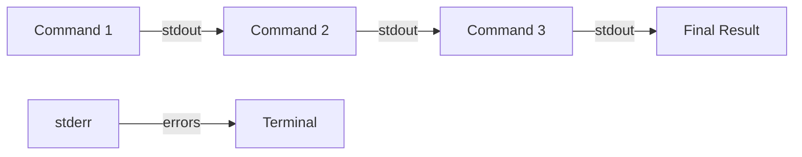
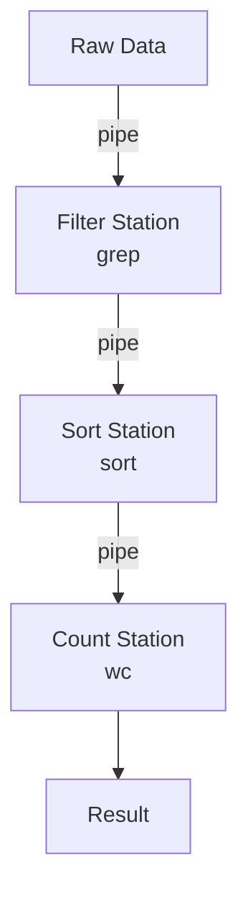

# Pipes and Redirection

> Pipes let you chain commands together. Redirection lets you send output to files instead of the screen. Together, they're what make the terminal truly powerful.

---

## What Is It?

- **Pipes (`|`)** - Send the output of one command as input to another
- **Redirection (`>`, `>>`, `<`)** - Send output to a file or read input from a file
- **Standard streams** - Three data channels: stdin (input), stdout (output), stderr (errors)

## Why Does It Exist?

Pipes and redirection turn simple commands into powerful workflows. Instead of doing everything in one command, you break it into small pieces and chain them together.



## Mental Model

Think of pipes as a **factory assembly line**:

1. Raw material goes in (input)
2. Each station processes it (command)
3. The result passes to the next station (pipe)
4. Final product comes out (output)



## When Should I Use It?

| Situation | Technique |
|-----------|-----------|
| Processing text output | Pipe to filter/transform |
| Saving command output | Redirect to file |
| Combining multiple commands | Chain with pipes |
| Logging output | Tee to file and screen |
| Reading input from file | Redirect from file |

## Cheat Sheet

### Standard Streams

| Stream | Name | File Descriptor | Purpose |
|--------|------|----------------|---------|
| stdin | Standard Input | 0 | Input to commands |
| stdout | Standard Output | 1 | Normal output |
| stderr | Standard Error | 2 | Error messages |

### Basic Redirection

| Operator | PowerShell | Bash | Description |
|----------|------------|------|-------------|
| `>` | `>` | `>` | Output to file (overwrite) |
| `>>` | `>>` | `>>` | Output to file (append) |
| `<` | `<` | `<` | Input from file |
| `2>` | `2>` | `2>` | Stderr to file |
| `&>` | `*>` | `&>` | Both stdout and stderr to file |
| `\|` | `\|` | `\|` | Pipe stdout to next command |

### Pipe Combinations

| Task | PowerShell | Bash |
|------|------------|------|
| Pipe output | `cmd1 \| cmd2` | `cmd1 \| cmd2` |
| Pipe + filter | `Get-Process \| Where CPU -gt 100` | `ps aux \| awk '$3>100'` |
| Save to file | `cmd > file.txt` | `cmd > file.txt` |
| Append to file | `cmd >> file.txt` | `cmd >> file.txt` |
| Discard output | `cmd > $null` | `cmd > /dev/null` |
| Show and save | `cmd \| Tee-Object file.txt` | `cmd \| tee file.txt` |
| Redirect stderr | `cmd 2> errors.txt` | `cmd 2> errors.txt` |

## Step-by-Step Workflow

### 1. Basic Pipe

```powershell
# PowerShell - Find large processes
Get-Process | Sort-Object CPU -Descending | Select-Object -First 10
```

```bash
# Bash - Find large processes
ps aux | sort -k3 -rn | head -10
```

### 2. Redirect to File

```powershell
# PowerShell - Save directory listing
Get-ChildItem -Recurse | Out-File listing.txt
```

```bash
# Bash - Save directory listing
ls -la > listing.txt
```

### 3. Pipe + Redirect

```powershell
# PowerShell - Save and display
Get-Process | Tee-Object processes.txt
```

```bash
# Bash - Save and display
ps aux | tee processes.txt
```

### 4. Redirect Errors

```powershell
# PowerShell - Separate errors from output
Get-ChildItem -Recurse 2> errors.txt
```

```bash
# Bash - Separate errors from output
find / -name "*.py" 2> errors.txt
```

### 5. Complex Pipeline

```powershell
# PowerShell - Log analysis
Get-Content server.log | Where-Object { $_ -match "ERROR" } | Group-Object { $_ -replace '.*\[(\w+)\].*','$1' } | Sort-Object Count -Descending
```

```bash
# Bash - Log analysis
grep "ERROR" server.log | awk '{print $4}' | sort | uniq -c | sort -rn
```

## Real Project Examples

### Analyze Web Server Logs

```bash
# Top 10 most visited pages
cat access.log | awk '{print $7}' | sort | uniq -c | sort -rn | head -10

# Requests per hour
awk '{print substr($4,14,2)}' access.log | sort | uniq -c

# Find 404 errors
awk '$9 == 404' access.log | awk '{print $7}' | sort | uniq -c | sort -rn
```

### Process CSV Data

```powershell
# PowerShell - Filter and transform CSV
Import-Csv data.csv | Where-Object { $_.Age -gt 18 } | Select-Object Name, Age | Export-Csv adults.csv
```

```bash
# Bash - Filter CSV
awk -F',' '$3 > 18 {print $1","$2","$3}' data.csv > adults.csv
```

### Build Pipeline

```powershell
# PowerShell - Build and test
Get-ChildItem "src" -Recurse -Filter "*.ts" | ForEach-Object { tsc $_.FullName }
```

```bash
# Bash - Find, compile, and test
find src/ -name "*.ts" | xargs tsc && npm test
```

### Monitor a Process

```bash
# Bash - Watch for a process
while true; do
    if ! pgrep -x "myapp" > /dev/null; then
        echo "$(date): myapp stopped, restarting..."
        ./start.sh
    fi
    sleep 5
done
```

## Best Practices

- **Use `tee` when you need both screen and file** - Don't redirect and then cat
- **Redirect stderr separately** - `2>` for errors, `>` for output
- **Discard output with `/dev/null` or `$null`** - Clean up unwanted output
- **Use `xargs` for command arguments** - Convert piped input to arguments
- **Break complex pipelines into scripts** - Readability matters
- **Test pipelines incrementally** - Run each part separately first

## Common Mistakes

| Mistake | Problem | Solution |
|---------|---------|----------|
| `>` instead of `>>` | Overwrites file | Use `>>` to append |
| Not quoting variable in pipe | Word splitting | Quote `"$var"` |
| Pipe to nothing | Output lost | Add a destination command |
| Forgetting stderr | Errors mixed with output | Redirect `2>` separately |
| `cat file \| grep` | Useless use of cat | Just `grep pattern file` |

## Troubleshooting

| Problem | Cause | Solution |
|---------|-------|----------|
| No output | Command output is stderr | Redirect `2>&1` to merge |
| File is empty | Overwrote with `>` | Use `>>` to append |
| "Broken pipe" | Reader closed before writer finished | Usually harmless, check command order |
| Unexpected results | Shell expansion in quotes | Use single quotes for literal strings |

## Related Topics

- [Text Processing](text-processing.md) - awk, sed, cut, and more
- [Searching](searching.md) - grep and pattern matching
- [PowerShell vs Bash](powershell-vs-bash.md) - Pipeline differences

## Further Learning

- [Pipes and Redirection](https://ryanstutorials.net/linuxtutorial/pipes.php) - Visual tutorial
- [I/O Redirection](https://tldp.org/LDP/abs/html/io-redirection.html) - Advanced Bash guide

---

## Personal Notes

> Add your own notes, reminders, and experiences here.
