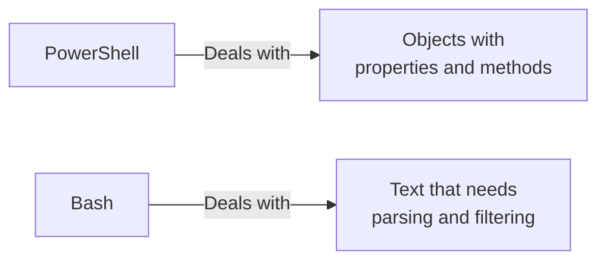
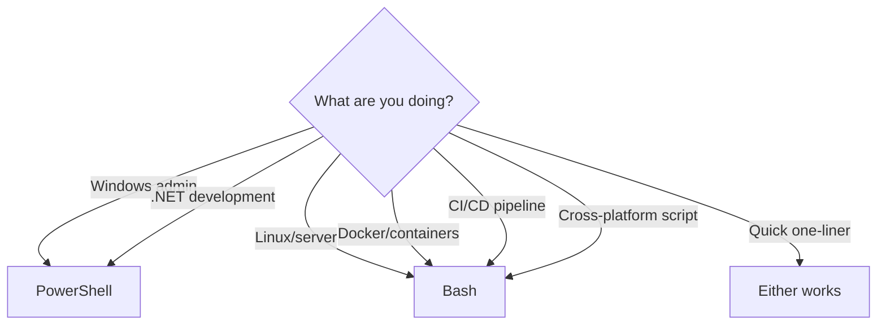

# PowerShell vs Bash

> A side-by-side comparison to help you translate between shells and choose the right one.

---

## What Is This Page?

A quick-reference comparison between PowerShell and Bash. Use this to:

- Translate commands from one shell to the other
- Understand the fundamental differences
- Decide which shell to use for a given task

## Why Does It Exist?

You'll encounter both shells constantly. Servers run Bash. Windows runs PowerShell. Docker uses Bash. CI/CD uses Bash. But Windows development often requires PowerShell. Knowing both is a superpower.

## Mental Model

| Concept | PowerShell | Bash |
|---------|------------|------|
| Philosophy | Objects and verbs | Text and flags |
| Data flows as | .NET objects | Plain text streams |
| Naming | Full verb-noun (`Get-ChildItem`) | Short abbreviations (`ls`) |
| Aliases exist | Yes (`ls` = `Get-ChildItem`) | N/A (commands are already short) |
| Config file | `Profile.ps1` | `.bashrc` / `.bash_profile` |
| Platform | Windows-first, cross-platform | Unix-first, runs everywhere |



## When Should I Use Each?



## Command Mapping

### Navigation

| Task | PowerShell | Bash | Notes |
|------|------------|------|-------|
| Current directory | `Get-Location` / `pwd` | `pwd` | Same concept |
| List files | `Get-ChildItem` / `ls` | `ls` | PowerShell: `-Force` for hidden |
| List all files | `Get-ChildItem -Force` | `ls -la` | |
| Change directory | `Set-Location` / `cd` | `cd` | Same concept |
| Go to home | `cd ~` | `cd ~` | |
| Go up one level | `cd ..` | `cd ..` | Same concept |
| Go to previous | `cd -` | `cd -` | Bash only |

### File Operations

| Task | PowerShell | Bash | Notes |
|------|------------|------|-------|
| Copy file | `Copy-Item src dest` | `cp src dest` | PowerShell: `-Recurse` for dirs |
| Move file | `Move-Item src dest` | `mv src dest` | Also renames |
| Rename file | `Rename-Item old new` | `mv old new` | |
| Delete file | `Remove-Item file` | `rm file` | PowerShell: `-Recurse` for dirs |
| Create directory | `New-Item -ItemType Dir -Path name` | `mkdir name` | |
| Delete directory | `Remove-Item -Recurse dir` | `rm -r dir` | |

### Reading/Writing Files

| Task | PowerShell | Bash | Notes |
|------|------------|------|-------|
| Read file | `Get-Content file` / `cat file` | `cat file` | |
| Write to file | `Set-Content file "text"` | `echo "text" > file` | `>` overwrites |
| Append to file | `Add-Content file "text"` | `echo "text" >> file` | `>>` appends |
| Read first lines | `Get-Content file -Head 10` | `head -n 10 file` | |
| Read last lines | `Get-Content file -Tail 10` | `tail -n 10 file` | |

### Searching

| Task | PowerShell | Bash | Notes |
|------|------------|------|-------|
| Find text in files | `Select-String "pattern" file` | `grep "pattern" file` | |
| Search recursively | `Select-String "pattern" -Path *.txt` | `grep -r "pattern" .` | |
| Find files by name | `Get-ChildItem -Recurse -Filter "*.py"` | `find . -name "*.py"` | |
| Find large files | `Get-ChildItem -Recurse \| Where Size -gt 100MB` | `find . -size +100M` | |

### Process Management

| Task | PowerShell | Bash | Notes |
|------|------------|------|-------|
| List processes | `Get-Process` | `ps aux` | |
| Kill process | `Stop-Process -Id PID` | `kill PID` | |
| Kill by name | `Stop-Process -Name "name"` | `killall name` | |
| Background job | `Start-Job { script }` | `command &` | Very different models |
| List jobs | `Get-Job` | `jobs` | |

### Environment Variables

| Task | PowerShell | Bash | Notes |
|------|------------|------|-------|
| Read variable | `$env:VAR_NAME` | `echo $VAR_NAME` | Different syntax |
| Set variable | `$env:VAR_NAME = "value"` | `export VAR_NAME="value"` | Bash needs `export` |
| List all | `Get-ChildItem Env:` | `env` or `printenv` | |
| PATH separator | `;` (semicolon) | `:` (colon) | Important difference |

### String Operations

| Task | PowerShell | Bash | Notes |
|------|------------|------|-------|
| Variable | `$name = "hello"` | `name="hello"` | No spaces around `=` in Bash |
| String length | `$name.Length` | `${#name}` | |
| Substring | `$name.Substring(0,3)` | `${name:0:3}` | |
| Replace | `$name -replace "llo"` | `${name/llo/}` | |
| Uppercase | `$name.ToUpper()` | `${name^^}` | Bash 4+ |

## Key Differences

### 1. Object vs Text Pipeline

**PowerShell:**
```powershell
Get-Process | Where-Object {$_.CPU -gt 100} | Select-Object Name, CPU
```

**Bash:**
```bash
ps aux | awk '$3 > 100 {print $11, $3}'
```

PowerShell returns objects with named properties. Bash returns text that needs to be parsed.

### 2. Error Handling

**PowerShell:**
```powershell
try {
    Get-Content "nonexistent.txt"
} catch {
    Write-Host "Error: $_"
}
```

**Bash:**
```bash
if ! file=$(cat nonexistent.txt 2>&1); then
    echo "Error: $file"
fi
```

### 3. Conditional Logic

**PowerShell:**
```powershell
if ($age -gt 18) { "Adult" } elseif ($age -gt 12) { "Teen" } else { "Child" }
```

**Bash:**
```bash
if [ $age -gt 18 ]; then echo "Adult"
elif [ $age -gt 12 ]; then echo "Teen"
else echo "Child"
fi
```

### 4. Loops

**PowerShell:**
```powershell
foreach ($file in Get-ChildItem "*.txt") {
    Write-Host $file.Name
}
```

**Bash:**
```bash
for file in *.txt; do
    echo "$file"
done
```

### 5. Path Separators

| | PowerShell | Bash |
|-|------------|------|
| Path separator | `\` (backslash) | `/` (forward slash) |
| Home directory | `$env:USERPROFILE` or `~` | `~` or `$HOME` |
| Root directory | `C:\` | `/` |

## Best Practices

- **Learn both** - You'll need both shells in your career
- **Use aliases interactively** - Full cmdlet names in scripts
- **Quote everything in Bash** - `"$var"` not `$var`
- **Use `-WhatIf` in PowerShell** - Test before executing
- **Install shellcheck** - Lint your Bash scripts
- **Use Windows Terminal** - Tab between PowerShell and WSL/Bash

## Common Mistakes

| Mistake | Problem | Solution |
|---------|---------|----------|
| Using Bash syntax in PowerShell | Won't work | Learn PowerShell's syntax |
| Forgetting `export` in Bash | Variable not visible to child processes | Use `export VAR=value` |
| Using `\` in Bash paths | Escapes the next character | Use `/` in Bash |
| PowerShell `;` vs Bash `;` | Different behavior with errors | PowerShell: use `;` or newlines |
| Mixing up `$env:VAR` and `$VAR` | Wrong variable access | `$env:VAR` for env vars, `$VAR` for script vars |

## Related Topics

- [PowerShell](powershell.md) - PowerShell deep dive
- [Bash](bash.md) - Bash deep dive
- [What Is a Terminal?](what-is-a-terminal.md) - Terminal fundamentals
- [Pipes and Redirection](pipes-and-redirection.md) - Data flow
- [Environment Variables](environment-variables.md) - System configuration

---

## Personal Notes

> Add your own notes, reminders, and experiences here.
