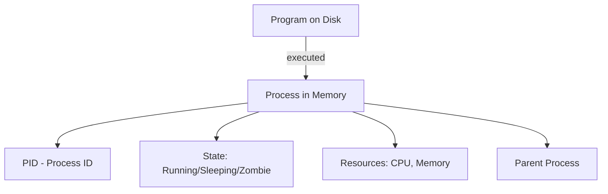

# Processes

> Understanding processes lets you see what's running, kill misbehaving programs, and manage background tasks.

---

## What Is It?

A **process** is a running instance of a program. Every time you open an application, run a command, or start a server, you create a process. Process management means viewing, controlling, and terminating these running programs.

## Why Does It Exist?

You need process management to:

- Find out what's using your CPU or memory
- Kill frozen or misbehaving applications
- Run tasks in the background while you keep working
- Monitor server health
- Debug resource issues

## Mental Model



Every process has:
- **PID** (Process ID) - Unique number identifying it
- **PPID** (Parent PID) - The process that started it
- **State** - Running, sleeping, stopped, zombie
- **Resources** - CPU time, memory, open files

## When Should I Use It?

| Situation | Action |
|-----------|--------|
| Computer is slow | Check what's using CPU/RAM |
| Program is frozen | Kill the process |
| Need to run something in background | Use `&` or `Start-Process` |
| Server monitoring | Watch processes over time |
| Port conflict | Find which process uses a port |

## Cheat Sheet

### View Processes

| Task | PowerShell | Bash |
|------|------------|------|
| List all processes | `Get-Process` | `ps aux` |
| List by name | `Get-Process -Name "chrome"` | `ps aux \| grep chrome` |
| Interactive viewer | `Get-Process \| Sort CPU -Desc` | `top` or `htop` |
| Tree view | `Get-CimInstance Win32_Process \| Select ProcessId, ParentProcessId` | `pstree` |
| By user | `Get-Process -IncludeUserName` | `ps aux \| grep $USER` |

### Control Processes

| Task | PowerShell | Bash |
|------|------------|------|
| Kill by PID | `Stop-Process -Id PID` | `kill PID` |
| Kill by name | `Stop-Process -Name "name"` | `killall name` |
| Force kill | `Stop-Process -Id PID -Force` | `kill -9 PID` |
| Send signal | `Stop-Process -Id PID` | `kill -SIGNAL PID` |
| Suspend | `Suspend-Process -Id PID` | `kill -STOP PID` |
| Resume | `Resume-Process -Id PID` | `kill -CONT PID` |

### Background Jobs

| Task | PowerShell | Bash |
|------|------------|------|
| Run in background | `Start-Job { script }` | `command &` |
| List jobs | `Get-Job` | `jobs` |
| Bring to foreground | `Receive-Job -Id 1` | `fg %1` |
| Suspend to background | `Suspend-Job -Id 1` | `Ctrl+Z` then `bg` |
| Stop job | `Stop-Job -Id 1` | `kill %1` |
| Wait for job | `Wait-Job -Id 1` | `wait` |

## Step-by-Step Workflow

### 1. See What's Running

```powershell
# PowerShell - All processes sorted by CPU
Get-Process | Sort-Object CPU -Descending | Select-Object -First 20 Name, CPU, Id
```

```bash
# Bash - Interactive process viewer
top

# Or with more detail
ps aux --sort=-%cpu | head -20
```

### 2. Find a Specific Process

```powershell
# PowerShell
Get-Process -Name "code"
# or
Get-Process | Where-Object { $_.Name -like "*code*" }
```

```bash
# Bash
ps aux | grep "code"
# or better
pgrep -a "code"
```

### 3. Kill a Frozen Process

```powershell
# PowerShell
Stop-Process -Name "notepad" -Force
```

```bash
# Bash - graceful first
kill $(pgrep notepad)

# If it doesn't respond
kill -9 $(pgrep notepad)
```

### 4. Run Something in Background

```powershell
# PowerShell
Start-Job { 
    Start-Sleep -Seconds 30
    "Task complete" | Out-File result.txt
}
Get-Job  # Check status
Receive-Job -Id 1  # Get results
```

```bash
# Bash
long_command &
echo $!  # Get PID of background process
wait  # Wait for all background jobs
```

### 5. Monitor a Process Over Time

```powershell
# PowerShell - Watch CPU usage
while ($true) {
    Get-Process -Name "myapp" | Select-Object CPU, WorkingSet64
    Start-Sleep -Seconds 5
}
```

```bash
# Bash - Watch CPU usage
while true; do
    ps -p $(pgrep myapp) -o %cpu,%mem,etime
    sleep 5
done
```

## Real Project Examples

### Find What's Using a Port

```powershell
# PowerShell
Get-NetTCPConnection -LocalPort 3000 | Select-Object OwningProcess | ForEach-Object { Get-Process -Id $_.OwningProcess }
```

```bash
# Bash
lsof -i :3000
# or
ss -tlnp | grep :3000
```

### Kill All Node Processes

```powershell
# PowerShell
Get-Process -Name "node" -ErrorAction SilentlyContinue | Stop-Process -Force
```

```bash
# Bash
pkill -f node
# or
killall node
```

### Monitor System Resources

```powershell
# PowerShell - Top memory consumers
Get-Process | Sort-Object WorkingSet64 -Descending | Select-Object -First 10 Name, @{N="MB";E={[math]::Round($_.WorkingSet64/1MB)}}
```

```bash
# Bash - Top memory consumers
ps aux --sort=-%mem | head -11
```

### Run Command with Timeout

```bash
# Bash - Kill if running more than 10 seconds
timeout 10 long_running_command
```

## Best Practices

- **Try `kill` before `kill -9`** - Graceful shutdown first, force as last resort
- **Use `pgrep` instead of `ps | grep`** - Cleaner, more reliable
- **Check before killing** - Make sure you're killing the right process
- **Use `top`/`htop` interactively** - Best for real-time monitoring
- **Background jobs for long tasks** - Don't block your terminal

## Common Mistakes

| Mistake | Problem | Solution |
|---------|---------|----------|
| `kill -9` first | Doesn't give process time to clean up | Try `kill` (SIGTERM) first |
| Killing wrong PID | Wrong process dies | Always verify with `ps` |
| Forgetting `&` | Command blocks terminal | Add `&` to run in background |
| Not checking exit codes | Silent failures | Check `$?` (Bash) or `$LASTEXITCODE` (PS) |
| Zombie processes | Resources not released | Kill the parent process |

## Troubleshooting

| Problem | Cause | Solution |
|---------|-------|----------|
| "Access denied" | Not your process or need admin | Run as administrator |
| Can't kill process | Process is a zombie or kernel thread | Kill parent process |
| Process respawning | Watchdog or service restarting it | Stop the service |
| High CPU but no process | Interrupt or kernel issue | Check `dmesg` / Event Viewer |

## Related Topics

- [Networking](networking.md) - Network-related processes
- [Environment Variables](environment-variables.md) - Process environment

## Further Learning

- [Linux Process Management](https://www.thegeekstuff.com/2012/03/linux-process-management/) - Comprehensive guide
- [htop](https://htop.dev/) - Better top replacement
- [Windows Process Explorer](https://learn.microsoft.com/en-us/sysinternals/downloads/process-explorer) - Advanced Windows process viewer

---

## Personal Notes

> Add your own notes, reminders, and experiences here.
