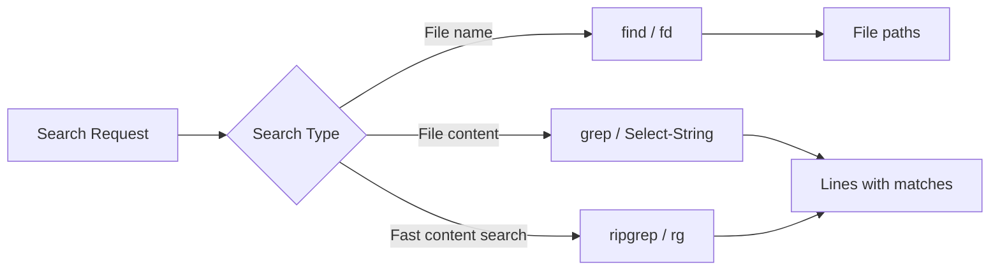

# Searching

> Finding files by name and content is one of the most common terminal tasks. Master these tools and you'll never hunt through folders again.

---

## What Is It?

Searching in the terminal means two things:

1. **Finding files** by name, type, size, or date
2. **Finding text** inside files by pattern or regex

## Why Does It Exist?

GUI search is slow for large projects. Terminal search tools are:

- **Fast** - `ripgrep` searches thousands of files in milliseconds
- **Precise** - Regular expressions let you find exactly what you need
- **Composable** - Results can be piped to other commands
- **Scriptable** - Automate search-and-replace workflows

## Mental Model



## Cheat Sheet

### Find Files by Name

| Task | PowerShell | Bash | Notes |
|------|------------|------|-------|
| Find file by name | `Get-ChildItem -Recurse -Filter "*.py"` | `find . -name "*.py"` | |
| Find exact name | `Get-ChildItem -Recurse -Filter "config.json"` | `find . -name "config.json"` | |
| Find by extension | `Get-ChildItem -Recurse -Filter "*.log"` | `find . -name "*.log"` | |
| Find directories only | `Get-ChildItem -Recurse -Directory -Filter "src"` | `find . -type d -name "src"` | |
| Find files only | `Get-ChildItem -Recurse -File` | `find . -type f` | |
| Find large files | `Where-Object { $_.Length -gt 10MB }` | `find . -size +10M` | |
| Find recent files | `Where-Object { $_.LastWriteTime -gt (Get-Date).AddDays(-1) }` | `find . -mtime -1` | |

### Find Files (Modern Tools)

| Task | fd (Bash) | Notes |
|------|-----------|-------|
| Find by name | `fd "*.py"` | Respects `.gitignore` |
| Find by type | `fd -t f` (file) / `fd -t d` (dir) | |
| Find by extension | `fd -e py` | |
| Find with size | `fd -S +10M` | |

### Find Text in Files

| Task | PowerShell | Bash | Notes |
|------|------------|------|-------|
| Search file | `Select-String "pattern" file.txt` | `grep "pattern" file.txt` | |
| Search all files | `Select-String "pattern" -Path *.txt` | `grep "pattern" *.txt` | |
| Search recursively | `Get-ChildItem -Recurse \| Select-String "pattern"` | `grep -r "pattern" .` | |
| Case insensitive | `-CaseSensitive:$false` | `grep -i "pattern"` | |
| Whole word | `-WholeWord` | `grep -w "pattern"` | |
| Invert match | `-NotMatch` | `grep -v "pattern"` | |
| Show line numbers | `-LineNumber` | `grep -n "pattern"` | |
| Count matches | `(Select-String "pattern").Count` | `grep -c "pattern"` | |
| Show context | `-Context 2` | `grep -C 2 "pattern"` | 2 lines before/after |

### Fast Content Search (Modern Tools)

| Task | ripgrep (rg) | Notes |
|------|-------------|-------|
| Basic search | `rg "pattern"` | Respects `.gitignore`, very fast |
| Recursive | `rg "pattern" .` | |
| Case insensitive | `rg -i "pattern"` | |
| File types | `rg -t py "pattern"` | Only search Python files |
| Exclude types | `rg -T js "pattern"` | Skip JavaScript files |
| Count | `rg -c "pattern"` | |
| Files with matches | `rg -l "pattern"` | Only show filenames |
| Replace | `rg "old" -r "new"` | Dry-run by default |
| With line numbers | `rg -n "pattern"` | |

## Step-by-Step Workflow

### 1. Find a File You Lost

```bash
# Bash - find by name
find . -name "config.json"

# fd - faster, respects .gitignore
fd config.json
```

```powershell
# PowerShell
Get-ChildItem -Recurse -Filter "config.json"
```

### 2. Search for Text in a Project

```bash
# Basic grep
grep -r "TODO" .

# ripgrep - faster, cleaner output
rg "TODO"
```

```powershell
# PowerShell
Get-ChildItem -Recurse -File | Select-String "TODO"
```

### 3. Find Files Modified Today

```bash
# Bash
find . -type f -mtime -1

# fd
fd --changed-within 1d
```

### 4. Find and Replace Across Files

```bash
# grep to find, sed to replace
grep -rl "old_function" --include="*.py" . | xargs sed -i 's/old_function/new_function/g'

# ripgrep (safer, shows what would change)
rg "old_function" -t py -l | xargs sed -i 's/old_function/new_function/g'
```

### 5. Find Large Files Taking Disk Space

```bash
# Bash
find . -type f -size +100M -exec ls -lh {} \; | awk '{print $5, $9}'

# PowerShell
Get-ChildItem -Recurse -File | Where-Object { $_.Length -gt 100MB } | Select-Object @{N="MB";E={[math]::Round($_.Length/1MB)}}, FullName
```

## Real Project Examples

### Find All TODOs in a Project

```bash
rg "TODO|FIXME|HACK|XXX" --type-not lock -n
```

### Find Unused Imports in Python

```bash
# Find imports
rg "^import |^from " -t py -n

# Cross-reference with usage
rg "os\." -t py -c  # Check if 'os' is actually used
```

### Find Configuration Files

```bash
# Find all config files
fd -e json -e yaml -e yml -e toml -e ini -e env

# Find hidden config files
fd -H "\.env|\.gitignore|\.eslintrc"
```

### Search Logs for Errors

```bash
# Search last hour of logs
rg "ERROR|FATAL|Exception" /var/log/app/ --sort modified

# Search with context
rg "Error" app.log -C 3
```

## Best Practices

- **Use `ripgrep` (`rg`) when possible** - Faster than grep, respects `.gitignore`
- **Use `fd` instead of `find`** - Faster, more intuitive syntax
- **Quote your patterns** - `"my pattern"` not `my pattern`
- **Use `-r` for recursive** - Always search recursively unless you mean not to
- **Combine tools** - `fd | xargs rg` for powerful workflows
- **Use `--include` / `-t`** - Limit search to specific file types

## Common Mistakes

| Mistake | Problem | Solution |
|---------|---------|----------|
| Not quoting patterns | Shell interprets special chars | Always quote: `grep "pattern"` |
| Searching binary files | Garbage output | Add `-I` to grep, `-t` to rg |
| Searching node_modules | Slow, noisy results | Use tools that respect `.gitignore` |
| Using `grep` for large projects | Slow | Switch to `ripgrep` |
| Forgetting `-r` | Only searches one file | Add `-r` for recursive search |

## Troubleshooting

| Problem | Cause | Solution |
|---------|-------|----------|
| "No matches found" | Pattern doesn't exist | Check spelling, try broader pattern |
| "Permission denied" | Can't read some directories | Use `2>/dev/null` to suppress errors |
| Too many results | Pattern too broad | Add file type filter or narrow pattern |
| Slow search | Searching binary or generated files | Exclude with `-t` or `--exclude` |

## Related Topics

- [Text Processing](text-processing.md) - Processing search results
- [Pipes and Redirection](pipes-and-redirection.md) - Piping search results
- [File Management](file-management.md) - File operations

## Further Learning

- [ripgrep Manual](https://burntsushi.net/ripgrep/) - Fast grep replacement
- [fd GitHub](https://github.com/sharkdp/fd) - User-friendly find alternative
- [Regular Expressions 101](https://regex101.com/) - Test regex patterns

---

## Personal Notes

> Add your own notes, reminders, and experiences here.
