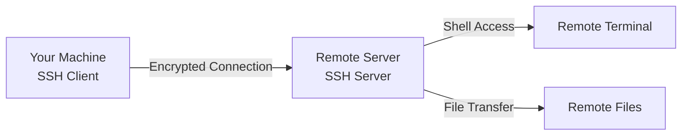

# SSH

> SSH (Secure Shell) lets you securely connect to remote machines. It's how you manage servers, deploy code, and work on remote development environments.

---

## What Is It?

SSH is a protocol for secure remote access. It encrypts all communication between your computer and the remote machine, so passwords and data can't be intercepted.

| Component | What It Does |
|-----------|-------------|
| **SSH client** | Runs on your machine, initiates connection |
| **SSH server** | Runs on remote machine, accepts connections |
| **Key pair** | Public key (lock) + Private key (key) for authentication |

## Why Does It Exist?

- **Remote servers** - Most servers don't have GUIs
- **Security** - Encrypted communication
- **Port forwarding** - Tunnel traffic through SSH
- **Git operations** - Authenticate with GitHub/GitLab
- **Dev Containers** - Connect to remote dev environments

## Mental Model



SSH creates a secure tunnel. Everything you type is encrypted, sent to the server, executed, and the results are sent back encrypted.

## When Should I Use It?

| Use SSH When | Use Something Else When |
|-------------|----------------------|
| Managing a remote server | Remote desktop (full GUI needed) |
| Running commands on a VPS | Copying files (use SCP/SFTP) |
| Git push/pull over SSH | Web-based terminals |
| Tunneling through a firewall | Local development |

## Cheat Sheet

### Basic Connection

| Task | Command | Description |
|------|---------|-------------|
| Connect to server | `ssh user@host` | Basic connection |
| Connect on port | `ssh -p 2222 user@host` | Custom port |
| Run command and exit | `ssh user@host "command"` | Remote execution |

### Key Management

| Task | Command | Description |
|------|---------|-------------|
| Generate key pair | `ssh-keygen -t ed25519` | Create new key |
| Copy key to server | `ssh-copy-id user@host` | Install public key |
| List keys | `ls ~/.ssh/` | View key files |
| Change passphrase | `ssh-keygen -p -f ~/.ssh/id_ed25519` | Update key password |

### SSH Config

| Task | Command | Description |
|------|---------|-------------|
| Edit config | `nano ~/.ssh/config` | Configure hosts |
| Test config | `ssh -G hostname` | Show resolved config |

### File Transfer (SCP)

| Task | Command | Description |
|------|---------|-------------|
| Upload file | `scp file user@host:/path/` | Local to remote |
| Download file | `scp user@host:/path/file .` | Remote to local |
| Upload directory | `scp -r dir/ user@host:/path/` | Recursive copy |
| Download directory | `scp -r user@host:/path/dir/ .` | Recursive download |

## Step-by-Step Workflow

### 1. Generate SSH Keys

```bash
# Generate a key pair (Ed25519 is recommended)
ssh-keygen -t ed25519 -C "your_email@example.com"

# Accept defaults, or specify path:
# Enter file in which to save (~/.ssh/id_ed25519):
# Enter passphrase (empty for no passphrase):
```

### 2. Copy Public Key to Server

```bash
# This adds your key to the server's authorized_keys
ssh-copy-id user@remote-server.com

# You'll enter your password one last time
```

### 3. Connect Without Password

```bash
ssh user@remote-server.com
# Should connect without asking for password
```

### 4. Set Up SSH Config

```bash
# Edit ~/.ssh/config
Host myserver
    HostName 192.168.1.100
    User admin
    Port 22
    IdentityFile ~/.ssh/id_ed25519

Host github.com
    HostName github.com
    User git
    IdentityFile ~/.ssh/id_ed25519
```

Now you can just type:
```bash
ssh myserver
```

### 5. Transfer Files

```bash
# Upload a file
scp ./myfile.txt myserver:/home/admin/

# Download a file
scp myserver:/var/log/app.log ./

# Upload a folder
scp -r ./myproject/ myserver:/home/admin/projects/
```

## Real Project Examples

### Deploy to Server

```bash
# Upload build
scp -r ./dist/ myserver:/var/www/html/

# Restart service
ssh myserver "sudo systemctl restart nginx"
```

### Git over SSH

```bash
# Set up SSH key for GitHub
ssh-keygen -t ed25519 -C "your_email@example.com"
# Copy to GitHub: Settings > SSH Keys > Add

# Clone over SSH
git clone git@github.com:user/repo.git
```

### SSH Tunnel for Database

```bash
# Access remote database locally
ssh -L 5432:localhost:5432 user@db-server

# Now connect locally to localhost:5432
psql -h localhost -p 5432 -U dbuser dbname
```

### Remote Port Forwarding

```bash
# Share local dev server to the internet
ssh -R 8080:localhost:3000 user@public-server
# Now public-server:8080 -> your localhost:3000
```

## Best Practices

- **Use Ed25519 keys** - More secure than RSA, smaller key size
- **Use SSH config** - Saves time typing full connections
- **Always use key authentication** - Disable password auth on servers
- **Set a passphrase on keys** - Protects if private key is compromised
- **Use `~/.ssh/config`** - Configure hosts for quick access

## Common Mistakes

| Mistake | Problem | Solution |
|---------|---------|----------|
| No passphrase on key | Anyone with your key gets access | Set a passphrase |
| Sharing private key | Security breach | Never share `id_ed25519`, only `id_ed25519.pub` |
| Wrong file permissions | SSH refuses to use key | `chmod 600 ~/.ssh/id_ed25519` |
| Not using SSH config | Long, error-prone commands | Set up `~/.ssh/config` |

## Troubleshooting

| Problem | Cause | Solution |
|---------|-------|----------|
| "Permission denied (publickey)" | Key not installed on server | Run `ssh-copy-id` |
| "Host key verification failed" | Server's key changed | `ssh-keygen -R hostname` |
| "Connection timed out" | Firewall or wrong port | Check firewall, try `-p 2222` |
| "Too many authentication failures" | Multiple keys tried | Use `-v` to debug, specify key with `-i` |
| "Warning: Identity file not accessible" | Wrong permissions | `chmod 600 ~/.ssh/id_ed25519` |

## Related Topics

- [Networking](networking.md) - Network fundamentals
- [File Management](file-management.md) - Local file operations

## Further Learning

- [SSH Wiki](https://en.wikipedia.org/wiki/SSH_(Protocol)) - How SSH works
- [SSh Config Manual](https://man.openbsd.org/ssh_config) - All config options
- [SSH Tunneling](https://www.ssh.com/academy/ssh/tunneling) - Port forwarding guide

---

## Personal Notes

> Add your own notes, reminders, and experiences here.
