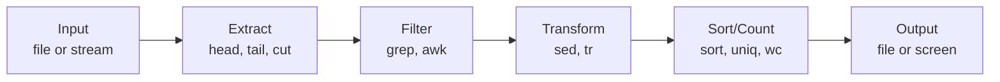

# Text Processing

> The terminal has powerful tools for reading, transforming, and analyzing text files. These tools are the building blocks of data processing pipelines.

---

## What Is It?

Text processing means manipulating text files from the command line: reading contents, extracting parts, transforming data, and generating output. Tools like `cat`, `head`, `tail`, `sort`, `awk`, `cut`, and `sed` are the workhorses.

## Why Does It Exist?

Many development tasks involve text: log files, configuration files, CSV data, source code, API responses. Text processing tools let you:

- Quickly inspect files
- Extract specific data
- Transform formats
- Generate reports
- Automate repetitive text tasks

## Mental Model

Think of text processing as a **pipeline** where each tool does one thing well:



## Cheat Sheet

### Reading Files

| Task | PowerShell | Bash | Description |
|------|------------|------|-------------|
| Read entire file | `Get-Content file` | `cat file` | Display all contents |
| First N lines | `Get-Content file -Head 10` | `head -n 10 file` | First 10 lines |
| Last N lines | `Get-Content file -Tail 10` | `tail -n 10 file` | Last 10 lines |
| Follow file (live) | `Get-Content file -Wait` | `tail -f file` | Watch for changes |
| Count lines | `(Get-Content file).Count` | `wc -l file` | Number of lines |
| Count words | `(Get-Content file -Raw -Split '\s+').Count` | `wc -w file` | Number of words |
| Count chars | `(Get-Content file -Raw).Length` | `wc -m file` | Number of characters |

### Extracting Columns

| Task | PowerShell | Bash | Description |
|------|------------|------|-------------|
| Select columns | `ForEach-Object { $_.Split(',')[0] }` | `cut -d',' -f1` | First column of CSV |
| Multiple columns | | `cut -d',' -f1,3` | Columns 1 and 3 |
| Character positions | | `cut -c1-10` | First 10 characters |
| By delimiter | | `cut -d':' -f1` | Split on colon, take first |

### Sorting and Counting

| Task | PowerShell | Bash | Description |
|------|------------|------|-------------|
| Sort lines | `Sort-Object` | `sort` | Alphabetical sort |
| Sort numerically | `Sort-Object { [int]$_ }` | `sort -n` | Numeric sort |
| Sort reverse | `Sort-Object -Descending` | `sort -r` | Reverse order |
| Unique lines | `Unique` | `uniq` | Remove duplicates |
| Count occurrences | `Group-Object \| Sort Count` | `sort \| uniq -c` | Count duplicates |
| Sort by count | | `sort \| uniq -c \| sort -rn` | Most common first |

### Text Transformation

| Task | PowerShell | Bash | Description |
|------|------------|------|-------------|
| Replace text | `-replace 'old','new'` | `sed 's/old/new/g'` | Find and replace |
| Upper/lower case | `.ToUpper()` / `.ToLower()` | `tr '[:lower:]' '[:upper:]'` | Case conversion |
| Remove whitespace | `.Trim()` | `tr -d ' '` | Delete spaces |
| Split and join | `-split ','` / `-join ','` | `tr ',' '\n'` | Convert formats |

### Advanced (awk)

| Task | Bash | Description |
|------|------|-------------|
| Print column | `awk '{print $1}'` | First column |
| Print with separator | `awk -F',' '{print $1}'` | CSV first column |
| Conditional | `awk '$3 > 100'` | Filter by column value |
| Compute | `awk '{sum+=$1} END {print sum}'` | Sum a column |
| Custom format | `awk '{print $1 ":" $2}'` | Format output |

## Step-by-Step Workflow

### 1. Inspect a Log File

```bash
# See how many lines
wc -l app.log

# See the last 20 lines
tail -n 20 app.log

# Watch for new entries
tail -f app.log
```

```powershell
# PowerShell
(Get-Content app.log).Count
Get-Content app.log -Tail 20
Get-Content app.log -Wait
```

### 2. Extract Data from CSV

```bash
# Get first column (names)
cut -d',' -f1 data.csv

# Get name and age (columns 1 and 3)
cut -d',' -f1,3 data.csv

# Skip header, get columns
tail -n +2 data.csv | cut -d',' -f1,3
```

### 3. Count Occurrences

```bash
# Count unique IP addresses in a log
awk '{print $1}' access.log | sort | uniq -c | sort -rn

# Count lines per file type in a project
find . -type f | sed 's/.*\.//' | sort | uniq -c | sort -rn
```

### 4. Transform Data

```bash
# Convert CSV to simple list
awk -F',' '{print $1 " is " $3 " years old"}' people.csv

# Extract timestamps from log
grep "ERROR" app.log | awk '{print $1, $2}'
```

### 5. Search and Replace

```bash
# Replace in a file (creates new file)
sed 's/old_function/new_function/g' script.py > new_script.py

# In-place replace
sed -i 's/old_function/new_function/g' script.py
```

```powershell
# PowerShell
(Get-Content script.py) -replace 'old_function','new_function' | Set-Content new_script.py
```

## Real Project Examples

### Analyze Git Log

```bash
# Commits per author
git log --pretty=format:"%an" | sort | uniq -c | sort -rn

# Most active files
git log --pretty=format:"" --name-only | sort | uniq -c | sort -rn | head -20

# Commits per month
git log --pretty=format:"%ad" --date=format:"%Y-%m" | sort | uniq -c
```

### Parse JSON from API

```bash
# Using jq (install separately)
curl -s https://api.example.com/data | jq '.results[] | {name: .name, score: .score}'

# Without jq - extract a field
curl -s https://api.example.com/data | grep -o '"name":"[^"]*"'
```

### Generate a Report

```bash
# Count lines of code by language
find . -type f \( -name "*.py" -o -name "*.js" -o -name "*.ts" \) | \
    while read f; do
        ext="${f##*.}"
        lines=$(wc -l < "$f")
        echo "$lines $ext"
    done | sort -rn | awk '{a[$2]+=$1} END {for(k in a) print a[k], k}'
```

### Extract Email Addresses from Text

```bash
grep -oE '[a-zA-Z0-9._%+-]+@[a-zA-Z0-9.-]+\.[a-zA-Z]{2,}' file.txt | sort -u
```

## Best Practices

- **Use `head` and `tail` to limit output** - Don't dump entire large files
- **Chain tools with pipes** - Small tools, big results
- **Use `uniq` only after `sort`** - `uniq` only removes adjacent duplicates
- **Prefer `awk` over complex grep+sed** - awk handles columns natively
- **Use `wc -l` before processing** - Know how much data you're dealing with

## Common Mistakes

| Mistake | Problem | Solution |
|---------|---------|----------|
| `uniq` without `sort` | Only removes adjacent duplicates | Pipe through `sort` first |
| `sed -i` without backup | Modifies original file | Use `sed -i.bak` for backup |
| Forgetting `-n` with `head` | Different behavior across versions | Use `head -n 10` |
| Not quoting patterns | Shell expansion | Use single quotes: `'pattern'` |
| Processing huge files | Memory issues | Use streaming tools (awk, grep) |

## Related Topics

- [Searching](searching.md) - Finding files and content
- [Pipes and Redirection](pipes-and-redirection.md) - Data flow
- [PowerShell vs Bash](powershell-vs-bash.md) - Command differences

## Further Learning

- [AWK Tutorial](https://www.gnu.org/software/gawk/manual/gawk.html) - Official gawk manual
- [Sed Tutorial](https://www.gnu.org/software/sed/manual/sed.html) - Official sed manual
- [jq Play](https://jqplay.org/) - Interactive jq playground
- [Explain Shell](https://explainshell.com/) - Paste a command, get explanation

---

## Personal Notes

> Add your own notes, reminders, and experiences here.
