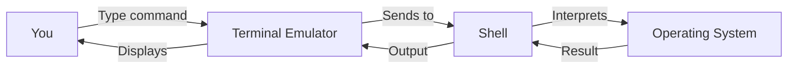
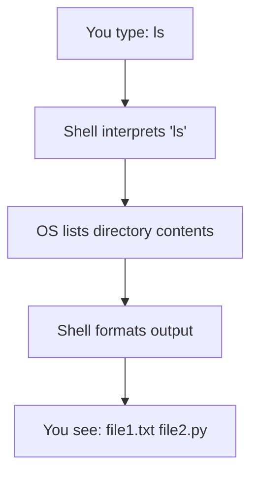

# What Is a Terminal?

> The terminal is your text-based interface to the computer. It's faster, more precise, and more powerful than clicking through menus.

---

## What Is It?

A terminal (also called a console, shell, or command line) is a text-based interface where you type commands and the computer responds with text output. Instead of clicking icons and buttons, you communicate with the computer by typing instructions.

The terminal consists of three layers:

| Layer | What It Is | Examples |
|-------|-----------|----------|
| **Terminal emulator** | The window that displays text | Windows Terminal, iTerm2, GNOME Terminal |
| **Shell** | The program that interprets your commands | PowerShell, Bash, Zsh |
| **Operating system** | The kernel that executes the commands | Windows, macOS, Linux |



## Why Does It Exist?

The terminal exists because:

1. **Speed** - Typing a command is faster than navigating menus
2. **Precision** - Exact control over what happens
3. **Automation** - Commands can be scripted and repeated
4. **Remote access** - You can control machines anywhere in the world
5. **Power** - Some tasks can *only* be done from the terminal
6. **Development** - Compilers, package managers, Git, and most dev tools are terminal-first

## Mental Model

Think of the terminal as a **conversation** with your computer:

- **You** type a command (a sentence in the computer's language)
- **The computer** responds with output (the answer)
- **The shell** is the interpreter that translates between you and the OS



The **current directory** (also called working directory) is like your "location" in the file system. Commands operate on this location unless you specify otherwise.

## When Should I Use It?

Use the terminal when you:

| Situation | Why Terminal is Better |
|-----------|----------------------|
| Installing software | Package managers are terminal-first |
| Using Git | Git is designed for the terminal |
| Running scripts | Scripts execute in the terminal |
| Remote servers | SSH is a terminal tool |
| Automating tasks | Shell scripts automate workflows |
| Debugging | Logs and diagnostics are terminal-friendly |
| Working with data | Command-line tools process data faster |
| Development | Compilers, linters, and test runners live here |

### When GUI is Fine

- Browsing the web
- Editing images/video
- Reading documents
- Casual file management

## Getting Started

### Opening a Terminal

**Windows:**
- Press `Win + X`, then select "Terminal" or "Windows PowerShell"
- Or press `Win + R`, type `powershell`, press Enter
- Or search "Windows Terminal" in the Start menu

**macOS:**
- Press `Cmd + Space`, type "Terminal", press Enter
- Or find Terminal in Applications > Utilities

**Linux:**
- Press `Ctrl + Alt + T` (most distributions)
- Or find Terminal in your applications menu

### Your First Commands

```powershell
# See where you are
pwd

# See what's here
ls

# Go somewhere
cd Documents

# Come back
cd ..
```

```bash
# See where you are
pwd

# See what's here
ls

# Go somewhere
cd Documents

# Come back
cd ..
```

## Key Concepts

### Paths

A **path** is the address of a file or folder:

| Type | Example | Description |
|------|---------|-------------|
| Absolute | `/home/user/file.txt` | Full path from root |
| Relative | `Documents/file.txt` | Path from current directory |
| Parent | `../file.txt` | One directory up |
| Home | `~/file.txt` | From your home directory |

### Commands vs Arguments vs Flags

```bash
command --flag argument
#      ^       ^
#      |       |
#      |       What to operate on
#      How to modify the command
```

Example:
```bash
ls -la Documents/
# |  |  |
# |  |  Which directory
# |  Long format + show hidden files
# List files
```

### The Prompt

The text before your cursor is the **prompt**. It usually shows:

```
username@computer:current-directory$
```

In PowerShell:
```
PS C:\Users\you\current-directory>
```

## Common Mistakes

| Mistake | Problem | Solution |
|---------|---------|----------|
| Typing the wrong path | "No such file or directory" | Use `ls` / `dir` to check what exists |
| Forgetting you're in the wrong directory | Commands affect wrong files | Always check with `pwd` |
| Mixing up slash directions | `\` vs `/` between Windows and Unix | Use the right one for your OS |
| Not quoting paths with spaces | Shell interprets spaces as separators | Use `"path with spaces"` |

## Related Topics

- [Navigation](navigation.md) - Moving around the file system
- [PowerShell](powershell.md) - Windows shell deep dive
- [Bash](bash.md) - Unix/Linux shell deep dive
- [PowerShell vs Bash](powershell-vs-bash.md) - Side-by-side comparison
- [Environment Variables](environment-variables.md) - System configuration

## Further Learning

- [The Linux Command Line](https://linuxcommand.org/tlcl.php) - Free book, excellent for beginners
- [MIT Missing Semester](https://missing.csail.mit.edu/) - Covers the tools they don't teach in CS classes
- [PowerShell Documentation](https://learn.microsoft.com/en-us/powershell/) - Official Microsoft docs
- [GNU Bash Manual](https://www.gnu.org/software/bash/manual/) - Official Bash reference

---

## Personal Notes

> Add your own notes, reminders, and experiences here.
