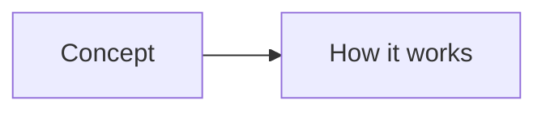
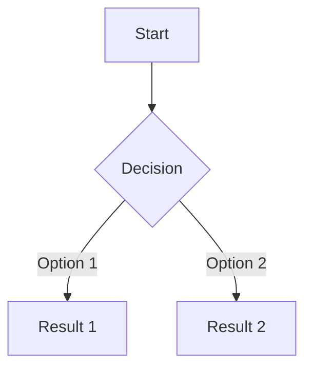

# Style Guide

This document defines the canonical formatting rules for all pages in the Developer Handbook. Every page must follow these standards.

---

## File Structure

### Naming Conventions

- **Files:** `lowercase-with-hyphens.md` (e.g., `powershell-vs-bash.md`)
- **Folders:** `XX-topic-name/` with two-digit prefix (e.g., `02-terminal/`)
- **Section READMEs:** Always `README.md` inside each section folder
- **Templates:** `lowercase-with-hyphens.md` inside `00-templates/`

### Folder Numbering

| Prefix | Section |
|--------|---------|
| `00` | Templates |
| `01` | Foundations |
| `02` | Terminal |
| `03` | Git |
| `04` | GitHub |
| `05` | Editors |
| `06` | Programming Languages |
| `07` | Package Managers |
| `08` | Virtual Environments |
| `09` | AI Development |
| `10` | Software Architecture |
| `11` | Project Management |
| `12` | Testing |
| `13` | Deployment |
| `14` | Game Development |
| `15` | Machine Learning |
| `16` | Hackathons & Game Jams |
| `17` | Developer Wisdom |
| `18` | Cheat Sheets |

---

## Heading Structure

```markdown
# Page Title

## Major Section

### Subsection

#### Rarely Used Sub-subsection
```

- `#` = Page title (one per file, H1)
- `##` = Major sections (What is it, Why does it exist, etc.)
- `###` = Subsections within a major section
- `####` = Rarely needed, avoid if possible

---

## Canonical Page Template

Every content page should include these sections when appropriate:

```markdown
# Page Title

Brief one-line description of what this page covers.

> **Related:** [Link to related page](../XX-section/related-page.md)

---

## What Is It?

Clear, concise definition. No jargon without explanation.

## Why Does It Exist?

The problem it solves. The motivation behind it.

## Mental Model

How to think about this concept. Use analogies.



## When Should I Use It?

Decision criteria. Include a decision tree when multiple options exist.

## Cheat Sheet

Quick reference table of the most important information.

| Command | Description | Example |
|---------|-------------|---------|
| `cmd` | Does something | `cmd --flag` |

## Step-by-Step Workflow

Numbered steps for common tasks.

1. **Step one** - Description
2. **Step two** - Description

## Real Project Examples

Concrete examples from real-world usage.

```bash
# Example: Setting up a project
command --flag
```

## Best Practices

- Do this
- Avoid that
- Prefer this over that

## Common Mistakes

> **Warning:** Common pitfall description and how to avoid it.

| Mistake | Problem | Solution |
|---------|---------|----------|
| Doing X | Causes Y | Do Z instead |

## Troubleshooting

| Problem | Cause | Solution |
|---------|-------|----------|
| Error message | Why it happens | How to fix |

## Related Topics

- [Related Page 1](../XX-section/page1.md) - Why it's related
- [Related Page 2](../XX-section/page2.md) - Why it's related

## Further Learning

- [Resource Name](URL) - Brief description

---

## Personal Notes

> Add your own notes, reminders, and experiences here.
```

---

## Markdown Formatting Rules

### Code Blocks

- Always specify the language for syntax highlighting
- Use triple backticks with language identifier

````markdown
```powershell
Get-Command
```

```bash
ls -la
```

```python
print("hello")
```
````

- Use `plaintext` or `text` for output that isn't code
- Use `console` or `shell` for generic terminal sessions

### Inline Code

- Use backticks for: commands, file names, functions, variables, flags

```markdown
Run `npm install` to install dependencies.
Edit `.bashrc` to configure your shell.
The `--verbose` flag enables detailed output.
```

### Tables

- Use tables for comparisons, command references, and quick lookups
- Always include a header row
- Left-align text columns, center-align short labels

```markdown
| Command | PowerShell | Bash | Description |
|---------|------------|------|-------------|
| List files | `Get-ChildItem` | `ls` | List directory contents |
```

### Callouts

Use blockquotes with bold labels for tips, warnings, and notes:

```markdown
> **Tip:** This is helpful advice.

> **Warning:** This could cause problems.

> **Note:** This is important context.

> **Remember:** Key takeaway.
```

### Mermaid Diagrams

Use Mermaid for:
- Decision trees
- Workflows
- Architecture diagrams
- Relationships between concepts

````markdown

````

### Checklists

Use GitHub-flavored checkbox syntax:

```markdown
- [x] Completed task
- [ ] Pending task
```

### Lists

- Use `-` for unordered lists (consistent, no `*` or `+`)
- Use `1.` for ordered lists
- Indent with 2 spaces for nested items

### Links

- Use relative paths for internal links: `[Page Name](../XX-section/page.md)`
- Use descriptive link text (not "click here")
- Check that all links resolve correctly

### Line Length

- Keep lines under 120 characters where practical
- Break long URLs, commands, or file paths across lines if needed

### Emphasis

- **Bold** for: important terms, UI elements, file names
- *Italic* for: new terms being introduced, emphasis
- `Code` for: commands, functions, file names, technical values

---

## Section README Format

Each section's `README.md` should include:

```markdown
# Section Name

Brief description of what this section covers.

> **Prerequisites:** [Link to required knowledge](../XX-section/prereq.md)

---

## Pages in This Section

| Page | Description |
|------|-------------|
| [Page Name](page-name.md) | Brief description |

## Quick Start

If applicable, a quick-start guide for the section.

## Decision Tree

If applicable, a Mermaid decision tree for choosing between options in this section.

---

> **Next:** [Next Section Name](../XX-next/README.md)
```

---

## Cross-Linking Rules

1. Every page should link to at least one related page in a different section
2. Section READMEs should link to the next logical section
3. Use relative paths: `../XX-section/page.md`
4. Use descriptive anchor text
5. Verify links work after creation

---

## Content Rules

1. **Concise but complete** - Don't over-explain, but don't leave gaps
2. **Practical over academic** - Real commands and examples first, theory second
3. **Both platforms** - Show PowerShell and Bash equally for terminal topics
4. **Modern tools** - Favor current best practices over legacy approaches
5. **Tradeoffs** - When multiple approaches exist, explain tradeoffs and recommend one
6. **No stale links** - Verify URLs are current before including
7. **Version notes** - Note when a command or feature requires a specific version
