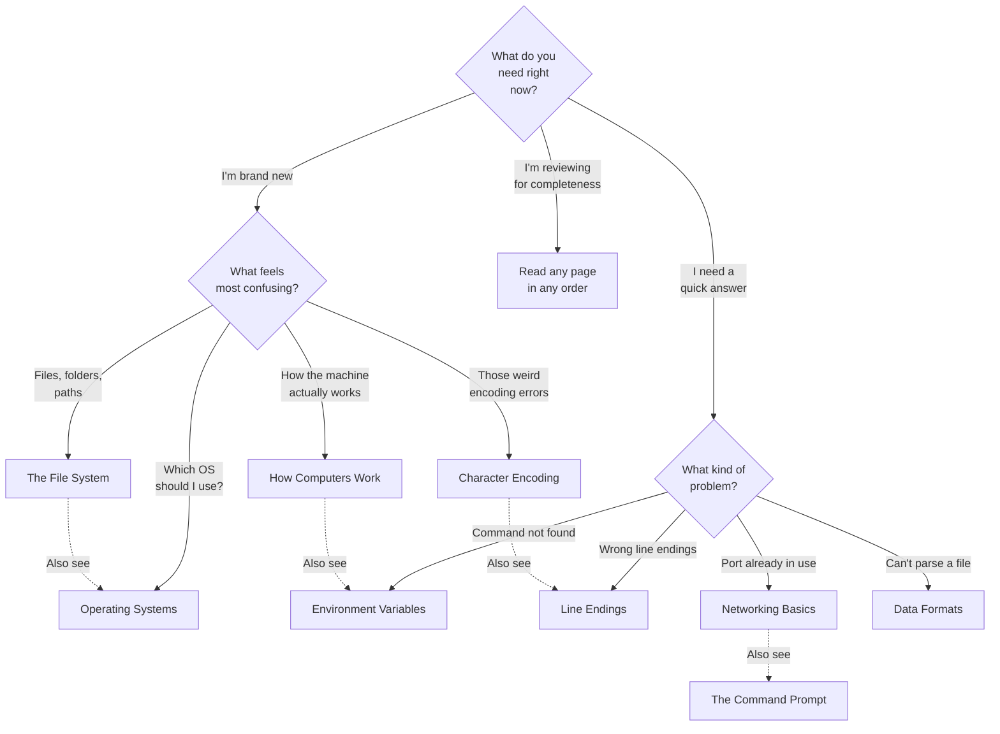

# Foundations

> How computers work, files, paths, environment variables, character encoding, networking basics, and everything else every developer needs to know regardless of platform or language.

---

## Prerequisites

- None — this section assumes zero prior knowledge
- If you already know this material, feel free to skip to [Terminal](../02-terminal/README.md)

---

## Pages in This Section

| Page | Description |
|------|-------------|
| [What Are Foundations?](what-are-foundations.md) | Why this section exists and how computers run code |
| [How Computers Work](how-computers-work.md) | CPU, RAM, storage, fetch-execute cycle, processes |
| [The File System](the-file-system.md) | Files, directories, paths, permissions, hidden files |
| [Operating Systems](operating-systems.md) | Windows vs macOS vs Linux — kernel, layout, key differences |
| [Environment Variables](environment-variables.md) | What they are, PATH, how to set them, common variables |
| [Character Encoding](character-encoding.md) | ASCII, UTF-8, UTF-16, BOM, why encoding matters |
| [Line Endings](line-endings.md) | LF vs CRLF, git config, per-language conventions |
| [Binary and Hex](binary-and-hex.md) | Base-2, base-16, bitwise ops, practical dev uses |
| [Data Formats](data-formats.md) | JSON, YAML, TOML, XML, CSV — when to use each |
| [Networking Basics](networking-basics.md) | IP, ports, DNS, HTTP, TLS, client-server model |
| [The Command Prompt](the-command-prompt.md) | What it is, shell vs terminal, how to launch it per OS |
| [Troubleshooting](foundations-troubleshooting.md) | Common issues and how to fix them |

---

## Decision Tree: Where Should I Start?

**Rule of thumb:** If you're completely new, start with [How Computers Work](how-computers-work.md). If you're troubleshooting, jump straight to the relevant page or the [Troubleshooting](foundations-troubleshooting.md) guide.

---

## Quick Reference

| Concept | What It Is |
|---------|-----------|
| CPU | The brain — executes instructions |
| RAM | Short-term memory — fast, cleared on power-off |
| Storage | Long-term memory — slow, persists |
| Process | A running program |
| Thread | A lightweight unit of work inside a process |
| File | A named sequence of bytes on disk |
| Directory | A container for files and other directories |
| Path | The address of a file or directory |
| Environment Variable | A named value available to running processes |
| `PATH` | Directories searched when you type a command |
| ASCII | 7-bit character encoding (English, numbers, symbols) |
| UTF-8 | Variable-width Unicode encoding (everything) |
| LF / CRLF | Line ending styles (Unix vs Windows) |
| IP Address | A machine's address on a network |
| Port | A numbered endpoint for a specific service |
| DNS | Translates domain names to IP addresses |
| HTTP | The protocol the web runs on |
| JSON | Text-based data format (JavaScript-derived) |
| YAML | Indentation-based data format (config files) |

> **Full reference:** [Foundations Cheat Sheet](../18-cheat-sheets/foundations-quick-reference.md)

---

> **Next:** [What Are Foundations?](what-are-foundations.md) | **Previous:** [Home](../README.md)
