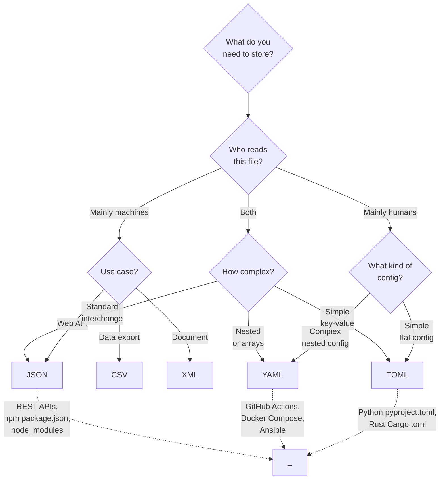

# Data Formats

> JSON, YAML, TOML, XML, CSV — what each is for, how they compare, and when to use which.

> **Related:** [Character Encoding](character-encoding.md) | [Binary and Hex](binary-and-hex.md)

---

## What Is It?

Data formats are **structured ways to represent information as text**. They sit on top of character encoding — they define not just the bytes, but how those bytes are organized into fields, records, and hierarchies.

| Format | Type | Used For | Human-Friendly? |
|--------|------|----------|-----------------|
| JSON | Key-value + arrays | APIs, config, data interchange | Moderate |
| YAML | Key-value with nesting | Config files, CI/CD, definitions | High |
| TOML | Sections with key-value | Config files (Python, Rust) | High |
| XML | Hierarchical with attributes | Documents, legacy systems, RSS | Low |
| CSV | Tabular | Spreadsheets, data export | Moderate |

## Why Does It Exist?

Different tasks need different tradeoffs:

- **JSON** — ubiquitous in web APIs, strict syntax, easy for machines
- **YAML** — easy for humans to write, supports anchors and comments
- **TOML** — unambiguous and simple, designed for config files
- **XML** — verbose but powerful, supports schemas and namespaces
- **CSV** — simplest possible table format, supported by every spreadsheet tool

## Mental Model

### Same Data in Different Formats

**JSON:**
```json
{
  "name": "Developer Handbook",
  "version": 2,
  "authors": ["Caleb"],
  "features": {
    "search": true,
    "dark_mode": true
  }
}
```

**YAML:**
```yaml
name: Developer Handbook
version: 2
authors:
  - Caleb
features:
  search: true
  dark_mode: true
```

**TOML:**
```toml
name = "Developer Handbook"
version = 2
authors = ["Caleb"]

[features]
search = true
dark_mode = true
```

**XML:**
```xml
<book name="Developer Handbook" version="2">
  <author>Caleb</author>
  <features search="true" dark_mode="true"/>
</book>
```

**CSV:**
```csv
name,version,author
Developer Handbook,2,Caleb
```

### When to Choose Each



## Key Differences

| Feature | JSON | YAML | TOML | XML | CSV |
|---------|------|------|------|-----|-----|
| Comments | No | Yes (`#`) | Yes (`#`) | Yes (`<!-- -->`) | No |
| Data types | String, number, bool, null, array, object | String, number, bool, null, array, map | String, number, bool, datetime, array, table | Text, attributes, with schema | All text (need to parse) |
| Multi-line strings | No (escape `\n`) | Yes (`\|` and `>`) | Yes (`"""`) | Yes | No |
| Nested structures | Yes | Yes | Yes (sections) | Yes | No |
| Schema validation | JSON Schema | No built-in | No built-in | XSD | No |
| Standard library | Yes (most languages) | Yes (most languages) | Yes (many languages) | Yes (most languages) | Yes (most languages) |

## Cheat Sheet

```
API data:             JSON
Config files:         YAML or TOML (Python/Rust → TOML; DevOps → YAML)
Simple flat config:   TOML (harder to make mistakes)
Spreadsheet export:   CSV
Legacy / documents:   XML

JSON:  strict, no comments, great for machines
YAML:  flexible, comments, watch out for indentation traps
TOML:  simple, unambiguous, section-based
XML:   verbose, powerful, avoid unless necessary
CSV:   simple, no nesting, watch out for commas in values
```

## Common Mistakes

| Mistake | Problem | Solution |
|---------|---------|----------|
| Using JSON for hand-edited config | No comments, trailing commas cause errors | Use YAML or TOML for config files |
| YAML indentation errors | Parses wrong or silently creates nested data | Use a YAML linter |
| CSV without quoting commas | Columns shift when values contain commas | Quote all fields or use RFC 4180 |
| XML without a schema | No validation, hard to evolve | Define an XSD |
| Not handling edge cases | Empty values, null vs missing keys | Document the expected format |
| Mixing tabs and spaces in YAML | Parse error | Use 2-space indentation consistently |

## Related Topics

- [Character Encoding](character-encoding.md) — All formats rely on text encoding
- [Binary and Hex](binary-and-hex.md) — Binary formats (protobuf, msgpack) are alternatives
- [Environment Variables](environment-variables.md) — An alternative to config files

## Further Learning

- [JSON specification](https://www.json.org/json-en.html)
- [YAML specification](https://yaml.org/)
- [TOML specification](https://toml.io/)
- [CSV RFC 4180](https://datatracker.ietf.org/doc/html/rfc4180)

---

> **Next:** [Networking Basics](networking-basics.md) | **Previous:** [Binary and Hex](binary-and-hex.md)
