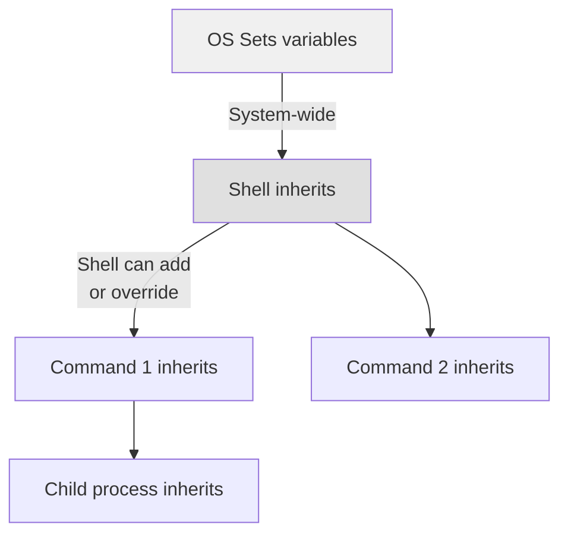

# Environment Variables

> Named values that the operating system and running processes can access — the primary mechanism for configuring software without hardcoding.

> **Related:** [The Command Prompt](../02-terminal/README.md) | [Operating Systems](operating-systems.md)

---

## What Is It?

An environment variable is a **key-value pair** available to all running processes. They are the standard way to:

- Tell programs where to find things (`PATH`, `HOME`)
- Configure behavior without editing code (`NODE_ENV`, `DEBUG`)
- Inject secrets at runtime (`DATABASE_URL`, `API_KEY`)
- Set language and locale (`LANG`, `LC_ALL`)

## Why Does It Exist?

Before environment variables, configuration was either hardcoded or read from a fixed file. Environment variables let you:

- **Separate config from code** — the same binary works in dev, staging, and production
- **Avoid secrets in source control** — `.env` files are gitignored
- **Change behavior at runtime** — restart with different values without rebuilding

## Mental Model

### Scope and Inheritance



**Rule:** Environment variables flow **down** the process tree. A child process inherits its parent's environment. Changing a variable in a child does **not** affect the parent.

### The PATH Variable

`PATH` is the most important environment variable. It's a list of directories the shell searches when you type a command.

```text
When you type "python":
  1. Shell looks in each PATH directory, in order
  2. First match wins
  3. If not found → "command not found"

Example PATH:
  /usr/local/bin:/usr/bin:/bin:/opt/homebrew/bin
```

**Troubleshooting:** "command not found" almost always means the installed tool's directory is not in your PATH.

### Where Variables Live

| OS | System-wide | User-wide | Shell-specific |
|----|-------------|-----------|----------------|
| Windows | System Properties → Environment Variables | Same dialog, User section | `$PROFILE` (PowerShell), autoexec.bat (CMD) |
| macOS | `launchctl setenv` or `/etc/launchd.conf` | `~/.zshrc`, `~/.bash_profile` | Same files |
| Linux | `/etc/environment`, `/etc/profile` | `~/.bashrc`, `~/.profile` | Same files |

## Common Environment Variables

| Variable | Purpose | Typical Value |
|----------|---------|---------------|
| `PATH` | Directories to search for commands | `/usr/local/bin:/usr/bin:/bin` |
| `HOME` | Current user's home directory | `/home/user` or `C:\Users\User` |
| `USER` / `USERNAME` | Current user's name | `jdoe` |
| `SHELL` | Path to the default shell | `/bin/zsh` |
| `LANG` | Locale and encoding | `en_US.UTF-8` |
| `NODE_ENV` | Node.js environment mode | `development`, `production` |
| `PYTHONPATH` | Python module search path | `/home/user/lib/python` |
| `DATABASE_URL` | Database connection string | `postgresql://localhost/mydb` |
| `EDITOR` | Default text editor | `code`, `vim`, `nano` |
| `TEMP` / `TMP` | Temporary file directory | `/tmp` or `C:\Users\User\AppData\Local\Temp` |

## Cheat Sheet

```
# See all env vars
Linux/Mac:  env | printenv
Windows:    Get-ChildItem Env:  |  SET

# Get one variable
Linux/Mac:  echo $PATH
Windows:    echo %PATH%  (CMD)  |  $env:PATH (PowerShell)

# Set temporarily (current session only)
Linux/Mac:  export DB_URL="postgres://localhost/mydb"
Windows:    $env:DB_URL = "postgres://localhost/mydb" (PowerShell)
            set DB_URL=postgres://localhost/mydb        (CMD)

# Set permanently
Linux/Mac:  Add to ~/.zshrc or ~/.bashrc
Windows:    System Properties → Environment Variables

# Use in .env file (for dev)
DATABASE_URL=postgres://localhost/mydb
NODE_ENV=development
```

> For detailed shell commands, see the [Terminal section](../02-terminal/environment-variables.md).

## Common Mistakes

| Mistake | Problem | Solution |
|---------|---------|----------|
| Hardcoding secrets | Leaks in source control | Use environment variables + `.env` files |
| Not restarting shell | "I set the variable but it's not working" | Restart shell or run `source ~/.zshrc` |
| Spaces in values | Variable ends at the first space | Quote the value: `export VAR="a b"` |
| Forgetting export | Variable set but not passed to child processes | Use `export VAR=value`, not `VAR=value` |
| Committing .env files | Secret exposure | Add `.env` to `.gitignore` |
| Overriding PATH blindly | Breaks system commands | Append to PATH: `export PATH="$PATH:/new/dir"` |

## Related Topics

- [The File System](the-file-system.md) — Paths and where config files live
- [The Command Prompt](../02-terminal/README.md) — How to set and use env vars in different shells
- [Operating Systems](operating-systems.md) — Per-OS differences in env var management

## Further Learning

- [Environment Variables (Wikipedia)](https://en.wikipedia.org/wiki/Environment_variable)
- [.env file specification](https://github.com/bkeepers/dotenv) — The dotenv standard
- [PATH variable explained](https://medium.com/@jalendport/what-exactly-is-your-shell-path-e7e2010f1b4a)

---

> **Next:** [Character Encoding](character-encoding.md) | **Previous:** [Operating Systems](operating-systems.md)
