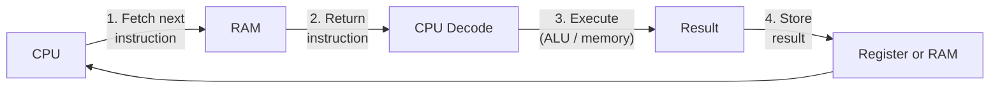
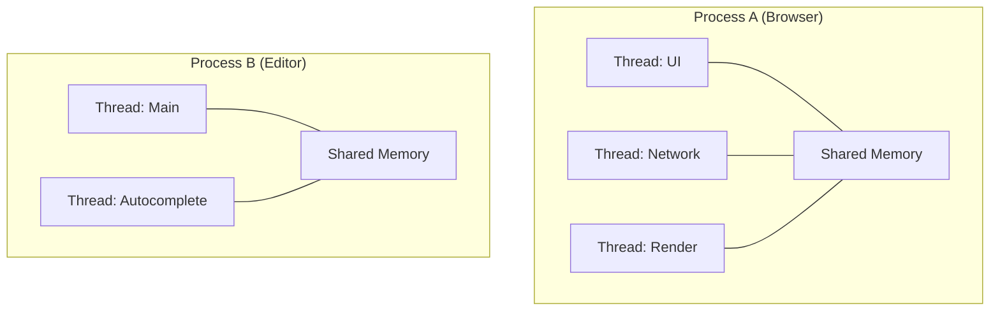

# How Computers Work

> The bare-metal basics: CPU, RAM, storage, the fetch-execute cycle, and how processes turn code into running programs.

> **Related:** [What Are Foundations?](what-are-foundations.md) | [Operating Systems](operating-systems.md)

---

## What Is It?

A computer is a machine that **fetches instructions from memory, decodes them, and executes them** — billions of times per second.

Three main hardware components matter to a developer:

| Component | Role | Analogy | Speed |
|-----------|------|---------|-------|
| CPU | Executes instructions | The chef | Fastest |
| RAM | Short-term memory (data + instructions) | The countertop | Fast |
| Storage | Long-term memory (files, programs) | The pantry | Slow (100x+ slower than RAM) |

## Why Does It Exist?

You don't need to build a CPU to write software, but understanding the hardware explains **why**:

- Some operations are **fast** (adding numbers, comparing values)
- Some operations are **slow** (reading from disk, allocating memory)
- Some bugs only happen when **memory runs out** or **CPU is maxed**
- Some performance fixes work by **changing how you use memory**

Without this model, performance and resource behavior seem magical.

## Mental Model

### The Fetch-Execute Cycle



The CPU repeats this cycle billions of times per second. Each core does this independently.

### How Code Becomes a Process

```text
Source Code (on disk)
    ↓ Compiler / Interpreter
Machine Instructions (on disk)
    ↓ OS loader reads them into RAM
Process (instructions + data in RAM)
    ↓ CPU fetches & executes each instruction
Program Running
```

### Memory Hierarchy

| Level | Size | Speed | Managed By |
|-------|------|-------|-----------|
| CPU Register | ~100 bytes | ~1 cycle (0.3 ns) | Compiler / code |
| CPU Cache (L1/L2/L3) | ~1-30 MB | ~5-30 cycles | Hardware automatically |
| RAM | ~8-256 GB | ~100-300 cycles | OS / code |
| SSD | ~256 GB-4 TB | ~100,000 cycles | OS / code |
| HDD | ~1-20 TB | ~10,000,000 cycles | OS / code |

**Key insight:** A RAM read is ~100x slower than a cache hit. A disk read is ~1000x slower than a RAM read. This is why caching exists.

### Processes vs Threads

| Concept | What It Is | Memory |
|---------|-----------|--------|
| Process | A running program with its own memory space | Isolated — one process can't see another's memory |
| Thread | A lightweight unit of execution within a process | Shared — all threads in a process share memory |



## Cheat Sheet

```
CPU = executes instructions
RAM = fast, temporary, cleared on shutdown
Disk = slow, permanent, survives shutdown

Process = isolated program instance
Thread = concurrent work inside a process

Fast operations: math, comparisons, cache hits
Slow operations: disk reads, RAM misses, network I/O
```

## Common Mistakes

| Mistake | Problem | Solution |
|---------|---------|----------|
| Ignoring memory | Programs slow down or crash at scale | Understand your data structures' memory use |
| Confusing processes and threads | Wrong tool for concurrency | Use processes for isolation, threads for shared work |
| Assuming disk is fast | IO becomes bottleneck | Cache reads, batch writes |
| Not knowing about cache | Commenting out code does nothing — but reordering does | Locality of reference: access nearby data together |
| Overprovisioning | Buying more RAM than needed | Profile first, then decide |

## Related Topics

- [Operating Systems](operating-systems.md) — How the OS manages all of this
- [Binary and Hex](binary-and-hex.md) — What instructions and data look like at the lowest level
- [Character Encoding](character-encoding.md) — How text becomes data in RAM

## Further Learning

- *But How Do It Know?* — J. Clark Scott (build a CPU from first principles, no EE degree needed)
- *Computer Systems: A Programmer's Perspective* — Bryant & O'Hallaron
- [CPU Execution Visualization](https://www.cs.cmu.edu/~./213/schedule.html) — CMU 15-213 labs and demos

---

> **Next:** [The File System](the-file-system.md) | **Previous:** [What Are Foundations?](what-are-foundations.md)
