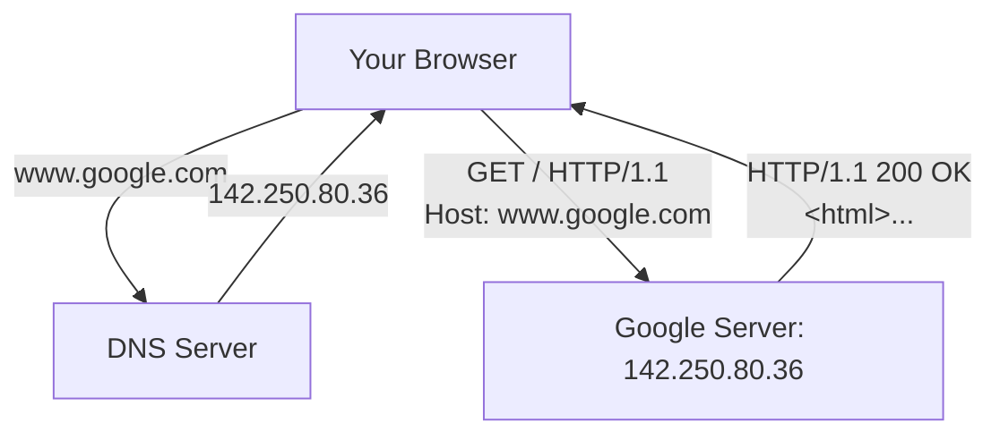

# Networking Basics

> How computers communicate over networks — IP addresses, ports, DNS, HTTP, and the client-server model.

> **Related:** [The Command Prompt](the-command-prompt.md) | [Environment Variables](environment-variables.md)

---

## What Is It?

Computer networking is the set of protocols and conventions that let one computer send data to another. As a developer, you work with networking every time you:

- Load a web page (HTTP/HTTPS)
- Push code to GitHub (HTTPS or SSH)
- Connect to a database (TCP connection to a port)
- Call an API (HTTP request/response)
- Run a local dev server (localhost:port)

## Why Does It Exist?

Without networking, every computer is an island. Networking enables:

- **Communication** — send data between machines
- **Distribution** — split work across servers
- **Access** — reach services from anywhere
- **Collaboration** — share code, data, and tools

## Mental Model

### The OSI Model (Simplified)

```text
Layer          Example               Your Code
──────         ───────               ────────
Application    HTTP, DNS, SSH        Your app talks here
Transport      TCP, UDP              Guarantees delivery (TCP) or doesn't (UDP)
Internet       IP, ICMP              Finds the right machine (IP address)
Link           Ethernet, Wi-Fi       Physical connection
```

Most developers work at the **Application** layer (HTTP, WebSockets) and occasionally the **Transport** layer (choosing TCP vs UDP).

### How Data Travels



1. **DNS** resolves the domain name to an IP address
2. **TCP** establishes a connection between your machine and the server
3. **HTTP** sends a request and receives a response
4. **TCP** tears down the connection

### Key Concepts

**IP Address**
- IPv4: `192.168.1.1` (4 numbers, 0-255) — 4.3 billion addresses
- IPv6: `2001:0db8::1` (8 hex groups) — essentially unlimited
- `127.0.0.1` (localhost) — your own machine
- `0.0.0.0` — all interfaces on your machine

**Port**
- A numbered endpoint on a machine (0-65535)
- Common ports: 80 (HTTP), 443 (HTTPS), 22 (SSH), 5432 (PostgreSQL)
- A server "listens" on a port; a client "connects" to it
- `localhost:3000` means port 3000 on your own machine

**DNS**
- Translates domain names (`google.com`) to IP addresses (`142.250.80.36`)
- Like a phonebook for the internet
- Your computer checks `/etc/hosts` or `C:\Windows\System32\drivers\etc\hosts` first

**HTTP**
- Request/response protocol
- Methods: GET (read), POST (create), PUT/PATCH (update), DELETE (remove)
- Status codes: 200 (OK), 201 (Created), 301 (Redirect), 400 (Bad Request), 401 (Unauthorized), 403 (Forbidden), 404 (Not Found), 500 (Server Error)

**TCP vs UDP**
| Feature | TCP | UDP |
|---------|-----|-----|
| Connection | Connected (3-way handshake) | Connectionless |
| Reliability | Guaranteed delivery, ordering | Best effort, no ordering |
| Use cases | HTTP, SSH, databases | Video streaming, DNS, gaming |

## Cheat Sheet

```
Common ports:
  22    SSH
  53    DNS
  80    HTTP
  443   HTTPS
  3000  React / Express dev
  5432  PostgreSQL
  6379  Redis
  8080  Alt HTTP
  3306  MySQL

HTTP status code ranges:
  2xx  Success
  3xx  Redirect
  4xx  Client error (you messed up)
  5xx  Server error (they messed up)

Local development:
  localhost     = 127.0.0.1 (loopback)
  localhost:3000 = HTTP server on port 3000
  0.0.0.0        = all network interfaces

Check if a port is in use:
  Windows:   netstat -an | findstr :3000
  Mac/Linux: lsof -i :3000
```

## Common Mistakes

| Mistake | Problem | Solution |
|---------|---------|----------|
| Forgetting `http://` | Browser thinks it's a search query | Always include the protocol |
| Port already in use | Another process is listening | Kill the process or use a different port |
| Hardcoding IP addresses | Breaks when network changes | Use hostnames or environment variables |
| Confusing localhost and 0.0.0.0 | Can't connect from another machine | localhost = this machine only; 0.0.0.0 = all interfaces |
| Ignoring HTTPS | Data sent in plaintext | Always use HTTPS in production |
| No error handling for network calls | App hangs or crashes | Set timeouts and handle connection errors |

## Related Topics

- [Environment Variables](environment-variables.md) — Database URLs and API endpoints in config
- [The Command Prompt](the-command-prompt.md) — Using network commands like `ping`, `curl`, `netstat`
- [Data Formats](data-formats.md) — JSON is the language of HTTP APIs

## Further Learning

- *Computer Networking: A Top-Down Approach* — Kurose & Ross
- [How DNS Works](https://howdns.works/) — Comic-style explanation
- [HTTP Status Dogs](https://httpstatusdogs.com/) — HTTP codes with pictures

---

> **Next:** [The Command Prompt](the-command-prompt.md) | **Previous:** [Data Formats](data-formats.md)
