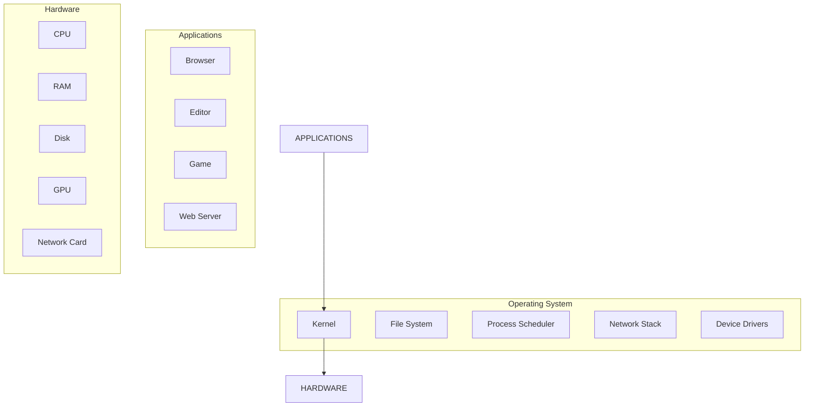

# Operating Systems

> The differences between Windows, macOS, and Linux — kernel, file system layout, package management, and what every developer should know about each.

> **Related:** [The File System](the-file-system.md) | [Environment Variables](environment-variables.md)

---

## What Is It?

An operating system (OS) is the software that manages hardware and provides services to applications. It sits between your code and the bare metal.

Three desktop OSes matter to developers:

| OS | Kernel | Primary Shell | Default FS | Market |
|----|--------|---------------|-----------|--------|
| Windows | NT | PowerShell + CMD | NTFS | Desktop, Gaming, Enterprise |
| macOS | XNU (hybrid) | Zsh | APFS | Creative, Web Dev, iOS |
| Linux | Linux (monolithic) | Bash (usually) | ext4 / btrfs | Servers, DevOps, Android |

## Why Does It Exist?

Different OSes make different tradeoffs. Knowing them helps you:

- **Diagnose** "works on my machine" problems
- **Choose** the right environment for each task
- **Read** documentation that assumes a different OS
- **Set up** CI/CD that matches your deployment target

## Mental Model

### What the OS Does



The OS abstracts the hardware so your code doesn't have to talk to it directly.

### Key Differences

| Area | Windows | macOS | Linux |
|------|---------|-------|-------|
| Path separator | `\` | `/` | `/` |
| Root | `C:\` (drive letters) | `/` (single root) | `/` (single root) |
| User homes | `C:\Users\Name` | `/Users/name` | `/home/name` |
| Config dir | `%APPDATA%` | `~/.config` | `~/.config` |
| Case-sensitive paths | No | No (but APFS can) | Yes |
| Package manager | winget, chocolatey | Homebrew, MacPorts | apt, dnf, pacman |
| System updates | Windows Update | App Store + Software Update | `apt upgrade` (varies) |
| GUI | Desktop + Explorer | Aqua + Finder | Desktop environment (GNOME, KDE, etc.) |

### Linux Directory Layout

```text
/bin        → Essential user commands (symlink to /usr/bin)
/sbin       → System admin commands
/etc        → System configuration files
/var        → Variable data (logs, databases)
/tmp        → Temporary files (cleared on reboot)
/home       → User home directories
/root       → Root user's home
/usr        → User system resources
/opt        → Optional third-party software
/proc       → Virtual filesystem for process info
/dev        → Device files
```

Windows and macOS have different layouts but the same categories exist somewhere.

## When to Use Which

| Scenario | Best OS |
|----------|---------|
| Web development | Any — all three work well |
| Game development (Unity/Unreal) | Windows (best driver support) |
| iOS/macOS development | macOS (Xcode required) |
| .NET / C# development | Windows (best tooling) |
| DevOps / infrastructure | Linux (server standard) |
| Data science / ML | Linux or macOS |
| Embedded / IoT | Linux |
| General learning | Linux (free, open, server-standard) |

## Cheat Sheet

```
  Windows:  \ separators, C:\, .exe, .bat, .ps1
  macOS:    / separators, .app bundles, .dmg installers
  Linux:    / separators, ELF binaries, .deb/.rpm packages

  Commands that differ:
    Windows:   tasklist, systeminfo, ipconfig
    macOS:     ps aux, sw_vers, ifconfig
    Linux:     ps aux, uname -a, ip a

  Pro tip: Use a cross-platform shell (PowerShell Core, Bash via WSL)
           to reduce context-switching.
```

## Common Mistakes

| Mistake | Problem | Solution |
|---------|---------|----------|
| Only knowing one OS | Helpless when infrastructure uses another | Install Linux in a VM or WSL and practice |
| Hardcoding OS-specific paths | Breaks CI/CD and teammates | Use environment variables and path libraries |
| Assuming case-insensitivity | Linux is case-sensitive | Use consistent casing everywhere |
| Ignoring line endings | Git shows every file as changed | Set `git config core.autocrlf` appropriately |
| Managing apps differently | Installing tools wrong per OS | Use a cross-platform tool when possible |

## Related Topics

- [The File System](the-file-system.md) — How each OS organizes files
- [The Command Prompt](the-command-prompt.md) — How to interact with each OS via terminal
- [Environment Variables](environment-variables.md) — Where config values live per OS

## Further Learning

- *The Design of the UNIX Operating System* — Maurice Bach
- *Windows Internals* — Russinovich & Solomon
- [OSDev.org](https://wiki.osdev.org/) — Write your own OS (advanced)

---

> **Next:** [Environment Variables](environment-variables.md) | **Previous:** [The File System](the-file-system.md)
