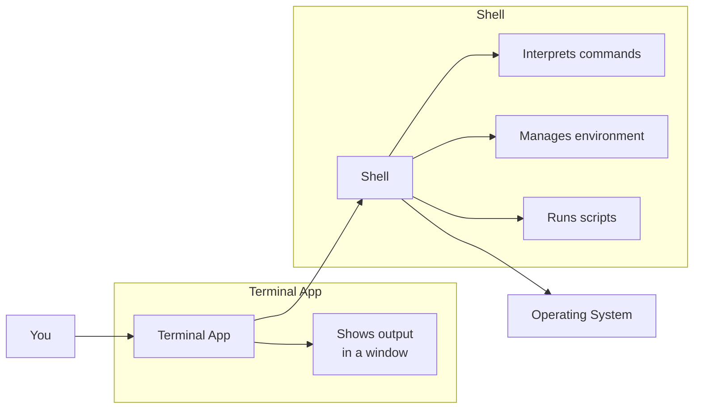

# The Command Prompt

> What the command prompt is, the difference between a shell and a terminal, and how to launch one on every operating system.

> **Related:** [Terminal (full section)](../02-terminal/README.md) | [Environment Variables](environment-variables.md)

---

## What Is It?

The command prompt (or terminal, or console) is a **text-based interface** for interacting with your computer. Instead of clicking buttons, you type commands.

This page is a gentle introduction — a bridge to the full [Terminal section](../02-terminal/README.md). It covers just enough to get you started.

## Why Does It Exist?

Graphical interfaces are convenient, but the command line gives you:

- **Speed** — one command can do what takes 10 clicks
- **Automation** — chain commands into scripts
- **Access** — tools and settings not available in the GUI
- **Precision** — exact control over what happens
- **Consistency** — the same interface across every machine

## Mental Model

### Shell vs Terminal

These terms are often used interchangeably, but they are different:



| Term | What It Is | Examples |
|------|-----------|----------|
| Terminal | The window/app that displays text | Windows Terminal, iTerm2, GNOME Terminal |
| Shell | The program that interprets your commands | PowerShell, Bash, Zsh, CMD |
| Console | The physical or virtual device (largely historical) | — |
| Prompt | The text indicator that the shell is ready (`C:\>`, `$`, `%`) | `PS C:\Users\Name>` |

### How to Launch

| OS | Default Terminal | Default Shell | How to Open |
|----|-----------------|---------------|-------------|
| Windows | Windows Terminal | PowerShell | Right-click Start → Terminal, or Win+R → `wt` |
| macOS | Terminal.app | Zsh | Cmd+Space → "Terminal" |
| Linux | Varies (GNOME Terminal, Konsole) | Bash (usually) | Ctrl+Alt+T |

### What You'll See

```text
# Windows (PowerShell)
PS C:\Users\You>

# macOS / Linux
you@machine:~$

# Windows (CMD)
C:\Users\You>
```

The prompt tells you:
- **Who** you are (`you`)
- **Where** you are (`C:\Users\You` or `~`)
- **Which** shell is waiting (`PS` for PowerShell)

## What Can You Do?

| Task | Command | Instead Of |
|------|---------|------------|
| List files | `ls` (Mac/Linux) / `dir` (Windows) | Opening Finder/Explorer |
| Change directory | `cd Documents` | Clicking folders |
| Create a file | `touch file.txt` (Mac/Linux) / `New-Item file.txt` (Windows) | Right-click → New |
| Delete a file | `rm file.txt` (Mac/Linux) / `Remove-Item file.txt` (Windows) | Dragging to Trash |
| Run a program | `python script.py` | Double-clicking |
| See running processes | `ps` (Mac/Linux) / `Get-Process` (Windows) | Task Manager |

> All of these are covered in detail in the [Terminal section](../02-terminal/README.md).

## Cheat Sheet

```
 Opening the terminal:
   Windows:  Win+R → wt
   macOS:    Cmd+Space → Terminal
   Linux:    Ctrl+Alt+T

 First commands to try:
   whoami     → your username
   pwd        → your current directory
   ls / dir   → files in this directory
   cd ~       → go to your home directory
   clear      → clear the screen

 Getting help:
   command --help   → show usage
   man command      → show manual (Mac/Linux)
   Get-Help command → PowerShell help
```

## Common Mistakes

| Mistake | Problem | Solution |
|---------|---------|----------|
| Typing full paths manually | Slow and error-prone | Use Tab completion |
| Ctrl+C vs Ctrl+V | `^C` terminates instead of pasting | Right-click to paste, or Ctrl+Shift+V |
| Closing terminal on "not responding" | Kills the process without cleanup | Try Ctrl+C first, then close |
| Running as root/admin unnecessarily | Risk of damaging the system | Use a regular user account |
| Not reading error messages | Missing the exact problem | The error message tells you what to fix |

## Related Topics

- [Terminal (full section)](../02-terminal/README.md) — Everything about shells and commands
- [Environment Variables](environment-variables.md) — How to set and use them in the terminal
- [Operating Systems](operating-systems.md) — Terminal differences between OSes

## Further Learning

- [The Linux Command Line](https://linuxcommand.org/) — William Shotts (free online book)
- [PowerShell Documentation](https://learn.microsoft.com/en-us/powershell/) — Microsoft official docs
- [ExplainShell](https://explainshell.com/) — Type any command to learn what it does

---

> **Next:** [Foundations Troubleshooting](foundations-troubleshooting.md) | **Previous:** [Networking Basics](networking-basics.md)
