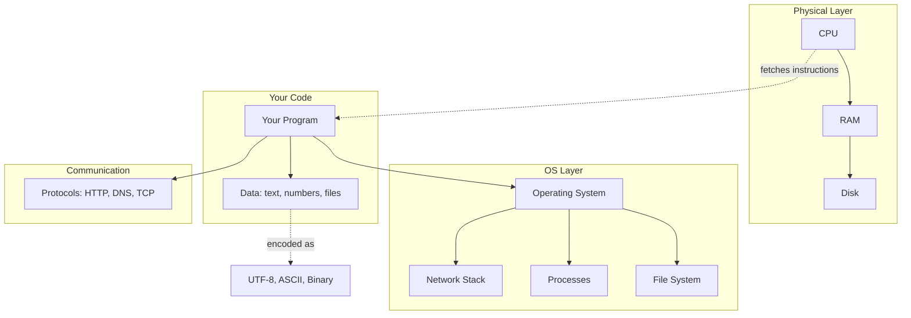

# What Are Foundations?

> The core knowledge every developer needs — how computers work, how files are organized, how data is represented, and how systems communicate.

> **Related:** [How Computers Work](how-computers-work.md) | [The File System](the-file-system.md)

---

## What Is It?

Foundations are the **concepts that don't change** — they are the same whether you're writing a Python script, a Unity game, or a web app. This section covers:

- How a computer actually runs your code
- How files and directories are organized
- What makes Windows, macOS, and Linux different
- How data is stored, encoded, and formatted
- How computers talk to each other over networks

## Why Does It Exist?

Every developer hits walls that trace back to missing fundamentals:

| Symptom | Root Cause |
|---------|-----------|
| "Command not found" | PATH is wrong |
| "Why are there ^M characters?" | Line ending mismatch |
| "Port is already in use" | Another process is listening |
| "Invalid byte sequence" | Wrong character encoding |
| "It works on my machine" | OS difference you didn't account for |

The **goal** is not to make you a systems programmer or a networking expert. It is to give you the mental model you need to diagnose problems, understand documentation, and pick up tools faster.

## Mental Model

Think of foundations as the **laws of physics** for software development:



Everything above sits on top of these layers. When something breaks, the problem lives in one of them.

## Why Should I Care?

| If You... | Foundations Help You... |
|-----------|------------------------|
| Are new to programming | Understand what's actually happening when you run code |
| Switch between OSes | Know where files go, how paths work, what tools to use |
| Debug weird errors | Recognize the category of problem (encoding? path? port?) |
| Read technical docs | Understand the terminology (process, thread, daemon, socket) |
| Set up dev environments | Know what PATH is, how env vars work, where configs live |

## Cheat Sheet

```
Every computing problem lives in one of these layers:
  1. Hardware (CPU, RAM, disk)
  2. Operating System (files, processes, devices)
  3. Data (encoding, format, representation)
  4. Communication (network, protocols, ports)

Most "weird" bugs are in layer 2 or 3.
```

## Common Mistakes

| Mistake | Problem | Solution |
|---------|---------|----------|
| Skipping fundamentals | Every new tool feels confusing | Invest time early — it compounds |
| Only learning one OS | Surprised every time you switch | Learn the concepts, not just the commands |
| Ignoring encoding | Random corruption in non-English text | Always use UTF-8 |
| Memorizing instead of understanding | Can't adapt to new tools | Focus on mental models, not recipes |
| Assuming "it just works" | No idea how to debug when it doesn't | Learn what happens "under the hood" |

## Related Topics

- [How Computers Work](how-computers-work.md) — The hardware layer
- [The File System](the-file-system.md) — Files, paths, permissions
- [Operating Systems](operating-systems.md) — The OS layer

## Further Learning

- *But How Do It Know?* — J. Clark Scott (how a CPU works from first principles)
- *Computer Systems: A Programmer's Perspective* — Bryant & O'Hallaron
- [Introducing Computer Systems](https://www.cs.cmu.edu/~15122/handouts/lectures.html) — CMU course notes

---

> **Next:** [How Computers Work](how-computers-work.md) | **Previous:** [Foundations README](README.md)
