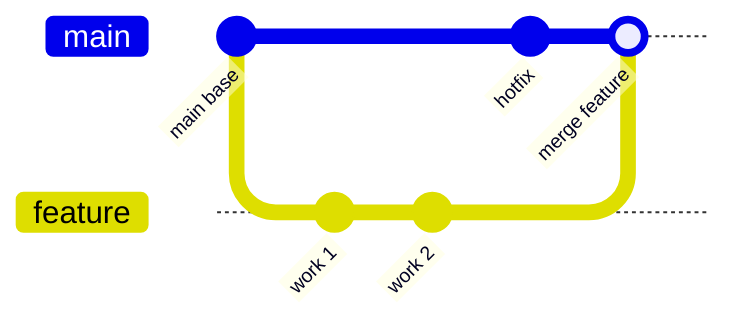

# Branching & Merging

> Branches let you work on multiple features or fixes in isolation, then weave them back together.

> **Related:** [Working with Remotes](remote-repos.md) | [Collaboration](collaboration.md)

---

## What Is It?

A branch is a movable pointer to a commit. When you create a new branch, Git creates a new pointer you can move forward independently. Branches make it safe to experiment without breaking the main codebase.

## Mental Model



The main branch stays stable while feature branches diverge and later merge back.

## Working with Branches

### Creating and Switching

```bash
git branch feature-x         # create a branch
git checkout feature-x       # switch to it
git switch feature-x         # modern alternative (Git 2.23+)
git checkout -b feature-x    # create and switch in one step
git switch -c feature-x      # modern alternative
```

### Listing Branches

```bash
git branch              # local branches (* = current)
git branch -a           # all branches (including remote-tracking)
git branch -v           # branches with last commit
```

### Deleting a Branch

```bash
git branch -d feature-x      # delete if merged
git branch -D feature-x      # force delete (unmerged)
```

## Merging

```bash
git checkout main
git merge feature-x
```

Git creates a **merge commit** that has two parents — the tip of main and the tip of the feature branch.

### Fast-Forward Merge

If the target branch hasn't diverged, Git simply moves the pointer forward — no merge commit needed. Use `--no-ff` to force a merge commit anyway:

```bash
git merge --no-ff feature-x
```

### Resolving Merge Conflicts

When Git can't automatically merge, it marks the conflict in the file:

```
<<<<<<< HEAD
code from the current branch
=======
code from the incoming branch
>>>>>>> feature-x
```

Fix the file, stage it, and finish the merge:

```bash
git add conflicted-file.txt
git commit
```

## Branching Strategies

| Strategy | How It Works | Best For |
|----------|-------------|----------|
| GitHub Flow | Main branch is always deployable; feature branches branch off and PR back | Simple, CI/CD-heavy projects |
| Git Flow | `main`, `develop`, `feature/*`, `release/*`, `hotfix/*` branches | Scheduled releases, larger teams |
| Trunk-Based | Short-lived feature branches (hours/days), frequent merges to main | CI/CD, DevOps culture |

## Key Commands

| Task | Command |
|------|---------|
| Create branch | `git switch -c name` |
| Switch branch | `git switch name` |
| List branches | `git branch` |
| Merge branch | `git merge name` |
| Abort merge | `git merge --abort` |
| Delete branch | `git branch -d name` |
