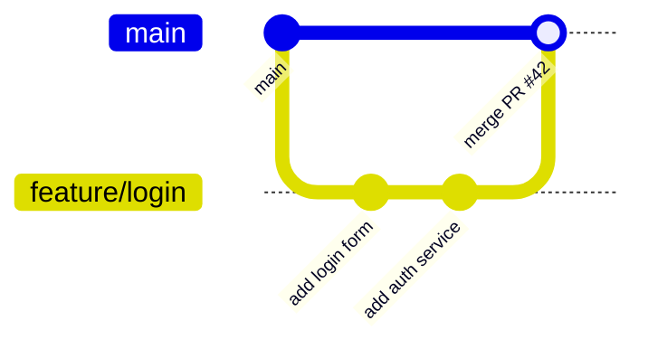

# Pull Requests

> The heart of collaboration on GitHub: propose changes, discuss them, and merge them in.

> **Related:** [Repositories](repositories.md) | [Code Review](code-review.md) | [Git CLI](../03-git/collaboration.md)

---

## What Is It?

A Pull Request (PR) is a proposal to merge changes from one branch into another. It's where code review happens, discussions take place, and automated checks run before code lands.

## The PR Lifecycle



## Creating a Pull Request

### Via the Web

1. Push your feature branch: `git push origin feature/login`
2. On GitHub, click **Compare & pull request**
3. Fill in:
   - **Title** — concise summary (e.g., "Add login form with email/password")
   - **Description** — what changed, why, and how to test
   - **Reviewers** — request specific people
   - **Labels** — e.g., `enhancement`, `bug`
   - **Projects** — link to a project board
4. Click **Create pull request**

### Via the CLI

```bash
gh pr create --base main --title "Add login form" --body "Closes #12"
```

### Draft PRs

Open a draft PR to signal work-in-progress. It can't be merged until marked ready:

```bash
gh pr create --draft
```

On the web, use the dropdown arrow on **Create pull request** → **Create draft pull request**.

## Reviewing a PR

### Code Review

1. Go to the **Files changed** tab
2. Hover over a line and click the **+** to comment
3. Write feedback or suggestions
4. At the top right, choose:
   - **Comment** — general feedback
   - **Approve** — looks good to merge
   - **Request changes** — must be addressed before merge

### Suggesting Changes

```suggestion
-export function calculateTotal(items: Item[]): number {
+export function calculateTotal(items: Item[]): number | null {
```

The author can accept suggestions with one click.

### Required Checks

If branch protection is enabled, PRs must pass:
- Required reviews (1+ approvals)
- Status checks (CI, tests, linting)
- No unresolved conversations

## Merging a PR

Three merge strategies:

| Strategy | What It Does | History |
|----------|-------------|---------|
| **Create a merge commit** | Adds a merge commit | Preserves full branch history |
| **Squash and merge** | Combines all commits into one | Clean, linear history |
| **Rebase and merge** | Rebases commits onto base | Linear, individual commits |

### Via CLI

```bash
gh pr merge 42 --squash       # squash and merge
gh pr merge 42 --rebase       # rebase and merge
gh pr merge 42 --merge        # create merge commit
```

## Closing Without Merging

If the changes aren't needed:

```bash
gh pr close 42
```

## Linking Issues

Reference issues in PR descriptions with keywords to auto-close them on merge:

```
Closes #12
Fixes #34
Resolves #56
```

## Best Practices

- **Small PRs** — easier to review and less likely to conflict
- **Descriptive titles** — "Fix login crash" not "Fix bug"
- **Link to context** — reference issues, discussions, or designs
- **Self-review first** — diff your own code before requesting review
- **Respond to feedback** — address comments or explain why you disagree
- **Keep it up to date** — rebase or merge main to resolve conflicts early
