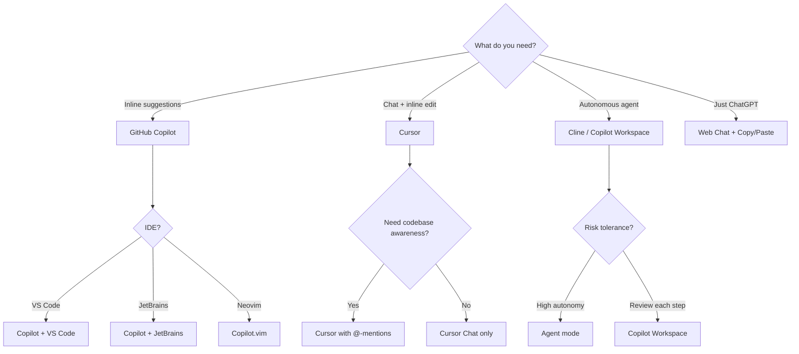

# AI Development

> How to use AI coding assistants, prompt engineering, and context management to accelerate your workflow.

---

## Prerequisites

- Basic comfort with a code editor (see [Editors](../05-editors/README.md))
- Understanding of terminal commands (see [Terminal](../02-terminal/README.md))
- Git basics (see [Git](../03-git/README.md))

---

## Pages in This Section

| Page | Description |
|------|-------------|
| [What Is AI Development?](what-is-ai-development.md) | Mental model, landscape, what AI can and can't do |
| [AI Coding Assistants](ai-coding-assistants.md) | Deep dive into Copilot, Cursor, Windsurf, Cline |
| [Prompt Engineering](prompt-engineering.md) | Advanced techniques for getting useful AI output |
| [Context Engineering](context-engineering.md) | Managing context windows, AGENTS.md, .cursorrules |
| [AI Agents](ai-agents.md) | Agent modes, autonomous coding, tool use, MCP |
| [Code Review](ai-code-review.md) | AI-assisted PR review and quality analysis |
| [Testing](ai-testing.md) | Test generation, coverage, edge case discovery |
| [Debugging](ai-debugging.md) | AI-assisted error analysis and root cause finding |
| [Workflows](ai-workflows.md) | End-to-end feature development, refactoring, documentation |
| [Limitations](ai-limitations.md) | Hallucination, security, bias, when not to use AI |
| [Troubleshooting](ai-troubleshooting.md) | Common issues and fixes |

---

## Decision Tree: Which AI Tool Should I Use?

**Rule of thumb:** Start with GitHub Copilot for inline suggestions. Add Cursor if you want chat + codebase awareness. Use agents for well-scoped tasks where you can verify the output.

---

## Quick Reference

| Task | Tool | How |
|------|------|-----|
| Inline completion | Copilot | Start typing, press `Tab` |
| Ask about code | Cursor | Select code, `Ctrl+L` |
| Edit code | Cursor | `Ctrl+K`, describe change |
| Generate file | Agent | Describe what to build |
| Review PR | Copilot | "Review changes" in PR view |
| Write tests | Any | "Write tests for [function]" |
| Debug error | Any | Paste error + relevant code |

> **Full reference:** [AI Dev Cheat Sheet](../18-cheat-sheets/ai-dev-quick-reference.md)

---

> **Next:** [What Is AI Development?](what-is-ai-development.md) | **Previous:** [Virtual Environments](../08-virtual-environments/README.md)
