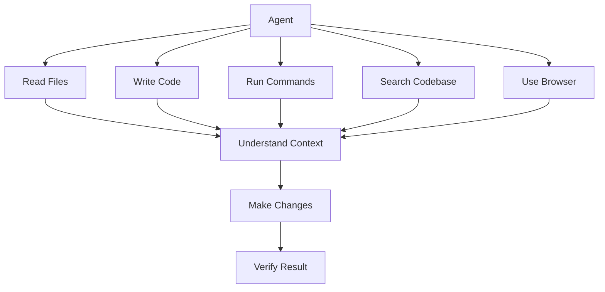
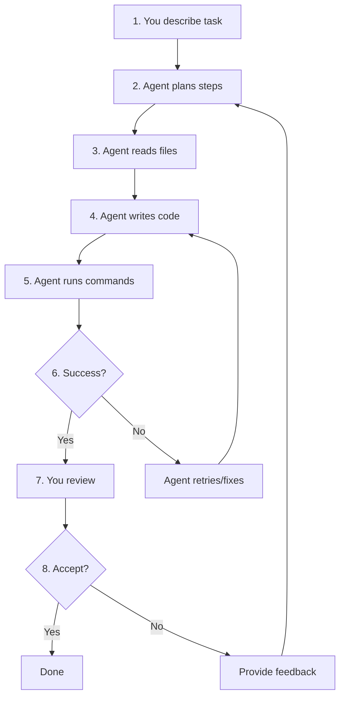

# AI Agents

> What agents are, how they work, and how to use autonomous coding capabilities safely and effectively.

---

## What Are AI Agents?

An AI agent is a language model that can **use tools** — read files, write code, run terminal commands, search the web, and interact with APIs. Unlike chat (which just generates text), agents take actions in the real world.

> **Related:** [AI Coding Assistants](ai-coding-assistants.md) for tool-specific agent features. [Context Engineering](context-engineering.md) for managing what agents can see.

---

## Why Do They Exist?

Some tasks are too complex for a single prompt:

- "Refactor the authentication system to use JWT instead of sessions"
- "Add a new API endpoint with database migration, validation, and tests"
- "Port this module from JavaScript to TypeScript"

These require reading multiple files, understanding relationships, making changes across the codebase, and verifying the result. Agents can do this autonomously.

## Mental Model

Think of an agent as a **developer pair-programming with you**. They can:



The key difference from chat: **agents can act, not just suggest**.

## Agent Capabilities

| Capability | What It Does | Example |
|------------|--------------|---------|
| **Read files** | Understands codebase structure | Reads `src/` to find patterns |
| **Write code** | Creates or modifies files | Adds new component, updates types |
| **Run commands** | Executes terminal commands | Runs tests, builds project |
| **Search** | Finds relevant code | Searches for similar patterns |
| **Browser** | Opens and reads web pages | Fetches documentation |
| **Multi-file** | Coordinates changes across files | Refactors across 10+ files |

## Agent Modes by Tool

### Cursor Agent

| Feature | How |
|---------|-----|
| Activate | Toggle "Agent" in chat panel |
| Read files | Automatic based on your request |
| Write files | Proposes changes, you accept/reject |
| Run commands | Proposes commands, you approve |
| Multi-file | Plans steps, executes sequentially |

**Best for:** Refactoring, feature development, bug fixes

### GitHub Copilot Workspace

| Feature | How |
|---------|-----|
| Activate | From issue → "Open in Copilot Workspace" |
| Plan | Generates implementation plan |
| Edit | Proposes code changes |
| Review | Shows diff for each file |
| Fix | Automatically addresses CI failures |

**Best for:** Issue-driven development, known tasks

### Cline

| Feature | How |
|---------|-----|
| Activate | Install extension, start chatting |
| Read files | Reads as needed for context |
| Write files | Writes with your approval |
| Run commands | Executes with your approval |
| Browser | Can open and interact with web pages |
| MCP | Connects to external tools |

**Best for:** Autonomous tasks, research, complex workflows

### Continue

| Feature | How |
|---------|-----|
| Activate | Install extension, configure models |
| Chat | Ask questions, get code |
| Edit | Select code, describe changes |
| Terminal | Run commands from chat |

**Best for:** Open-source, customizable, self-hosted

## The Agent Loop



### Your Role in the Loop

| Step | Agent Does | You Do |
|------|-----------|--------|
| 1 | Listens | Describe what you want |
| 2 | Plans | Verify the plan makes sense |
| 3 | Reads | Ensure it reads the right files |
| 4 | Writes | Review each file change |
| 5 | Tests | Verify tests pass |
| 6 | Fixes | Approve or redirect |
| 7 | Presents | Final review |
| 8 | Waits | Accept or reject |

## MCP (Model Context Protocol)

### What Is It?

MCP is a standard for connecting AI agents to external tools and data sources. Think of it as **USB for AI** — a universal way to plug in new capabilities.

| Without MCP | With MCP |
|-------------|----------|
| Agent can only use built-in tools | Agent can use any MCP-connected tool |
| Limited to file/code/terminal | Can access databases, APIs, services |
| Manual integration for each tool | Standard protocol, plug and play |

### How It Works

```
Agent ←→ MCP Client ←→ MCP Server ←→ External Tool
                                      (Database, API, Browser, etc.)
```

### Common MCP Servers

| Server | Connects To | Use Case |
|--------|-------------|----------|
| Filesystem | Local files | Enhanced file access |
| GitHub | GitHub API | PRs, issues, repos |
| PostgreSQL | PostgreSQL DB | Query data, inspect schema |
| Puppeteer | Web browser | Web scraping, testing |
| Slack | Slack API | Send messages, read channels |

### Setting Up MCP

```json
// .cursor/mcp.json (Cursor)
{
  "mcpServers": {
    "github": {
      "command": "npx",
      "args": ["-y", "@modelcontextprotocol/server-github"],
      "env": {
        "GITHUB_TOKEN": "your-token"
      }
    },
    "postgres": {
      "command": "npx",
      "args": ["-y", "@modelcontextprotocol/server-postgres", "postgresql://localhost/mydb"]
    }
  }
}
```

## OpenCode: Open Source AI Agent Framework

OpenCode is an open-source AI coding agent that runs in your terminal, desktop app, or IDE extension. It's fully customizable — you can create your own agents, skills, commands, and tools.

> **Docs:** [opencode.ai/docs](https://opencode.ai/docs) | **GitHub:** [github.com/anomalyco/opencode](https://github.com/anomalyco/opencode)

### Setup

```bash
# Install
curl -fsSL https://opencode.ai/install | bash
# or: npm install -g opencode-ai
# or: choco install opencode       # Windows
# or: brew install anomalyco/tap/opencode  # macOS

# Launch in your project directory
opencode

# Initialize (creates AGENTS.md)
/init
```

### Built-in Agents

| Agent | Type | Purpose | Tool Access |
|-------|------|---------|-------------|
| **Build** | Primary | Default agent for development | Full (read, write, bash, etc.) |
| **Plan** | Primary | Analysis and planning without changes | Read-only (writes/bashes ask permission) |
| **General** | Subagent | Research complex questions, multi-step tasks | Full (except todo) |
| **Explore** | Subagent | Fast, read-only codebase exploration | Read-only |
| **Scout** | Subagent | External docs and dependency research | Read-only (external repos) |

Switch between primary agents with **Tab**. Invoke subagents with `@general`, `@explore`, or `@scout` in your messages.

### Creating Custom Agents

**Markdown method** — Create a file in `.opencode/agents/`:

```markdown
---
description: Reviews code for quality and best practices
mode: subagent
model: anthropic/claude-sonnet-4-20250514
temperature: 0.1
permission:
  edit: deny
  bash: deny
---
You are in code review mode. Focus on:
- Code quality and best practices
- Potential bugs and edge cases
- Performance implications
- Security considerations
Provide constructive feedback without making direct changes.
```

**JSON method** — Add to `opencode.json`:

```json
{
  "agent": {
    "code-reviewer": {
      "description": "Reviews code for best practices and potential issues",
      "mode": "subagent",
      "model": "anthropic/claude-sonnet-4-20250514",
      "prompt": "You are a code reviewer. Focus on security, performance, and maintainability.",
      "permission": {
        "edit": "deny"
      }
    }
  }
}
```

**CLI method** — Interactive creation:

```bash
opencode agent create
```

### Key Agent Options

| Option | What It Does | Example |
|--------|-------------|---------|
| `description` | What the agent does (required) | `"Reviews code for issues"` |
| `mode` | How it's used: `primary`, `subagent`, or `all` | `"subagent"` |
| `model` | Override the LLM model | `"anthropic/claude-sonnet-4-20250514"` |
| `temperature` | Response randomness (0.0–1.0) | `0.1` for deterministic, `0.7` for creative |
| `steps` | Max agentic iterations before forced text response | `10` |
| `permission` | Tool access control (allow/ask/deny) | `{ "edit": "deny" }` |
| `prompt` | Custom system prompt file | `"{file:./prompts/review.txt}"` |
| `color` | UI appearance | `"#ff6b6b"` or `"accent"` |
| `hidden` | Hide from `@` autocomplete (subagents only) | `true` |

### Permissions System

Control what agents can do with fine-grained permissions:

```json
{
  "agent": {
    "safe-agent": {
      "permission": {
        "edit": "deny",
        "bash": {
          "*": "ask",
          "git status": "allow",
          "git diff": "allow",
          "npm test": "allow"
        }
      }
    }
  }
}
```

| Value | Behavior |
|-------|----------|
| `"allow"` | Tool runs without asking |
| `"ask"` | User prompted before each use |
| `"deny"` | Tool is unavailable |

Permission keys: `read`, `edit`, `bash`, `glob`, `grep`, `task`, `webfetch`, `websearch`, `skill`, and more. Use glob patterns for fine-grained bash control.

### Agent Skills

Skills are reusable instruction files loaded on demand via the `skill` tool. Place them in:

- `.opencode/skills/<name>/SKILL.md` (project)
- `~/.config/opencode/skills/<name>/SKILL.md` (global)

```markdown
---
name: git-release
description: Create consistent releases and changelogs
---
## What I do
- Draft release notes from merged PRs
- Propose a version bump
- Provide a copy-pasteable `gh release create` command

## When to use me
Use this when you are preparing a tagged release.
Ask clarifying questions if the target versioning scheme is unclear.
```

**Rules for skill names:** lowercase alphanumeric with single hyphen separators (regex: `^[a-z0-9]+(-[a-z0-9]+)*$`). Must match the directory name.

Skills appear in the agent's available skills list and are loaded when the agent calls `skill({ name: "git-release" })`.

### Custom Commands

Create slash commands for repetitive tasks. Place markdown files in `.opencode/commands/`:

```markdown
---
description: Run tests with coverage
agent: build
model: anthropic/claude-sonnet-4-20250514
---
Run the full test suite with coverage report and show any failures.
Focus on the failing tests and suggest fixes.
```

Run with `/test` in the TUI. Supports:

| Feature | Syntax | Example |
|---------|--------|---------|
| Arguments | `$ARGUMENTS` or `$1`, `$2`, `$3` | `/component Button` |
| Shell output | `` !`command` `` | `` !`git log --oneline -10` `` |
| File references | `@path/to/file` | `@src/components/Button.tsx` |

### Custom Tools

Create tools the LLM can call. Place TypeScript/JavaScript files in `.opencode/tools/`:

```typescript
import { tool } from "@opencode-ai/plugin"

export default tool({
  description: "Query the project database",
  args: {
    query: tool.schema.string().describe("SQL query to execute"),
  },
  async execute(args) {
    return `Executed query: ${args.query}`
  },
})
```

The filename becomes the tool name. You can call any language from the tool definition — TypeScript is just for the tool wrapper. Tools receive context with `agent`, `sessionID`, `directory`, and `worktree`.

### Rules (AGENTS.md)

Provide custom instructions via `AGENTS.md` files:

- **Project rules:** `AGENTS.md` in repo root (committed to Git)
- **Global rules:** `~/.config/opencode/AGENTS.md` (personal)
- **Additional files:** `"instructions": ["CONTRIBUTING.md", "docs/guidelines.md"]` in `opencode.json`

Run `/init` to auto-generate an AGENTS.md from your project structure.

### How to Build Agents Well

| Practice | Why |
|----------|-----|
| Start with `opencode agent create` | Interactive wizard generates a solid starting prompt |
| One agent per concern | Don't make a "do everything" agent — split by task type |
| Use `mode: subagent` for specialized work | Let primary agents delegate to focused specialists |
| Set `permission: edit: deny` for read-only agents | Prevents accidental modifications during review/analysis |
| Use `hidden: true` for internal subagents | Keeps the `@` autocomplete clean for user-facing agents |
| Pin models per agent | Use fast/cheap models for exploration, capable models for implementation |
| Set `temperature: 0.1` for code analysis | Deterministic output for review, planning, and debugging |
| Reference prompt files with `{file:./prompts/...}` | Keeps prompts version-controlled and separate from config |
| Use glob permissions for bash | `"git status": "allow"` while `"rm *": "deny"` |
| Share agents via Git | Commit `.opencode/agents/` to share team-specific agents |

### Finding Premade Agents and Skills

| Resource | What's There |
|----------|-------------|
| [awesome-opencode](https://github.com/awesome-opencode/awesome-opencode) | Curated list of OpenCode plugins, tools, and configs |
| [opencode.cafe](https://opencode.cafe) | Community hub aggregating the ecosystem |
| [Ecosystem — Agents](https://opencode.ai/docs/ecosystem/) | Official list: `Agentic` (modular agents), `opencode-agents` (configs/prompts/plugins) |
| [oh-my-opencode](https://github.com/code-yeongyu/oh-my-opencode) | Background agents, pre-built LSP/AST tools, curated agents |
| [opencode-skillful](https://github.com/zenobi-us/opencode-skillful) | Skill discovery and lazy-loading plugin |
| [opencode-workspace](https://github.com/kdcokenny/opencode-workspace) | Bundled multi-agent orchestration — 16 components, one install |

## When to Use Agents vs Inline Suggestions

| Use Inline Suggestions When | Use Agents When |
|-----------------------------|-----------------|
| Completing a line or block | Multi-file changes |
| Small, local edits | Refactoring across modules |
| Quick fixes | Adding new features with tests |
| You know exactly what to write | You need help figuring out the approach |
| Low risk, easily reversible | Complex, interconnected changes |

## Safety Guidelines

### The Golden Rule

**Always review agent output before committing.** Agents can:

- Delete files you didn't intend to delete
- Introduce subtle logic errors
- Run commands with unintended side effects
- Modify files outside the scope of the task

### Safety Checklist

- [ ] Review every file change before accepting
- [ ] Check that tests still pass
- [ ] Verify the agent didn't modify unrelated files
- [ ] Check for security issues (hardcoded secrets, vulnerable patterns)
- [ ] Test the feature manually if possible
- [ ] Commit only after thorough review

### Scoped Tasks

Good agent tasks are **bounded**:

| Good (Scoped) | Bad (Unscoped) |
|----------------|----------------|
| "Add a `validateEmail` function to `src/utils.ts`" | "Improve the codebase" |
| "Refactor `UserService` to use dependency injection" | "Make the code better" |
| "Add error handling to the API routes in `src/routes/`" | "Fix all bugs" |
| "Port `utils.ts` to TypeScript" | "Convert the whole project to TypeScript" |

## Best Practices

- **Start with a plan** — Ask the agent to outline its approach before coding
- **Scope tightly** — One feature, one refactor, one bug fix per agent session
- **Review diffs** — Don't just look at the final result, review each change
- **Test after** — Run your test suite after agent changes
- **Use rules files** — AGENTS.md and .cursorrules guide the agent
- **Keep conversations focused** — Start new sessions for new tasks

## Common Mistakes

| Mistake | Problem | Solution |
|---------|---------|----------|
| Trusting agent output blindly | Bugs, security issues | Always review changes |
| Unscoped tasks | Agent modifies unrelated code | Break into small, focused tasks |
| Not reviewing file changes | Subtle modifications missed | Check every file diff |
| Running agents on production | Destructive changes | Use dev branches |
| No test suite | Can't verify changes work | Add tests before using agents |
| Ignoring agent plan | Agent goes off track | Review plan before execution |

## Troubleshooting

| Problem | Cause | Solution |
|---------|-------|----------|
| Agent modifies wrong files | Task too broad | Narrow scope, specify exact files |
| Agent runs destructive commands | No guardrails | Review commands before approval |
| Agent loops endlessly | Conflicting instructions | Start new conversation, clarify goal |
| Agent can't find relevant code | No context | Use rules files, @-mentions |
| Agent output is low quality | Insufficient context | Provide more files, clearer constraints |

## Related Topics

- [AI Coding Assistants](ai-coding-assistants.md) - Tool-specific agent features
- [Context Engineering](context-engineering.md) - Managing what agents can see
- [Workflows](ai-workflows.md) - Putting it all together

## Further Learning

- [OpenCode Docs](https://opencode.ai/docs) - Official OpenCode documentation
- [awesome-opencode](https://github.com/awesome-opencode/awesome-opencode) - Curated ecosystem list
- [opencode.cafe](https://opencode.cafe) - Community hub
- [Model Context Protocol](https://modelcontextprotocol.io/) - Official MCP docs
- [Cursor Agent Docs](https://docs.cursor.com/agent) - Cursor agent guide
- [Cline Docs](https://docs.cline.bot) - Cline agent guide

---

## Personal Notes

> Add your own notes, reminders, and experiences here.
