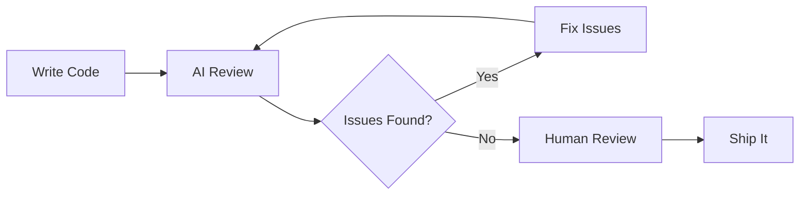

# AI Code Review

> Using AI to review code for bugs, security issues, performance problems, and style violations — before humans even look at it.

---

## What Is It?

AI code review uses language models to analyze code changes and identify issues. It can catch bugs, suggest improvements, flag security vulnerabilities, and enforce coding standards — all before a human reviewer sees the PR.

> **Related:** [AI Agents](ai-agents.md) for autonomous review workflows. [Testing](../12-testing/README.md) for verification strategies.

---

## Why Does It Matter?

| Without AI Review | With AI Review |
|-------------------|----------------|
| Human reviewers catch obvious issues | AI catches obvious issues first |
| Review takes 30-60 minutes | AI pre-filters in 30 seconds |
| Style nitpicks waste reviewer time | AI handles style automatically |
| Security issues slip through | AI flags common vulnerabilities |

## Mental Model



AI review is a **first pass** — it handles the mechanical stuff so humans can focus on design and architecture.

## Review Strategies

### Strategy 1: Self-Review Before PR

Before creating a PR, ask AI to review your changes:

```
Review this code for:
1. Bugs and logic errors
2. Security vulnerabilities (SQL injection, XSS, etc.)
3. Performance issues
4. Error handling gaps
5. Type safety issues

[paste code or reference files]
```

### Strategy 2: PR Description Enhancement

```
I just created a PR with these changes:
[paste diff or git log]

Write a clear PR description that:
1. Explains what changed and why
2. Lists any breaking changes
3. Notes areas that need extra review
4. Suggests test cases
```

### Strategy 3: Automated Review with GitHub Copilot

GitHub Copilot can review PRs automatically:

1. Create your PR as usual
2. In the PR view, click "Review changes"
3. Select "GitHub Copilot" as a reviewer
4. Copilot posts comments on the PR

### Strategy 4: Focused Reviews

Instead of reviewing everything, focus on specific concerns:

| Focus | Prompt |
|-------|--------|
| Security | "Review this code for security vulnerabilities. Focus on input validation, authentication, and data exposure." |
| Performance | "Review this code for performance issues. Look for N+1 queries, unnecessary re-renders, and memory leaks." |
| Error handling | "Review this code's error handling. Are all errors caught? Are error messages helpful? Are resources cleaned up?" |
| API design | "Review this API endpoint design. Are the routes RESTful? Is the response format consistent? Are errors handled properly?" |

## What AI Reviews Well

| Category | What AI Catches |
|----------|-----------------|
| **Syntax** | Typos, missing semicolons, wrong types |
| **Patterns** | Inconsistent naming, duplicated code |
| **Security** | SQL injection, XSS, hardcoded secrets |
| **Error handling** | Missing try/catch, unhandled promise rejections |
| **Type safety** | Type mismatches, missing null checks |
| **Style** | Inconsistent formatting, naming conventions |
| **Documentation** | Missing JSDoc, outdated comments |

## What AI Reviews Poorly

| Category | Why AI Struggles |
|----------|-----------------|
| **Architecture** | Doesn't understand system-wide tradeoffs |
| **Business logic** | Can't verify if logic matches requirements |
| **Race conditions** | Hard to detect without execution context |
| **Performance at scale** | Doesn't know your traffic patterns |
| **UX implications** | Can't evaluate user experience |
| **Team conventions** | May not know unwritten team rules |

## Review Prompts

### General Review

```
Review this code change. For each issue found:
1. Show the problematic line
2. Explain the issue
3. Suggest a fix

Focus on: bugs, security, performance, error handling.
```

### Security Audit

```
Perform a security audit on this code. Check for:
- Input validation gaps
- SQL injection vulnerabilities
- XSS risks
- Hardcoded secrets or credentials
- Insecure dependencies
- Authentication/authorization issues

Rate severity: Critical / High / Medium / Low
```

### Performance Review

```
Review this code for performance issues:
- N+1 queries or API calls
- Unnecessary re-renders (React)
- Memory leaks
- Large bundle sizes
- Blocking operations
- Missing caching opportunities
```

### API Review

```
Review this API endpoint:
- Is the URL structure RESTful?
- Are status codes appropriate?
- Is error handling consistent?
- Are inputs validated?
- Is the response format documented?
- Are rate limits considered?
```

## Best Practices

- **Review before human review** — AI first, humans second
- **Be specific about concerns** — "Check for SQL injection" beats "review this"
- **Don't skip human review** — AI catches mechanical issues, humans catch design issues
- **Use as a learning tool** — Read AI's suggestions to improve your skills
- **Combine with linting** — AI catches logic, linters catch style
- **Review AI's suggestions critically** — Sometimes the "fix" is worse than the problem

## Common Mistakes

| Mistake | Problem | Solution |
|---------|---------|----------|
| Skipping AI review | Obvious issues reach humans | Always do a first pass with AI |
| Accepting all suggestions blindly | Introduces new bugs | Review each suggestion critically |
| Reviewing too late | Hard to fix architectural issues | Review early and often |
| Not specifying focus | Too much noise, not enough signal | Tell AI what to focus on |
| Ignoring AI's security flags | Vulnerabilities ship to prod | Always investigate security warnings |

## Troubleshooting

| Problem | Cause | Solution |
|---------|-------|----------|
| AI misses obvious bugs | Insufficient context | Share more files, be specific |
| Too many false positives | Review scope too broad | Narrow the focus |
| AI suggests wrong patterns | No project context | Add rules files |
| Review takes too long | Reviewing too much code | Review in smaller chunks |

## Related Topics

- [AI Testing](ai-testing.md) — Automated test generation
- [AI Debugging](ai-debugging.md) — Finding and fixing bugs
- [Workflows](ai-workflows.md) — Putting it all together

## Further Learning

- [GitHub Copilot Code Review](https://docs.github.com/en/copilot/using-github-copilot/code-review/using-copilot-code-review) — Official guide
- [Code Review Best Practices](https://google.github.io/eng-practices/review/) — Google's guide

---

## Personal Notes

> Add your own notes, reminders, and experiences here.
