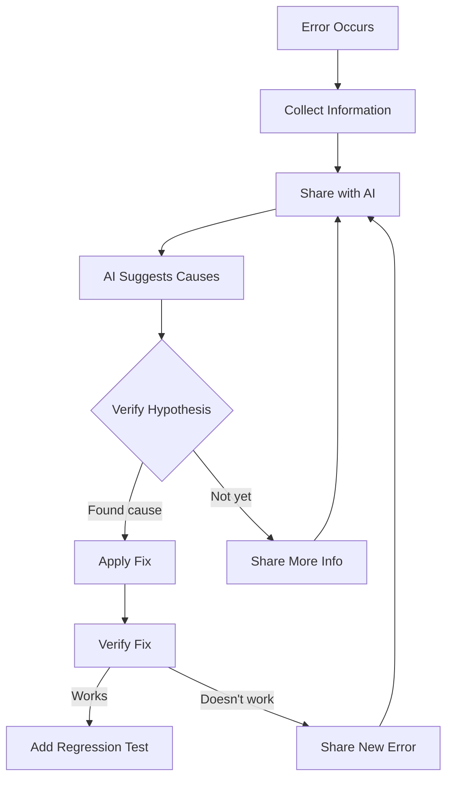

# AI Debugging

> Using AI to analyze errors, find root causes, and fix bugs systematically.

---

## What Is It?

AI debugging uses language models to analyze error messages, trace logic errors, and suggest fixes. It's especially powerful for errors you don't recognize, unfamiliar codebases, and complex stack traces.

> **Related:** [AI Code Review](ai-code-review.md) for catching bugs before they happen. [AI Testing](ai-testing.md) for regression tests after fixing.

---

## Why Does It Matter?

| Debugging Alone | Debugging with AI |
|-----------------|-------------------|
| Spend 30 min reading stack trace | AI explains the error in 30 seconds |
| Guess at root causes | AI suggests likely causes ranked by probability |
| Manual trial and error | AI suggests specific fixes |
| Same patterns repeated | AI recognizes common bug patterns |

## Mental Model

Think of AI as a **debugging rubber duck that talks back**. Instead of explaining your code to a silent duck, you explain it to an AI that can suggest fixes.



## The AI Debugging Loop

### Step 1: Collect Information

Before asking AI, gather:

| Information | Why |
|-------------|-----|
| Full error message | Exact text matters |
| Stack trace | Shows where the error occurred |
| Relevant code | The function/class involved |
| Expected behavior | What should have happened |
| Actual behavior | What actually happened |
| Steps to reproduce | How to trigger the bug |

### Step 2: Share with AI

```
I'm getting this error:

[paste full error message and stack trace]

Here's the relevant code:

[paste the function/class]

Expected behavior: [what should happen]
Actual behavior: [what actually happens]

What's the root cause?
```

### Step 3: Evaluate Suggestions

AI may suggest multiple causes. Evaluate each:

| Check | How |
|-------|-----|
| Does the fix make sense? | Read the suggested change |
| Does it match the error? | Verify the fix addresses the actual error |
| Are there side effects? | Check if the fix breaks other code |
| Is there a test? | Run existing tests after applying |

### Step 4: Verify the Fix

```
I applied your fix. Now I'm getting this new error:

[paste new error]

Here's the updated code:

[paste updated code]
```

## Error Analysis Patterns

### Pattern 1: Stack Trace Analysis

```
Explain this stack trace. What's the root cause?

Traceback (most recent call last):
  File "app.py", line 42, in process_order
    total = calculate_total(items)
  File "lib/pricing.py", line 15, in calculate_total
    price = item.price * quantity
AttributeError: 'NoneType' object has no attribute 'price'

Which item is None and why?
```

### Pattern 2: Logic Error

```
This function should return the top 5 items by score,
but it's returning items with score 0.

def get_top_items(items: list[Item], n: int = 5) -> list[Item]:
    sorted_items = sorted(items, key=lambda x: x.score)
    return sorted_items[:n]

What's wrong with the sorting logic?
```

### Pattern 3: Race Condition

```
This code sometimes fails and sometimes works:

async def fetch_all(urls):
    results = []
    for url in urls:
        response = await fetch(url)
        results.append(response)
    return results

When I run it with 100 URLs, about 30% fail with timeout.
What's the issue and how do I fix it?
```

### Pattern 4: Performance Issue

```
This function takes 5 seconds on 10k records:

def find_duplicates(items):
    duplicates = []
    for i, item in enumerate(items):
        for j, other in enumerate(items):
            if i != j and item.id == other.id:
                duplicates.append(item)
    return duplicates

How do I optimize this?
```

### Pattern 5: Unfamiliar Code

```
I inherited this codebase and this function is failing:

[paste function]

I don't understand what it's trying to do.
Can you:
1. Explain what the function does
2. Why it might be failing
3. How to fix it
```

## Common Bug Patterns

| Pattern | AI Recognition | Fix |
|---------|---------------|-----|
| Null/None errors | "NoneType has no attribute" | Add null checks, optional chaining |
| Type mismatches | "Expected X, got Y" | Add type validation, conversions |
| Off-by-one | Wrong iteration bounds | Check loop conditions, use `range(len())` |
| Async issues | Timing-dependent failures | Add proper awaiting, use Promise.all |
| State mutations | Unexpected side effects | Use immutable operations |
| Memory leaks | Growing memory over time | Clean up listeners, clear intervals |
| Race conditions | Intermittent failures | Add locks, use queues |

## Best Practices

- **Always share the full error** — Partial error messages waste time
- **Include relevant code** — Don't make AI guess what code is involved
- **Verify fixes before committing** — AI suggestions may not be complete
- **Add regression tests** — Prevent the same bug from coming back
- **Learn from the fix** — Understand *why* the bug happened, not just how to fix it
- **Debug systematically** — Use AI as one tool in a structured debugging process

## Common Mistakes

| Mistake | Problem | Solution |
|---------|---------|----------|
| Vague error description | AI can't help effectively | Share exact error message |
| Not testing the fix | May introduce new bugs | Run full test suite after fix |
| Accepting first suggestion blindly | May not be the right fix | Evaluate all suggestions |
| Not understanding the fix | Can't maintain the code | Ask AI to explain why it works |
| Ignoring root cause | Bug comes back later | Understand and fix the underlying issue |

## Troubleshooting

| Problem | Cause | Solution |
|---------|-------|----------|
| AI suggests wrong fix | Insufficient context | Share more code, explain behavior |
| Fix works but breaks other tests | Partial fix | Run full test suite, share results |
| AI can't reproduce the issue | Non-deterministic bug | Share specific reproduction steps |
| Multiple possible causes | Complex bug | Ask AI to rank by likelihood |

## Related Topics

- [AI Code Review](ai-code-review.md) — Catching bugs before they happen
- [AI Testing](ai-testing.md) — Writing regression tests
- [Workflows](ai-workflows.md) — End-to-end debugging workflows

## Further Learning

- [Debugging Principles](https://wiki.c2.com/?ThingsIAvoidWhileDebugging) — Common debugging wisdom
- [Rubber Duck Debugging](https://en.wikipedia.org/wiki/Rubber_duck_debugging) — The original AI debugger

---

## Personal Notes

> Add your own notes, reminders, and experiences here.
