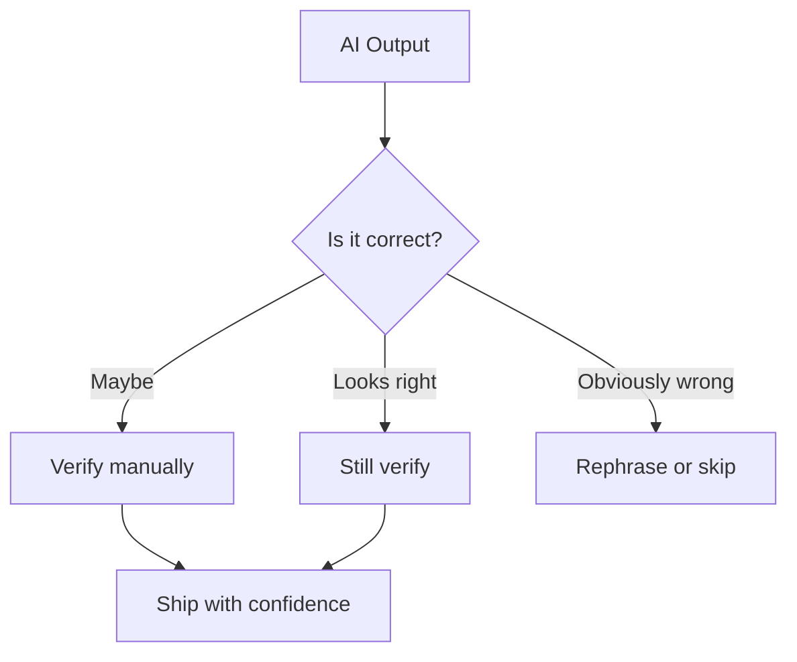

# AI Limitations

> What AI gets wrong, when not to trust it, and how to mitigate the risks. Critical knowledge for responsible AI-assisted development.

---

## What Is It?

AI language models are powerful tools, but they have fundamental limitations. Understanding these limitations is essential for using AI safely and effectively. This page covers what AI gets wrong, the risks involved, and when you should NOT rely on AI.

> **Related:** [What Is AI Development?](what-is-ai-development.md) for the foundational mental model. [AI Agents](ai-agents.md) for safety guidelines.

---

## Why Does It Matter?

Using AI without understanding its limitations leads to:

- **Bugs** — Code that looks right but fails
- **Security vulnerabilities** — Vulnerable patterns that pass review
- **Wrong architecture** — Solutions that don't fit your constraints
- **Knowledge gaps** — Developers who stop learning
- **Data exposure** — Sensitive information leaked through prompts

## Mental Model

**The rule:** AI output is a *hypothesis*, not a *fact*. Always verify.

## What AI Gets Wrong

### 1. Hallucination

AI confidently generates code that doesn't exist.

| Type | Example |
|------|---------|
| Made-up APIs | `library.nonExistentFunction()` |
| Wrong syntax | `def function():` in TypeScript |
| Outdated APIs | Using deprecated library methods |
| Fictional packages | `pip install fake-package` |

**Mitigation:** Verify every API call, function name, and package against official docs.

### 2. Logic Errors

AI generates code that runs but produces wrong results.

| Type | Example |
|------|---------|
| Off-by-one | `range(1, len(arr))` skips last element |
| Wrong comparison | `>=` instead of `>` |
| Missing edge cases | No handling for empty input |
| Incorrect algorithm | Sorting when you need filtering |

**Mitigation:** Test with known inputs and expected outputs.

### 3. Security Vulnerabilities

AI generates code with security flaws.

| Vulnerability | Example |
|---------------|---------|
| SQL injection | String concatenation in queries |
| XSS | Unsanitized user input in HTML |
| Hardcoded secrets | API keys in source code |
| Insecure defaults | CORS allowing all origins |
| Path traversal | Unsanitized file paths |

**Mitigation:** Always do a security review of AI-generated code.

### 4. Performance Issues

AI generates correct but slow code.

| Issue | Example |
|-------|---------|
| N+1 queries | Loop with individual DB calls |
| Unnecessary re-renders | React components re-rendering |
| Memory leaks | Event listeners not cleaned up |
| Blocking operations | Synchronous file I/O in async context |

**Mitigation:** Profile and benchmark AI-generated code.

### 5. Outdated Information

AI's training data has a cutoff date.

| Issue | Impact |
|-------|--------|
| Deprecated APIs | Using methods that no longer exist |
| Old library versions | Missing security patches |
| Changed conventions | Following outdated patterns |
| New features | Not aware of recent additions |

**Mitigation:** Check documentation for current versions and patterns.

### 6. Context Limitations

AI can't see your entire codebase.

| Issue | Impact |
|-------|--------|
| Missing relationships | Doesn't know about related modules |
| Architecture decisions | Can't evaluate system-wide tradeoffs |
| Business logic | Doesn't understand your requirements |
| Team conventions | May not follow unwritten rules |

**Mitigation:** Provide context through rules files and @-mentions.

## When NOT to Use AI

| Situation | Why |
|-----------|-----|
| **Security-critical code** | Authentication, encryption, access control |
| **Legal/compliance** | HIPAA, GDPR, financial regulations |
| **Novel algorithms** | Research, custom cryptography |
| **Performance-critical paths** | Need human-optimized code |
| **Data privacy** | Never paste secrets, PII, or credentials |
| **Production debugging** | Root cause analysis needs human judgment |

## Security Risks

### Data Leakage

| Risk | How It Happens | Prevention |
|------|---------------|------------|
| Secrets in prompts | Pasting API keys, passwords | Never paste secrets |
| PII exposure | Sharing user data in prompts | Sanitize all inputs |
| Code exposure | Sharing proprietary code | Check tool's privacy policy |
| Training data | Prompts may be used for training | Use enterprise plans |

### Code Injection

| Risk | How It Happens | Prevention |
|------|---------------|------------|
| SQL injection | AI generates string concat queries | Use parameterized queries |
| XSS | AI generates unsanitized output | Use proper escaping |
| Command injection | AI generates shell commands with user input | Validate and sanitize |
| Path traversal | AI generates file operations with user paths | Validate paths |

## Over-Reliance Risks

| Risk | Impact | Mitigation |
|------|--------|------------|
| Skill atrophy | Can't code without AI | Practice coding without AI |
| Shallow understanding | Don't understand what AI generates | Read and learn from AI output |
| Reduced critical thinking | Accepting suggestions blindly | Always review and question |
| Knowledge gaps | Can't debug AI-generated code | Maintain fundamental skills |

## The Human-AI Balance

| AI Is Good At | Humans Are Good At |
|---------------|-------------------|
| Pattern matching | Architecture decisions |
| Boilerplate generation | Understanding requirements |
| Code explanation | Evaluating tradeoffs |
| Finding syntax errors | Security analysis |
| Generating tests | Performance optimization |
| Repetitive tasks | Creative problem solving |

**Balance:** Use AI for the mechanical parts. Think for yourself on the important parts.

## Best Practices

- **Always review AI output** — It's a suggestion, not a final answer
- **Verify against documentation** — Check APIs, libraries, patterns
- **Test thoroughly** — AI generates code that looks right but may fail
- **Keep learning** — Don't let AI replace your understanding
- **Sanitize inputs** — Never paste secrets or sensitive data
- **Use enterprise plans** — For privacy and data protection

## Common Mistakes

| Mistake | Problem | Solution |
|---------|---------|----------|
| Trusting AI blindly | Bugs, security issues | Always verify |
| Pasting secrets | Data leakage | Never paste credentials |
| Not testing generated code | Silent failures | Run and verify everything |
| Letting skills atrophy | Can't work without AI | Practice without AI regularly |
| Ignoring security flags | Vulnerable code ships | Always investigate security warnings |

## Troubleshooting

| Problem | Cause | Solution |
|---------|-------|----------|
| AI suggests deprecated API | Training data outdated | Check current documentation |
| Code looks right but fails | Logic error, edge case | Test with known inputs |
| AI ignores your patterns | No context provided | Use rules files, @-mentions |
| Generated code is slow | No performance context | Provide performance requirements |
| AI can't find related code | Not in context window | Reference specific files |

## Related Topics

- [What Is AI Development?](what-is-ai-development.md) — Foundational mental model
- [AI Agents](ai-agents.md) — Safety guidelines for autonomous tools
- [AI Code Review](ai-code-review.md) — Catching issues before they ship

## Further Learning

- [OWASP Top 10](https://owasp.org/www-project-top-ten/) — Common security vulnerabilities
- [AI Safety Research](https://www.alignment.org/) — Ongoing safety research

---

## Personal Notes

> Add your own notes, reminders, and experiences here.
