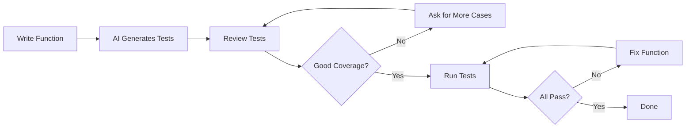

# AI Testing

> Using AI to generate tests, discover edge cases, improve coverage, and verify correctness.

---

## What Is It?

AI testing uses language models to generate unit tests, integration tests, and end-to-end tests. It can discover edge cases you might miss, generate test data, and improve coverage — turning your implementation into a test suite.

> **Related:** [Testing](../12-testing/README.md) for testing fundamentals. [AI Code Review](ai-code-review.md) for review workflows.

---

## Why Does It Matter?

| Writing Tests Manually | With AI Assistance |
|------------------------|-------------------|
| Slow, tedious process | Generate tests in seconds |
| Miss edge cases | AI suggests comprehensive cases |
| Copy-paste test patterns | AI follows your test conventions |
| Coverage gaps | AI finds untested paths |

## Mental Model



## Test Generation Strategies

### Strategy 1: Generate from Function

The simplest approach — give AI a function, get tests:

```
Write pytest tests for this function:

def calculate_discount(price: float, quantity: int, is_member: bool) -> float:
    """
    Calculate discount based on price, quantity, and membership.
    - 10% off for 10+ items
    - 20% off for members
    - Discounts stack (multiplicative)
    """
    discount = 1.0
    if quantity >= 10:
        discount *= 0.9
    if is_member:
        discount *= 0.8
    return price * quantity * discount

Cover: normal cases, boundary values, edge cases, and error cases.
```

### Strategy 2: Generate from Behavior

Describe what the code should do:

```
Write tests for a function `is_valid_password(password: str) -> bool` that:
- Requires at least 8 characters
- Requires at least one uppercase letter
- Requires at least one digit
- Allows special characters
- Returns False for empty string
- Returns False for None (type: Optional[str])

Use pytest. Include both valid and invalid cases.
```

### Strategy 3: Edge Case Discovery

Ask AI to find cases you might miss:

```
I have these tests for `parse_date(date_str: str) -> datetime`:
[paste existing tests]

What edge cases am I missing? Generate tests for each.
```

### Strategy 4: Test Data Generation

```
Generate test data for a user registration form:
- 10 valid email addresses (various formats)
- 10 invalid email addresses
- 5 valid passwords (various strengths)
- 5 invalid passwords
- Edge cases: empty strings, very long strings, special characters
```

### Strategy 5: Coverage Improvement

```
This function has 60% test coverage:

[paste function]

Write tests to bring coverage to 90%+.
Focus on the uncovered branches shown in the coverage report.
```

## Test Types

### Unit Tests

```
Write unit tests for this function.
Test each branch independently.
Mock external dependencies.
Use descriptive test names.
```

### Integration Tests

```
Write integration tests for this API endpoint.
Test the full request/response cycle.
Include: valid request, missing fields, invalid data, auth failures.
Use pytest fixtures for database setup.
```

### End-to-End Tests

```
Write Playwright tests for this user flow:
1. User visits /login
2. Enters valid credentials
3. Clicks "Login"
4. Redirected to /dashboard
5. Sees welcome message

Include: happy path, invalid credentials, network error.
```

## Test Frameworks

### pytest (Python)

```python
import pytest
from my_module import calculate_discount

class TestCalculateDiscount:
    def test_no_discount_small_order(self):
        assert calculate_discount(10.0, 1, False) == 10.0

    def test_quantity_discount(self):
        assert calculate_discount(10.0, 10, False) == 90.0

    def test_member_discount(self):
        assert calculate_discount(10.0, 1, True) == 8.0

    def test_stacked_discounts(self):
        # 10% off (quantity) * 20% off (member) = 28% of original
        assert calculate_discount(10.0, 10, True) == 72.0

    def test_zero_quantity(self):
        assert calculate_discount(10.0, 0, False) == 0.0

    def test_negative_price(self):
        # Should handle gracefully
        result = calculate_discount(-10.0, 5, False)
        assert result <= 0
```

### Jest (JavaScript)

```javascript
import { calculateDiscount } from './calculate';

describe('calculateDiscount', () => {
  test('no discount for small orders', () => {
    expect(calculateDiscount(10, 1, false)).toBe(10);
  });

  test('quantity discount for 10+ items', () => {
    expect(calculateDiscount(10, 10, false)).toBe(90);
  });

  test('member discount', () => {
    expect(calculateDiscount(10, 1, true)).toBe(8);
  });

  test('stacked discounts', () => {
    expect(calculateDiscount(10, 10, true)).toBe(72);
  });
});
```

## Best Practices

- **Always review generated tests** — They may test the wrong behavior
- **Run the tests** — AI generates syntactically correct but logically wrong tests
- **Check edge cases** — Ask AI specifically for boundary values and error cases
- **Follow your test conventions** — Tell AI about your testing patterns
- **Use descriptive names** — Good test names document expected behavior
- **Don't over-mock** — AI tends to mock too much; test real behavior when possible

## Common Mistakes

| Mistake | Problem | Solution |
|---------|---------|----------|
| Not running generated tests | Tests that pass but test wrong things | Always run the test suite |
| Accepting tests without review | Tests that don't match requirements | Read each test, verify assertions |
| Testing implementation details | Brittle tests that break on refactor | Test behavior, not internals |
| Over-mocking | False confidence, no real testing | Mock only external dependencies |
| Ignoring edge cases | Bugs in boundary conditions | Ask AI specifically for edge cases |
| Copy-paste test patterns | Tests that miss project-specific nuances | Provide existing tests as examples |

## Troubleshooting

| Problem | Cause | Solution |
|---------|-------|----------|
| Tests fail immediately | AI misunderstood the function | Provide more context, clarify behavior |
| Tests don't match style | No test conventions provided | Share existing tests as examples |
| Missing edge cases | Scope too narrow | Ask specifically for boundary values |
| Too many mocks | AI over-isolates | Specify "mock only external deps" |
| Tests are redundant | Overlapping test cases | Review and consolidate |

## Related Topics

- [AI Code Review](ai-code-review.md) — Finding issues before testing
- [AI Debugging](ai-debugging.md) — Fixing test failures
- [Testing](../12-testing/README.md) — Testing fundamentals

## Further Learning

- [pytest Documentation](https://docs.pytest.org/) — Official pytest guide
- [Jest Documentation](https://jestjs.io/) — Official Jest guide
- [Playwright Documentation](https://playwright.dev/) — Official Playwright guide

---

## Personal Notes

> Add your own notes, reminders, and experiences here.
