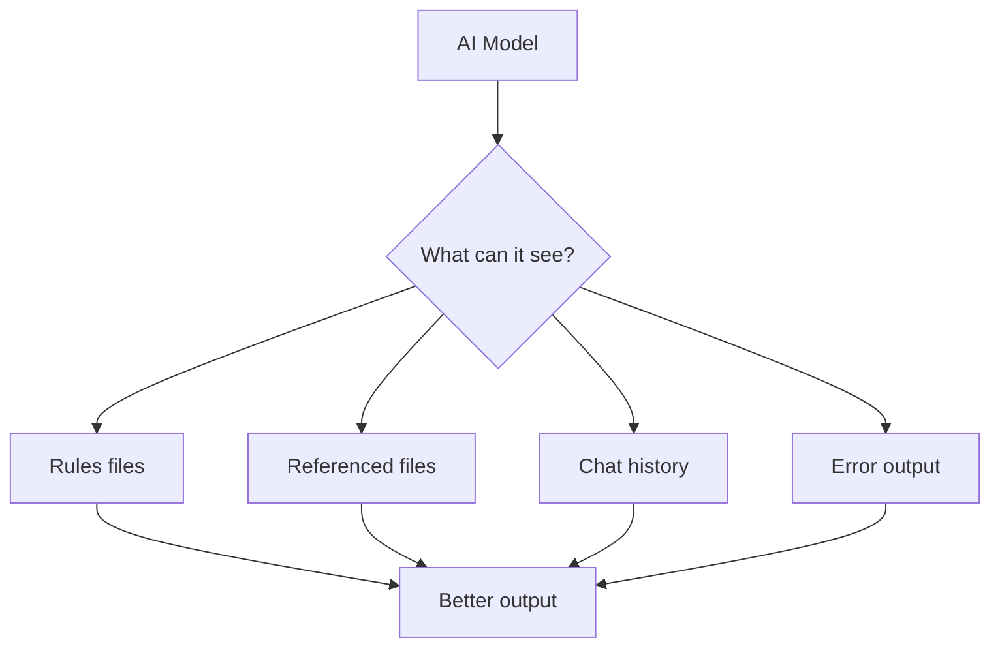

# Context Engineering

> Managing what AI can see about your codebase. Good context turns a generic model into a project-specific expert.

---

## What Is It?

Context engineering is the practice of controlling what information AI has access to when generating code. The model's output quality depends directly on the quality and relevance of its input context.

> **Related:** [Prompt Engineering](prompt-engineering.md) for structuring your requests. [AI Coding Assistants](ai-coding-assistants.md) for tool-specific context features.

---

## Why Does It Matter?

| Without Context | With Context |
|-----------------|--------------|
| "Write a function" | "Write a function following the pattern in `src/utils/api.ts`" |
| Generic boilerplate | Code that matches your project's style |
| Wrong libraries | Uses the libraries you already have |
| Wrong patterns | Follows your architecture |

## Mental Model

Think of context as a **desk you prepare for a new hire**. If you dump every document in the company on their desk, they'll be overwhelmed. If you give them nothing, they'll guess wrong. You need to give them the *right* documents.



## Types of Context

### 1. Rules Files (Persistent)

Rules files tell AI how to work with your project. They persist across conversations.

#### AGENTS.md (Global)

Place at repo root. Tells AI about your project:

```markdown
# AGENTS.md

## Project Overview
A Next.js 14 app with TypeScript, Prisma, and PostgreSQL.

## Build & Test
- `npm run dev` — Start dev server
- `npm test` — Run tests (Vitest)
- `npm run build` — Production build
- `npm run lint` — ESLint

## Code Style
- TypeScript strict mode
- Functional components with hooks
- Named exports (no default exports)
- Zod for runtime validation
- Error classes extending AppError

## Architecture
- `src/app/` — Next.js App Router pages
- `src/components/` — Reusable React components
- `src/lib/` — Business logic and utilities
- `src/lib/db/` — Prisma client and queries
- `src/lib/api/` — API route handlers

## Conventions
- Always use `cn()` from `src/lib/utils` for className merging
- API routes return { data, error } format
- Use `fetcher()` from `src/lib/api` for client-side fetches
- Database queries go through `src/lib/db/` helpers
```

#### .cursorrules (Cursor)

Place in project root. Cursor-specific:

```markdown
# .cursorrules

## Project
Next.js 14 + TypeScript + Prisma + PostgreSQL

## Conventions
- Use server components by default
- Add 'use client' only when needed
- Always handle loading and error states
- Use `notFound()` for 404s

## Imports
- Use `@/` path aliases
- Group: React → libraries → local components → utils
```

#### .windsurfrules (Windsurf)

Similar format to .cursorrules.

### 2. File References (In-Conversation)

| Tool | How to Reference | What It Does |
|------|------------------|--------------|
| Cursor | `@filename` | Adds file content to context |
| Cursor | `#symbolName` | References specific function/class |
| Cursor | `@docs` | References documentation |
| Cursor | `@web` | Searches web for context |
| Copilot | `/explain @file` | Explains referenced file |
| Cline | Auto-reads files | Reads files as needed |

### 3. Conversation Context

| Technique | How |
|-----------|-----|
| Paste code directly | Copy relevant code into chat |
| Share error output | Include full error message + traceback |
| Reference line numbers | "In the function at line 42..." |
| Show expected behavior | "It should return X but instead returns Y" |
| Describe constraints | "Must work with Python 3.12, can't use external libs" |

## The Context Window

The context window is how much text the model can "see" at once. It includes your prompt, the AI's response, and all referenced files.

| Model | Context Window | Roughly Equivalent To |
|-------|---------------|----------------------|
| GPT-4o | 128K tokens | ~300 pages of code |
| Claude 3.5 Sonnet | 200K tokens | ~500 pages of code |
| Gemini 1.5 Pro | 1M tokens | ~2,500 pages of code |

### Managing Context Limits

| Strategy | When to Use |
|----------|-------------|
| Reference specific files, not entire repo | Always |
| Start new conversations for new topics | When switching tasks |
| Use rules files for project-wide context | Always |
| Summarize large codebases | When sharing many files |
| Prioritize recent code | When iterating on a change |

## Context Engineering Strategies

### Strategy 1: Minimal Context First

Start with the minimum context needed. Add more only if the output isn't useful.

```
# Level 1: Just the task
"Write a function that parses CSV files"

# Level 2: Add language/framework
"Write a Python function that parses CSV files using the csv module"

# Level 3: Add constraints
"Write a Python function that parses CSV files, handles encoding errors,
 returns List[Dict], and streams large files"

# Level 4: Add examples
"Write a Python function like this signature:
def parse_csv(path: Path) -> List[Dict[str, str]]:
But handle encoding errors and stream large files."
```

### Strategy 2: Rules Files as Foundation

Set up rules files once, benefit forever:

```
1. Write AGENTS.md with project overview
2. Add .cursorrules with code conventions
3. Reference specific files in prompts
4. Update rules as conventions evolve
```

### Strategy 3: Progressive Disclosure

Share context in layers:

```
1. Start with task description
2. If AI asks for more, share relevant files
3. If output is wrong, share error output
4. If still wrong, share working examples
```

### Strategy 4: Codebase Anchoring

Always point AI to existing patterns:

```
"Follow the pattern in src/services/user.service.ts"
"Use the same error handling as src/lib/api.ts"
"Match the style of src/components/Button.tsx"
```

## Setting Up Context for Your Project

### Step 1: Write AGENTS.md

```markdown
# AGENTS.md

## Project
[One paragraph: what is this project, what does it do]

## Build & Test
[Exact commands to build, test, lint]

## Code Style
[Language, framework, key conventions]

## Architecture
[Directory structure with brief descriptions]

## Key Patterns
[Specific patterns used in this project]
```

### Step 2: Configure Editor Rules

```bash
# For Cursor
.cursor/rules/my-project.mdc

# For Windsurf  
.windsurfrules

# For Cline
.clinerules
```

### Step 3: Reference Files in Prompts

```
I need to add a new API endpoint.
Here's the existing pattern: @src/routes/users.ts
Here's the schema: @prisma/schema.prisma
Follow the same conventions.
```

## Best Practices

- **Rules files are investment** — 10 minutes writing saves hours of bad suggestions
- **Reference specific files** — "Like `src/utils/api.ts`" beats "like the other files"
- **Start minimal, add context as needed** — Don't overwhelm the model
- **New conversation for new topics** — Don't let old context pollute new tasks
- **Keep rules files updated** — Evolve as your project evolves
- **Use @-mentions liberally** — The model can't read your mind or your filesystem

## Common Mistakes

| Mistake | Problem | Solution |
|---------|---------|----------|
| No rules files | Generic suggestions every time | Write AGENTS.md and .cursorrules |
| Dumping entire repo | Model loses focus, slow responses | Reference specific files only |
| Stale rules files | Suggestions follow old patterns | Update rules as conventions change |
| Not using @-mentions | Model guesses about your code | Always reference relevant files |
| Mixing contexts in one chat | Confused output | Start new conversation for new task |
| Ignoring context limits | Model truncates important info | Prioritize recent, relevant code |

## Troubleshooting

| Problem | Cause | Solution |
|---------|-------|----------|
| AI uses wrong library | No library context provided | Specify libraries in rules file |
| Code doesn't match style | No style rules | Add conventions to .cursorrules |
| AI can't find my code | Not in context | Use @filename or paste code |
| Suggestions are generic | Rules file missing or empty | Write detailed AGENTS.md |
| Context window exceeded | Too many files referenced | Reduce to essential files only |

## Related Topics

- [Prompt Engineering](prompt-engineering.md) - Structuring your requests
- [AI Coding Assistants](ai-coding-assistants.md) - Tool-specific context features
- [AI Agents](ai-agents.md) - How agents use context autonomously

## Further Learning

- [Cursor Rules Documentation](https://docs.cursor.com/context/rules) - Official guide
- [AGENTS.md Pattern](https://agents-md.github.io/) - Community resource
- [Anthropic Context Engineering](https://docs.anthropic.com/en/docs/build-with-claude/context-engineering) - Official guide

---

## Personal Notes

> Add your own notes, reminders, and experiences here.
