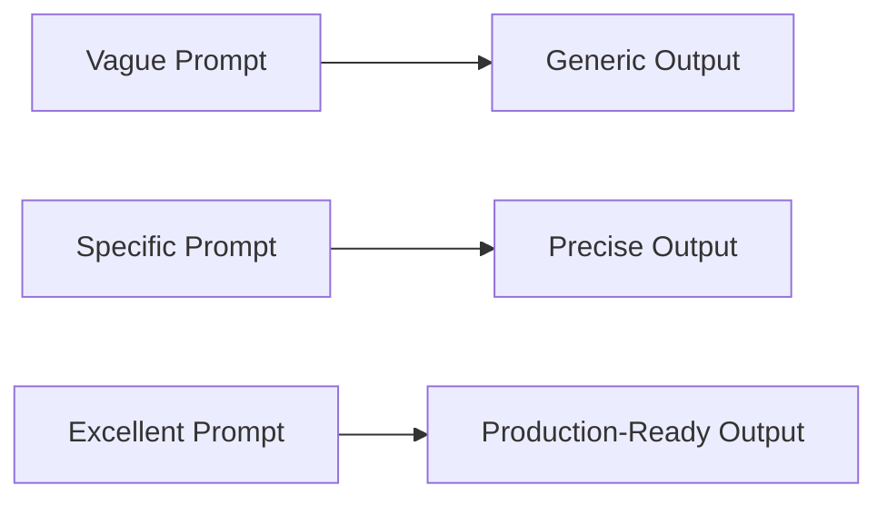

# Prompt Engineering

> Advanced techniques for writing prompts that produce useful AI output. The difference between "meh" and "excellent" AI assistance is prompt quality.

---

## What Is It?

Prompt engineering is the skill of communicating your intent clearly to an AI model. A well-structured prompt gets you 90% of the way to a good result. A vague prompt wastes everyone's time.

> **Related:** [Context Engineering](context-engineering.md) for managing what AI can see. [AI Coding Assistants](ai-coding-assistants.md) for tool-specific techniques.

---

## Why Does It Matter?

| Prompt Quality | Result |
|----------------|--------|
| Vague | Generic, unhelpful code that doesn't match your needs |
| Specific | Code that fits your constraints, style, and patterns |
| Excellent | Code that solves the problem correctly on the first try |

## Mental Model

Think of prompts as **specifications for a junior developer**. The more precise your spec, the better the implementation.



## The CARE Framework

A reliable structure for coding prompts:

| Letter | Meaning | What to Include |
|--------|---------|-----------------|
| **C** | Context | What is this code? What does it do? |
| **A** | Action | What do you want the AI to do? |
| **R** | Rules | Constraints, patterns, style requirements |
| **E** | Examples | Show desired output format or pattern |

### Template

```markdown
## Context
This is a [language] [project type] that [what it does].
The relevant code is in [file/module].

## Action
I need you to [write/refactor/explain/test] [specific thing].

## Rules
- Use [language/framework] conventions
- Follow the pattern in [existing file]
- Handle [edge cases]
- Don't [specific constraint]

## Examples
Here's what I mean:
[example code or description]
```

## Prompt Patterns

### Pattern 1: Specific over Vague

| Instead of | Write |
|------------|-------|
| "Write a function" | "Write a Python function that takes a list of email strings and returns only valid emails using regex" |
| "Fix this bug" | "This function raises `TypeError: argument of type 'NoneType'` on line 42 when `user.profile` is null. Fix it to return an empty string instead." |
| "Make it faster" | "This function takes 3 seconds on 10k records. Optimize it to run under 500ms without changing the interface." |
| "Write tests" | "Write pytest tests for `validate_email()`. Cover: valid emails, missing @, missing domain, empty string, None input." |

### Pattern 2: Show Examples

```
I need a TypeScript type for API responses. Format:

// Success
{ status: "ok", data: User }

// Error
{ status: "error", error: { code: string, message: string } }

// Loading
{ status: "loading" }
```

### Pattern 3: Constraint-Driven

```
Refactor this function to use async/await instead of .then() chains.
Constraints:
- Must maintain the same public API
- Error handling must remain identical
- Don't change any variable names
- Add JSDoc comments
```

### Pattern 4: Persona + Context

```
You are a senior TypeScript developer reviewing code for a healthcare startup.
Review this function for:
1. Type safety issues
2. Potential runtime errors
3. HIPAA compliance concerns (data handling)
4. Performance issues

[paste code]
```

### Pattern 5: Chain of Thought

```
I need to design a rate limiter for an API.
Before writing code, think through:
1. What algorithm (token bucket, sliding window, fixed window)?
2. What data structure to store request counts?
3. How to handle concurrent requests?
4. Edge cases (clock skew, distributed systems)?

Then implement the chosen approach.
```

## Anti-Patterns

| Anti-Pattern | Why It Fails | Fix |
|--------------|--------------|-----|
| **One-word prompts** | No context, no direction | Add specifics about what and why |
| **Multiple unrelated tasks** | Confused output | One task per prompt |
| **No language/framework specified** | Wrong syntax, wrong patterns | State your stack explicitly |
| **Hiding the real problem** | AI fixes symptoms, not causes | Share the full error, not just "it's broken" |
| **Asking for everything at once** | Incomplete, low quality | Break into smaller steps |
| **Not providing code** | AI guesses your patterns | Paste the relevant code |

## Language-Specific Tips

### Python

```
Write a Python 3.12+ function using:
- Type hints (including generic types)
- Docstring in Google style
- Dataclass for return type if complex
- Handle edge cases: empty input, None, wrong types
```

### TypeScript

```
Write TypeScript (strict mode) using:
- Interface for data shapes
- Generic types where appropriate
- Zod schema for runtime validation
- Throw custom errors, not generic Error
```

### Rust

```
Write Rust code using:
- Thiserror for custom errors
- Serde for serialization
- Proper error propagation with ?
- No unwrap() in production code
```

## Prompt Library

### Generate from Description

```
Create a [language] function that [behavior].
Handle edge cases: [list them].
Include error handling.
```

### Refactor

```
Refactor this code to [goal].
Constraints: [list constraints].
Show me the diff, don't just show the final code.
```

### Explain

```
Explain this code like I'm a mid-level developer.
Focus on:
1. What it does (purpose)
2. How it works (mechanism)
3. Why it's written this way (design decisions)
4. What could go wrong (edge cases)
```

### Debug

```
This code throws [error] when [condition].
Here's the full traceback: [paste]
Here's the relevant code: [paste]
What's the root cause and how do I fix it?
```

### Review

```
Review this code for:
1. Bugs and logic errors
2. Security vulnerabilities
3. Performance issues
4. Style/convention violations

For each issue, show the problematic line and the fix.
```

## Best Practices

- **Be specific** — "Write a function that validates UUIDs" beats "write a validator"
- **Provide context** — Share relevant files, error messages, constraints
- **One task per prompt** — Don't ask for three things at once
- **Show examples** — "Like this: [example]" eliminates ambiguity
- **Iterate** — First prompt gets you 80%, refine for the last 20%
- **State your stack** — "In TypeScript with Express and Zod" matters

## Common Mistakes

| Mistake | Problem | Solution |
|---------|---------|----------|
| Vague prompts | Generic, unhelpful output | Be specific about what you want |
| No examples | AI guesses your format | Show desired output |
| Too many constraints | Confused, contradictory output | Prioritize the 3 most important rules |
| Not iterating | Settling for mediocre output | Refine prompt based on output |
| Hiding context | AI can't see the real problem | Share relevant code and errors |

## Troubleshooting

| Problem | Cause | Solution |
|---------|-------|----------|
| Output doesn't match style | No style context provided | Add "follow the pattern in [file]" |
| Wrong API used | No version specified | Specify exact library versions |
| Code looks right but fails | Edge cases not covered | List edge cases in prompt |
| AI ignores constraints | Too many constraints | Prioritize, lead with the most important |
| Output is too long/short | No length guidance | Specify expected size |

## Related Topics

- [Context Engineering](context-engineering.md) - Managing what AI can see
- [AI Agents](ai-agents.md) - Autonomous coding capabilities
- [AI Coding Assistants](ai-coding-assistants.md) - Tool-specific prompt features

## Further Learning

- [Anthropic Prompt Engineering Guide](https://docs.anthropic.com/en/docs/build-with-claude/prompt-engineering) - Official guide
- [OpenAI Prompt Engineering](https://platform.openai.com/docs/guides/prompt-engineering) - GPT-specific techniques
- [Prompt Engineering Guide](https://www.promptingguide.ai/) - Comprehensive resource

---

## Personal Notes

> Add your own notes, reminders, and experiences here.
