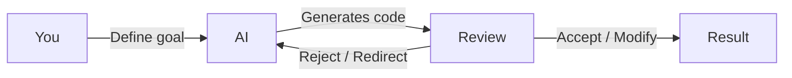
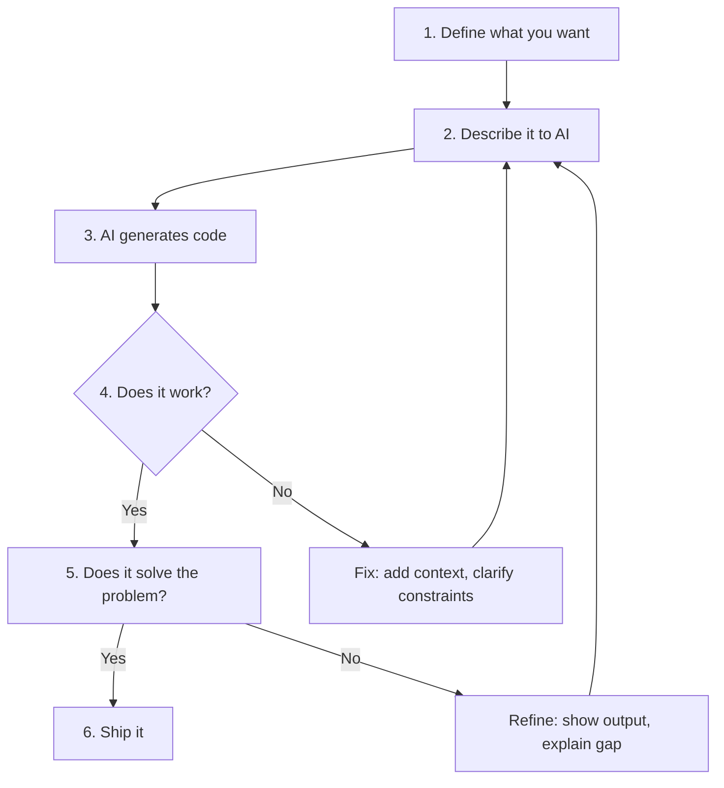

# What Is AI Development?

> Understanding how AI assists software development — what it can do, what it can't, and how to think about the human-AI collaboration.

---

## What Is It?

AI-assisted development means using language models (like GPT-4, Claude, or Gemini) integrated into your coding tools to help write, understand, debug, and review code. It's not a replacement for thinking — it's a force multiplier for the mechanical parts of programming.

| Term | What It Means |
|------|---------------|
| **Autocomplete** | AI suggests the next line as you type |
| **Inline edit** | You describe a change, AI rewrites code |
| **Chat** | You ask questions, AI answers with code |
| **Agent** | AI reads files, runs commands, makes changes autonomously |
| **Context window** | How much text the AI can "see" at once |

## Why Does It Exist?

Programming is full of repetitive, mechanical tasks that follow predictable patterns:

- Writing boilerplate code (classes, functions, types)
- Converting between formats (JSON to struct, API to client)
- Writing tests that mirror implementation
- Explaining unfamiliar code
- Finding bugs from error messages
- Generating documentation

AI excels at these pattern-matching tasks. It frees you to focus on the harder problems: architecture, design, and understanding user needs.

## Mental Model

Think of AI as a **junior developer who reads incredibly fast**.

| What You Do | What AI Does |
|-------------|--------------|
| Understand the problem | Generate possible solutions |
| Define constraints | Fill in boilerplate |
| Review output | Explain unfamiliar code |
| Make design decisions | Suggest alternatives |
| Test the result | Write test cases |
| Ship to production | Document what you built |

The key insight: **you provide direction, AI provides speed**. The quality of the output depends entirely on the quality of your input.

## The AI Landscape

### By Capability

| Level | What It Does | Tools | Trust Level |
|-------|--------------|-------|-------------|
| **Autocomplete** | Suggests next tokens | Copilot, Codeium | Low — always review |
| **Chat** | Answers questions about code | ChatGPT, Claude, Copilot Chat | Medium — verify output |
| **Inline Edit** | Rewrites selected code | Cursor `Ctrl+K`, Copilot Edit | Medium — review diffs |
| **Agent** | Reads files, runs commands, makes changes | Cursor Agent, Cline, Copilot Workspace | High — review everything |

### By Integration

| Type | Examples | Pros | Cons |
|------|----------|------|------|
| **IDE Plugin** | Copilot, Cursor | Seamless, uses your codebase | Locked to specific IDE |
| **Web Chat** | ChatGPT, Claude | No setup, general purpose | No codebase context, copy/paste |
| **CLI Agent** | Aider, Continue | Terminal-native, scriptable | Steeper learning curve |
| **Autonomous** | Devin, OpenHands | Full task execution | Expensive, less control |

## When Should I Use AI?

| Use AI When | Think For Yourself When |
|-------------|------------------------|
| Writing boilerplate | Designing architecture |
| Converting between formats | Making business decisions |
| Generating tests | Understanding user needs |
| Explaining unfamiliar code | Evaluating tradeoffs |
| Finding bugs from errors | Deciding what to build |
| Writing documentation | Security-critical code |
| Repetitive refactoring | Performance optimization |
| Learning a new API | Production debugging |

## The Collaboration Loop

### Step by Step

1. **Define what you want** — Be specific. "A function that validates email addresses" beats "email validation"
2. **Describe it to AI** — Include language, constraints, error handling, where it fits in your codebase
3. **Review the output** — Read every line. Don't just accept and move on
4. **Test it** — Run the code. AI generates syntactically correct but logically wrong code
5. **Iterate** — If it's close, tell AI what to fix. If it's wrong, rephrase your request
6. **Integrate** — Merge into your codebase, run tests, verify in context

## What AI Gets Right

- **Pattern matching** — "Write a React component like the others in this file"
- **Syntax and API knowledge** — Knows most libraries' APIs correctly
- **Boilerplate generation** — Types, interfaces, error handling patterns
- **Code explanation** — Can explain what code does and why
- **Translation** — Convert between languages, formats, paradigms

## What AI Gets Wrong

- **Novel logic** — Complex business rules, edge cases, race conditions
- **Architecture decisions** — Doesn't understand your system's constraints
- **Security** — May generate vulnerable code (SQL injection, XSS)
- **Performance** — Generates correct but slow code
- **Up-to-date information** — Training data has a cutoff date
- **Your codebase** — Without context, makes assumptions about your project

> **Deep dive:** [Limitations](ai-limitations.md) for a full list of what AI gets wrong and how to mitigate it.

## Best Practices

- **Always review AI output** — It's a suggestion, not a final answer
- **Provide context** — Share relevant files, error messages, constraints
- **Be specific** — Vague prompts produce vague code
- **Test everything** — AI generates code that looks right but may not work
- **Learn from AI** — Read what it generates, understand the patterns
- **Don't outsource thinking** — AI is a tool, not a replacement for understanding

## Common Mistakes

| Mistake | Problem | Solution |
|---------|---------|----------|
| Blindly accepting suggestions | Introduces bugs, security issues | Read every line before accepting |
| No context in prompt | Generic, unhelpful response | Share files, errors, constraints |
| Using AI for all decisions | Loses critical thinking | Use as assistant, not oracle |
| Not testing generated code | Silent failures in production | Always run and verify |
| Sharing secrets in prompts | Data leak risk | Sanitize inputs before sharing |
| Copying from web chat | Loses codebase context | Use IDE-integrated tools when possible |

## Troubleshooting

| Problem | Cause | Solution |
|---------|-------|----------|
| AI suggests wrong API | Training data outdated | Specify version, check docs |
| Suggestions don't match style | No codebase context | Use AGENTS.md or .cursorrules |
| Code looks right but fails | Logic errors, edge cases | Test thoroughly, add edge cases |
| AI can't find my code | Not in context window | Use @-mentions or paste relevant code |

## Related Topics

- [AI Coding Assistants](ai-coding-assistants.md) - Tool-specific deep dives
- [Prompt Engineering](prompt-engineering.md) - Getting better output from AI
- [Context Engineering](context-engineering.md) - Managing what AI can see
- [Limitations](ai-limitations.md) - What AI gets wrong

## Further Learning

- [The AI Engineer](https://www.ai.engineer/) - Emerging role and skill set
- [Cursor Documentation](https://docs.cursor.com) - Official Cursor guide
- [GitHub Copilot Docs](https://docs.github.com/en/copilot) - Official Copilot guide
- [Prompt Engineering Guide](https://www.promptingguide.ai/) - General prompt techniques

---

## Personal Notes

> Add your own notes, reminders, and experiences here.
