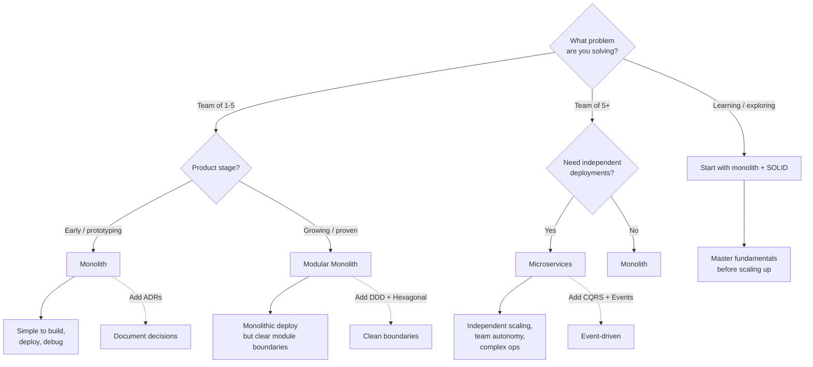

# Software Architecture

> How to structure, organize, and reason about software systems — from SOLID principles to distributed systems and the decisions that shape them.

---

## Prerequisites

- Solid programming fundamentals (see [Languages](../06-programming-languages/README.md))
- Basic understanding of how applications are structured
- Some experience building multi-file projects

---

## Pages in This Section

| Page | Description |
|------|-------------|
| [What Is Software Architecture?](what-is-software-architecture.md) | Mental model, why it matters, the big picture |
| [SOLID Principles](solid-principles.md) | The five foundational design principles with real code |
| [Design Patterns](design-patterns.md) | Most useful creational, structural, and behavioral patterns |
| [Architecture Styles](architecture-styles.md) | Monolith, Microservices, Serverless, CQRS, Event Sourcing |
| [Hexagonal Architecture](hexagonal-architecture.md) | Ports and adapters, dependency rule, clean architecture |
| [Domain-Driven Design](domain-driven-design.md) | Ubiquitous language, bounded contexts, aggregates |
| [API Design](api-design.md) | REST, GraphQL, versioning, error handling |
| [Dependency Injection](dependency-injection.md) | IoC, DI containers, constructor injection |
| [Architecture Decision Records](architecture-decision-records.md) | ADR format, when to write, examples |
| [Scalability Patterns](scalability-patterns.md) | Caching, load balancing, read replicas, sharding |
| [Troubleshooting](architecture-troubleshooting.md) | Common anti-patterns and how to fix them |

---

## Decision Tree: Which Architecture Approach Should I Use?

**Rule of thumb:** Start with a monolith. Use SOLID + design patterns to keep it clean. Extract services only when you have a concrete scaling or team need. Document every significant decision with an ADR.

---

## Quick Reference

| Concept | What It Is |
|---------|-----------|
| SOLID | Five principles for maintainable OOP |
| Design Pattern | Reusable solution to a common problem |
| Monolith | Single deployable unit |
| Microservices | Many small, independent services |
| Hexagonal Arch | Core logic isolated from I/O |
| DDD | Modeling software around domain concepts |
| CQRS | Separate read and write models |
| Event Sourcing | Store events, derive state |
| ADR | Record of an architecture decision |
| IoC / DI | Let the caller control dependencies |

> **Full reference:** [Architecture Cheat Sheet](../18-cheat-sheets/architecture-quick-reference.md)

---

> **Next:** [What Is Software Architecture?](what-is-software-architecture.md) | **Previous:** [AI Development](../09-ai-development/README.md)
