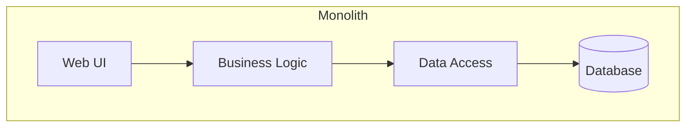
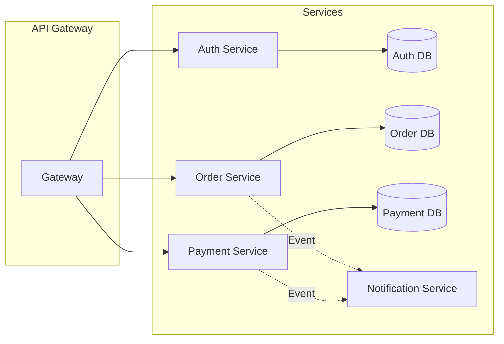
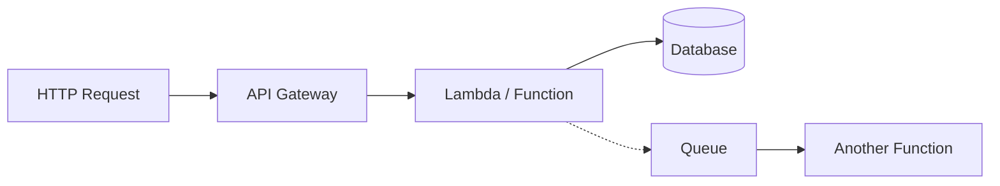
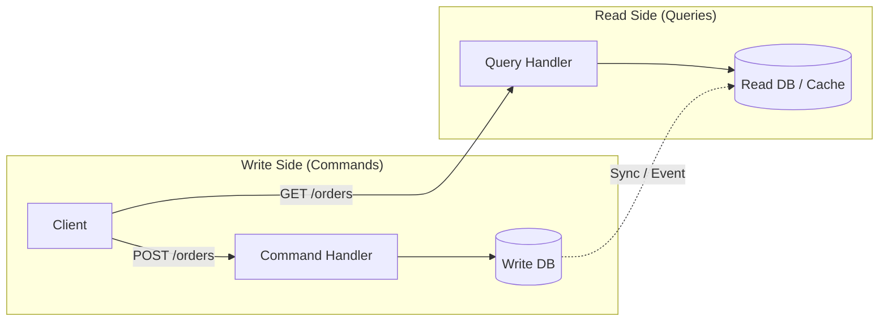
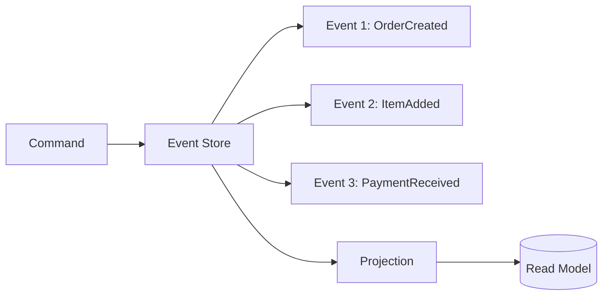

# Architecture Styles

> The high-level patterns that define how a system is structured, deployed, and scaled.

> **Related:** [What Is Software Architecture?](what-is-software-architecture.md) | [Hexagonal Architecture](hexagonal-architecture.md) | [Scalability Patterns](scalability-patterns.md)

---

## What Are They?

An architecture style is the **top-level organizational pattern** for a system — how it's split into pieces, how those pieces communicate, and how they're deployed.

The right style depends on your team size, scaling needs, and operational maturity.

---

## Monolith

A single deployable unit that contains all the application's functionality.

| Pros | Cons |
|------|------|
| Simple to develop, test, deploy | Difficult to scale individual components |
| Low operational overhead | One bug can bring down everything |
| Fast development velocity early on | Enforces a single tech stack |
| Easy to debug and profile | Harder to onboard new developers |

**Best for:** MVPs, small teams, early-stage products, internal tools.

> **Tip:** A **modular monolith** — well-defined modules with strict boundaries — gives you most of the benefits of a monolith with an easier path to splitting later.

## Microservices

Many small, independent services that each own a bounded context and communicate over a network.

| Pros | Cons |
|------|------|
| Independent deploy and scale | Distributed systems are hard |
| Team autonomy — each team owns services | Network latency, partial failure |
| Polyglot — different services can use different stacks | Eventual consistency complexity |
| Fault isolation — one service failing doesn't take down everything | Operational overhead (monitoring, tracing, deployment) |

**Best for:** Large teams, products that need independent scaling, organizations with DevOps maturity.

> **Warning:** Don't start with microservices. The operational cost is significant. Extract services only when a monolith concretely hurts you.

## Serverless

Functions as a Service (FaaS) — code runs in stateless containers triggered by events, with no server management.

| Pros | Cons |
|------|------|
| No infrastructure management | Cold starts add latency |
| Auto-scales to zero | Vendor lock-in |
| Pay-per-execution (cheap for low traffic) | Hard to debug locally |
| Built-in fault tolerance | Execution time limits |
| Rapid deployment | Not suitable for long-running processes |

**Best for:** Event-driven workloads, variable traffic, batch processing, webhook handlers.

## CQRS (Command Query Responsibility Segregation)

Separates read and write operations into different models.

| Pros | Cons |
|------|------|
| Optimize read and write models independently | Adds complexity |
| Read model can be denormalized for fast queries | Eventual consistency between models |
| Write model stays clean and normalized | Doubles the data storage |
| Different read models for different consumers | Synchronization logic needed |

**Best for:** Systems where read and write patterns are significantly different (reporting, dashboards, high-write systems).

## Event Sourcing

Stores all changes to application state as a sequence of events, rather than the current state.

| Pros | Cons |
|------|------|
| Complete audit trail — every change is recorded | Storage grows indefinitely |
| Time travel — replay events to reconstruct any past state | Event schema evolution is hard |
| Perfect for debugging — see exactly what happened | Learning curve |
| Enables temporal queries ("what was the state on Jan 1?") | Eventual consistency for read models |

> **Tip:** Event sourcing is powerful but expensive. Use it when you genuinely need an audit trail (finance, compliance) or temporal queries. Don't use it just because it sounds cool.

---

## Decision Matrix

| Style | Team Size | Scale | Complexity | When to Choose |
|-------|-----------|-------|------------|----------------|
| Monolith | 1-10 | Low-Med | Low | Start here, always |
| Modular Monolith | 5-20 | Med | Low-Med | When you need structure but not services |
| Microservices | 15+ | High | High | When teams need independent deploys |
| Serverless | Any | Variable | Med | Event-driven, variable load |
| CQRS | 5+ | High | Med-High | Different read/write patterns |
| Event Sourcing | 5+ | High | High | Need audit trail |

## Common Mistakes

| Mistake | Problem | Solution |
|---------|---------|----------|
| Microservices from day one | Distributed complexity without the scale | Start monolith, extract later |
| No modularity in monolith | Spaghetti code, impossible to extract services | Use modules, packages, bounded contexts |
| CQRS without need | Doubled complexity, doubled storage | Only apply when read/write patterns diverge |
| Event sourcing without projections | Can't query current state | Always build projections |
| Serverless for long requests | Timeouts, cold start pain | Use for event-driven, not for APIs with strict latency |

## Related Topics

- [Scalability Patterns](scalability-patterns.md) — How to scale each architecture style
- [Hexagonal Architecture](hexagonal-architecture.md) — Structuring services within any style
- [Domain-Driven Design](domain-driven-design.md) — Finding service boundaries

## Further Learning

- *Building Microservices* — Sam Newman
- *Fundamentals of Software Architecture* — Richards & Ford

---

> **Next:** [Hexagonal Architecture](hexagonal-architecture.md) | **Previous:** [Design Patterns](design-patterns.md)
