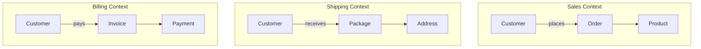

# Domain-Driven Design

> Model software around the concepts of your business domain, not the constraints of your technology.

> **Related:** [Hexagonal Architecture](hexagonal-architecture.md) | [Architecture Styles](architecture-styles.md)

---

## What Is It?

Domain-Driven Design (DDD) is a methodology for building software that reflects the **real-world business domain** it serves. Instead of designing around database tables or API endpoints, you model around business concepts — orders, invoices, shipments, patients, bookings.

Key building blocks:

| Concept | Purpose |
|---------|---------|
| **Ubiquitous Language** | A shared vocabulary between developers and domain experts |
| **Bounded Context** | A boundary where a domain model has a specific meaning |
| **Aggregate** | A cluster of domain objects treated as one unit |
| **Entity** | An object with a continuous identity (e.g., a User) |
| **Value Object** | An object defined by its attributes (e.g., an Address) |
| **Domain Event** | Something that happened in the domain (e.g., OrderPlaced) |
| **Repository** | A collection-like interface for retrieving domain objects |
| **Domain Service** | Business logic that doesn't fit naturally in an entity |

## Ubiquitous Language

> Use the same terms in code, conversations, documentation, and UI.

**Instead of:**
- Code says `P5_Adjustment`, business says `Refund`
- Business says `Reschedule`, engineers say `PUT /appointment/{id}?status=modified`

**Do this:**
```python
class Appointment:
    def reschedule(self, new_date: Date): ...
    def cancel(self): ...
```

Everyone — developers, product managers, support — uses the same words. If a term is ambiguous, you've found a modeling problem.

### When Language Drifts

```python
# Developer calls it "Invoicing"
# Business calls it "Billing"
# They're actually different concepts!
```

If terms clash, you likely have two different **bounded contexts** that need separate models.

## Bounded Context

A bounded context is a **semantic boundary** — a word means one thing inside it and something else outside.



`Customer` means something different in each context:
- **Sales** — has a shopping cart, order history
- **Shipping** — has an address, delivery preferences
- **Billing** — has a payment method, credit limit

Each context gets its own model, its own database (ideally), and its own team if the organization is big enough.

### Context Mapping

| Relationship | How It Works |
|-------------|--------------|
| **Partnership** | Two teams coordinate changes together |
| **Shared Kernel** | Share a small subset of the model |
| **Customer-Supplier** | Upstream supplies data, downstream consumes it |
| **Conformist** | Downstream blindly follows upstream model |
| **Anti-Corruption Layer** | Downstream translates upstream model to its own |

> **Tip:** When integrating with external systems or legacy code, build an **anti-corruption layer** (which is just the Adapter pattern from Hexagonal Architecture) to protect your domain model.

## Aggregate

An aggregate is a **cluster of domain objects** treated as a single unit for data changes.

```python
class Order( AggregateRoot):
    def __init__(self):
        self._items: list[OrderItem] = []
        self._status = OrderStatus.PENDING

    def add_item(self, product: Product, quantity: int):
        if self._status != OrderStatus.PENDING:
            raise OrderAlreadySubmitted()
        self._items.append(OrderItem(product, quantity))

    def submit(self):
        if not self._items:
            raise EmptyOrder()
        self._status = OrderStatus.SUBMITTED
        self.add_domain_event(OrderSubmitted(self.id))
```

Rules:
- **One aggregate per transaction** — never modify two aggregates in one transaction
- **Reference by ID** — aggregates reference each other by ID, not by object reference
- **Consistency boundary** — the aggregate root enforces invariants

## Entity vs Value Object

| Entity | Value Object |
|--------|-------------|
| Has an ID that persists across changes | Defined entirely by its attributes |
| Equality is by ID: `user1.id == user2.id` | Equality is by value: `money1 == money2` |
| Mutable — its state changes, identity stays | Immutable — replacing is cheaper than mutating |
| Example: `User`, `Order`, `Product` | Example: `Address`, `Money`, `Color` |

```python
# Entity
class User:
    def __init__(self, user_id: str, name: str):
        self.id = user_id
        self.name = name
    # Two users with different IDs are different even if names match

# Value Object
@dataclass(frozen=True)
class Address:
    street: str
    city: str
    zip_code: str
    # Two addresses with same data are equal
```

## Domain Events

Something that happened in the domain that other parts of the system might care about.

```python
@dataclass
class OrderSubmitted:
    order_id: str
    customer_id: str
    total: Money
    occurred_at: datetime
```

Handlers react to events — send emails, update projections, trigger workflows.

## When Should I Use DDD?

| Use When | Don't Use When |
|----------|---------------|
| Complex business logic with real rules | Simple CRUD — forms over data |
| Team includes domain experts | No domain experts to collaborate with |
| Long-lived system with evolving rules | Quick prototype or throwaway project |

> **Remember:** DDD is for the **core domain** — the part of the system that provides competitive advantage. Infrastructure (auth, logging, email) doesn't need DDD.

## Common Mistakes

| Mistake | Problem | Solution |
|---------|---------|----------|
| Anemic domain model | Domain objects are just data bags — all logic is in services | Add behavior to entities |
| One giant context | Everything is "User" — ambiguous, tangled | Split into bounded contexts |
| Over-modeling | 50 entities for a simple app | Focus on the core domain only |
| Ignoring the ubiquitous language | Code and conversation diverge | Update code when language changes |
| DDD without practitioners | Hard to get right without experience | Start small, learn iteratively |

## Related Topics

- [Hexagonal Architecture](hexagonal-architecture.md) — Structural counterpart to DDD
- [Architecture Styles](architecture-styles.md) — Bounded contexts map well to microservices
- [Design Patterns](design-patterns.md) — Repository, Factory patterns are used in DDD

## Further Learning

- *Domain-Driven Design: Tackling Complexity in the Heart of Software* — Eric Evans (the "Blue Book")
- *Implementing Domain-Driven Design* — Vaughn Vernon (the "Red Book")
- *Domain-Driven Design Distilled* — Vaughn Vernon (shorter introduction)

---

> **Next:** [API Design](api-design.md) | **Previous:** [Hexagonal Architecture](hexagonal-architecture.md)
