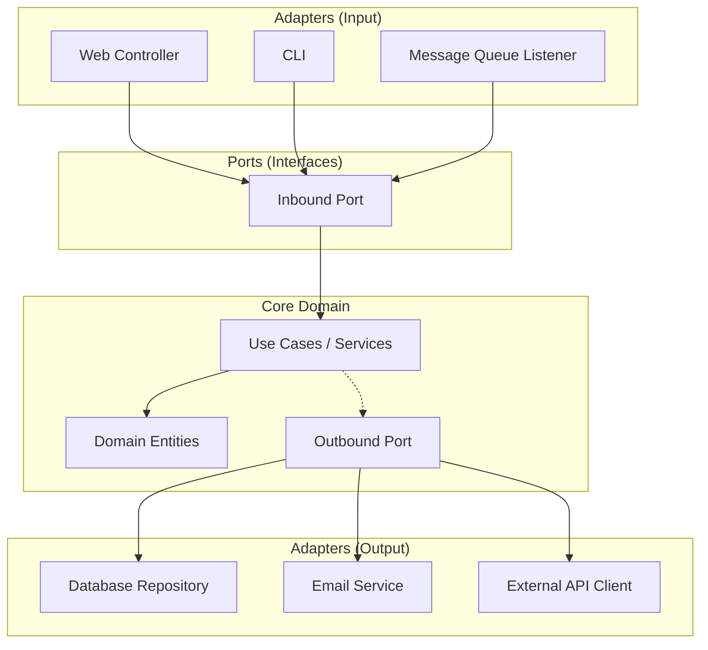

# Hexagonal Architecture

> Structure your application so the core business logic is isolated from databases, APIs, UIs, and every other external concern.

> **Related:** [Architecture Styles](architecture-styles.md) | [Dependency Injection](dependency-injection.md) | [Domain-Driven Design](domain-driven-design.md)

---

## What Is It?

Also called **Ports and Adapters** (or Clean Architecture, Onion Architecture), hexagonal architecture centers your business logic and connects it to the outside world through interfaces ("ports") and their implementations ("adapters").



## Why Does It Exist?

Most applications are **tightly coupled** to their infrastructure:

```python
class CreateUserHandler:
    def __init__(self):
        self.db = MySQLDatabase()  # Hard dependency
        self.email = SendGridClient()  # Hard dependency
```

This makes it hard to:
- **Test** — you need a real database and email server
- **Swap** — switching from MySQL to Postgres means changing business logic
- **Reason** — business rules are mixed with infrastructure code

Hexagonal architecture flips this: the **core has no dependencies on infrastructure**. Infrastructure depends on the core.

## Mental Model

The **hexagon** is your business logic. The **ports** are the doors (interfaces) through which data enters and leaves. The **adapters** are the specific implementations (a REST controller, a MariaDB repository, an SMTP emailer).

The **Dependency Rule**: Source code dependencies can only point inward. Nothing in the core domain knows anything about the outside world.

## The Layers

### Core Domain (Inner Hexagon)

Pure business logic with **zero imports from frameworks, databases, or external libraries**.

```python
# domain/entities.py
from dataclasses import dataclass

@dataclass
class User:
    id: str
    name: str
    email: str
```

```python
# domain/ports.py
from abc import ABC, abstractmethod

class UserRepository(ABC):
    @abstractmethod
    def save(self, user: "User"): ...

    @abstractmethod
    def find_by_id(self, user_id: str) -> "User": ...

class EmailService(ABC):
    @abstractmethod
    def send_welcome(self, user: "User"): ...
```

```python
# use_cases/create_user.py
class CreateUserUseCase:
    def __init__(self, user_repo: UserRepository, email_svc: EmailService):
        self.user_repo = user_repo
        self.email_svc = email_svc

    def execute(self, name: str, email: str) -> User:
        user = User(id=generate_id(), name=name, email=email)
        self.user_repo.save(user)
        self.email_svc.send_welcome(user)
        return user
```

### Adapters (Outer Layer)

Implement the ports. These know about frameworks, databases, and external services.

```python
# infrastructure/database.py
from domain.ports import UserRepository

class MySQLUserRepository(UserRepository):
    def __init__(self, connection):
        self.conn = connection

    def save(self, user: User):
        self.conn.execute("INSERT INTO users ...", user)

    def find_by_id(self, user_id: str) -> User:
        row = self.conn.fetch_one("SELECT * FROM users WHERE id = ?", user_id)
        return User(id=row["id"], name=row["name"], email=row["email"])
```

```python
# infrastructure/web.py
from flask import Flask, request
from use_cases.create_user import CreateUserUseCase

app = Flask(__name__)

@app.post("/users")
def create_user():
    use_case = CreateUserUseCase(
        user_repo=MySQLUserRepository(get_connection()),
        email_svc=SendGridEmailService()
    )
    user = use_case.execute(request.json["name"], request.json["email"])
    return {"id": user.id, "name": user.name}, 201
```

## Package Structure

```
project/
├── domain/              # Core — no framework imports
│   ├── entities.py      # Business objects
│   ├── ports.py         # Interfaces (repository, service contracts)
│   └── exceptions.py    # Domain exceptions
├── use_cases/           # Application-specific business rules
│   ├── create_user.py
│   └── update_profile.py
├── infrastructure/      # Adapters — framework code
│   ├── database/
│   │   ├── models.py
│   │   └── repositories.py
│   ├── email/
│   │   └── sendgrid.py
│   └── web/
│       ├── controllers.py
│       └── middleware.py
└── main.py              # Composition root — wire everything together
```

## When Should I Use It?

| Use When | Don't Use When |
|----------|---------------|
| The application has complex business logic | Simple CRUD with no real domain rules |
| You need to swap infrastructure (e.g., migrate databases) | The infrastructure is unlikely to change |
| You want comprehensive unit tests without infrastructure | The project is a prototype or short-lived |
| The domain logic is the main source of value | The value is in the infrastructure (e.g., data pipeline) |

## Testing in Hexagonal Architecture

```python
# tests/test_create_user.py
from use_cases.create_user import CreateUserUseCase

class FakeUserRepository(UserRepository):
    def __init__(self):
        self.users = {}
    def save(self, user):
        self.users[user.id] = user
    def find_by_id(self, user_id):
        return self.users.get(user_id)

def test_create_user():
    repo = FakeUserRepository()
    email_svc = FakeEmailService()
    use_case = CreateUserUseCase(repo, email_svc)
    user = use_case.execute("Alice", "alice@example.com")
    assert user.name == "Alice"
    assert email_svc.was_called
```

No database, no HTTP server, no real email — the test runs in milliseconds.

## Common Mistakes

| Mistake | Problem | Solution |
|---------|---------|----------|
| Putting too much in the domain | Slow tests, hard to change | Keep use cases thin, domain focused |
| Invalidating ports | "I'll just add one import to this domain class" | Enforce the rule with linters or code reviews |
| Over-engineering | 5 layers for a simple app | Apply hexagon only where there's real business value |
| Anemic domain model | Domain objects are just data bags | Add behavior to domain entities |

## Related Topics

- [Dependency Injection](dependency-injection.md) — How ports are wired to adapters
- [Domain-Driven Design](domain-driven-design.md) — Finding the right domain boundaries
- [Architecture Styles](architecture-styles.md) — Hexagonal fits inside any style

## Further Learning

- *Clean Architecture* — Robert C. Martin
- *Get Your Hands Dirty on Clean Architecture* — Tom Hombergs
- [Alistair Cockburn's original article](https://alistair.cockburn.us/hexagonal-architecture/)

---

> **Next:** [Domain-Driven Design](domain-driven-design.md) | **Previous:** [Architecture Styles](architecture-styles.md)
