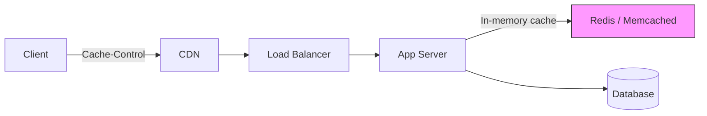
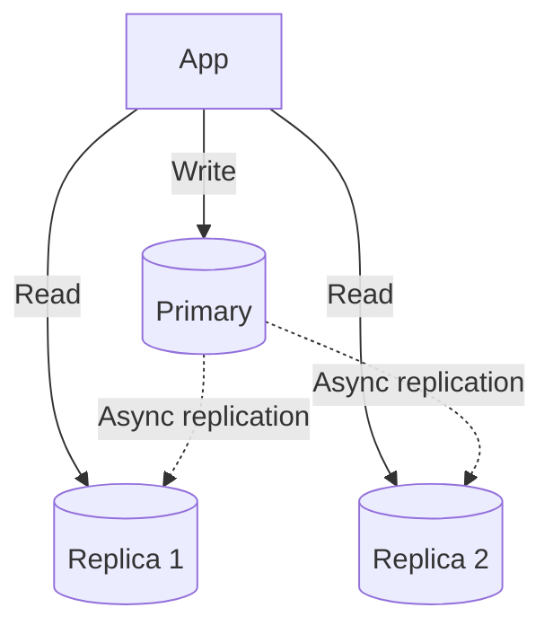
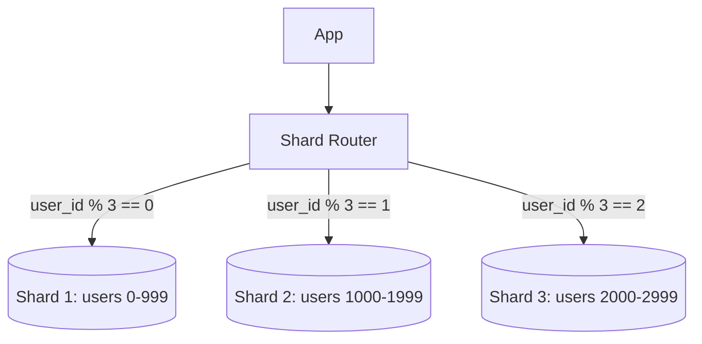
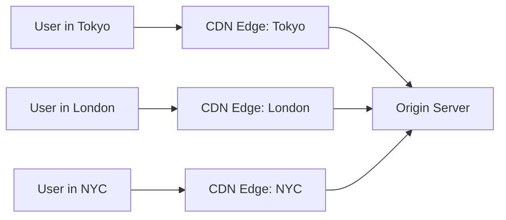
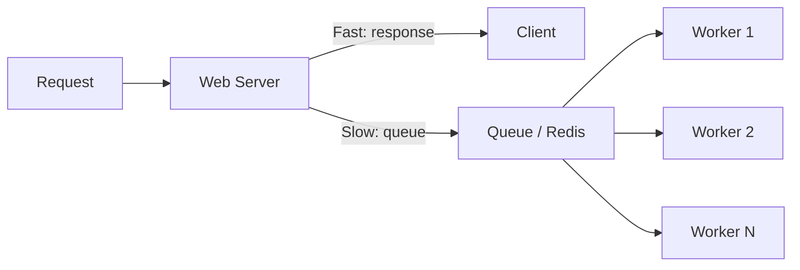

# Scalability Patterns

> How to make your system handle growth — more users, more data, more traffic — without crumbling.

> **Related:** [Architecture Styles](architecture-styles.md) | [API Design](api-design.md)

---

## What Are They?

Scalability patterns are **proven strategies** for handling increased load. They're not about making code faster — they're about adding capacity without redesigning the system.

Two dimensions:

| Dimension | Definition | Example |
|-----------|------------|---------|
| **Vertical scaling** | Bigger machine | More RAM, faster CPU |
| **Horizontal scaling** | More machines | Add servers behind a load balancer |

Horizontal scaling is the focus of most patterns below.

---

## Caching

Store expensive results so they don't need to be recomputed.

### Where to cache



| Cache Layer | What It Stores | Latency | When to Use |
|-------------|---------------|---------|-------------|
| **Browser** | Static assets (JS, CSS, images) | Instant | Set long `Cache-Control` headers |
| **CDN** | Cached responses globally | ~10ms | Static content, API responses |
| **App server** | In-memory (process-local) | ~1ms | Repeated computations |
| **Distributed** | Redis/Memcached | ~1-5ms | Shared cache across servers |
| **Database** | Query cache | ~10ms | Repeated identical queries |

### Caching Strategies

| Strategy | How It Works | Best For |
|----------|-------------|----------|
| **Cache-aside** | App checks cache first; on miss, loads from DB and stores in cache | General purpose |
| **Write-through** | Write to cache AND database simultaneously | Read-heavy, data must be consistent |
| **Write-behind** | Write to cache, asynchronously write to DB | Write-heavy, can tolerate lag |
| **Cache invalidation** | Invalidate cache entries when data changes | Stale data is unacceptable |

```python
# Cache-aside pattern
def get_user(user_id: str) -> User:
    user = cache.get(f"user:{user_id}")
    if user is None:  # Cache miss
        user = database.find_user(user_id)
        cache.set(f"user:{user_id}", user, ttl=300)  # 5 minute TTL
    return user
```

> **Warning:** Cache invalidation is one of the two hard things in computer science. Always set a TTL. Never assume cached data is current.

## Load Balancing

Distribute incoming traffic across multiple servers.

| Algorithm | How It Works | Best For |
|-----------|-------------|----------|
| **Round robin** | Each server gets a turn | Simple, servers are equal |
| **Least connections** | Send to server with fewest active connections | Uneven request duration |
| **IP hash** | Same client always goes to same server | Sticky sessions (avoid if possible) |
| **Weighted** | Some servers get more traffic | Heterogeneous hardware |

> **Tip:** Design your app to be **stateless** — then any server can handle any request, and load balancing is simple.

## Database Scaling

### Read Replicas

One primary database handles writes; replicas handle reads.



| Pros | Cons |
|------|------|
| Scales reads horizontally | Replica lag — reads may be slightly stale |
| Primary stays fast for writes | All writes still hit one node |
| Replica can be promoted on failure | Increased complexity |

### Sharding (Horizontal Partitioning)

Split data across multiple databases by a **shard key**.



| Pros | Cons |
|------|------|
| Scales writes horizontally | Cross-shard queries are hard |
| No single DB bottleneck | Resharding is complex and risky |
| Each shard is independent | Shard key choice is critical |

> **Warning:** Choose your shard key carefully. A bad key leads to "hot spots" where one shard gets most of the traffic. Changing the shard key later is painful.

## Content Delivery Network (CDN)

A globally distributed network of servers that serves cached content from the edge — closer to your users.



| Use for | Don't Use for |
|---------|---------------|
| Static assets (images, JS, CSS) | Personalized content |
| API responses (with long TTL) | Real-time data |
| Video streaming | Write operations |

## Async Processing

Offload slow or non-critical work to background workers.



| Pattern | Use Case | Tool |
|---------|----------|------|
| **Message queue** | Decouple producer from consumer | RabbitMQ, SQS |
| **Task queue** | Background job processing | Celery, Sidekiq |
| **Event stream** | Log of events, multiple consumers | Kafka, Redpanda |

```python
# Web request — fast path
def create_order(request):
    order = OrderService.create(request)
    send_to_processing_queue(order)  # Non-blocking
    return {"status": "accepted"}, 202

# Worker — slow path
def process_order(order):
    validate_payment(order)
    reserve_inventory(order)
    send_confirmation_email(order)
    update_recommendations(order)
```

---

## Decision Matrix

| Pattern | Complexity | Cost | Impact | When |
|---------|-----------|------|--------|------|
| Caching | Low | Low | High | First thing to add |
| CDN | Medium | Medium | Medium | Global users, static assets |
| Read replicas | Medium | Medium | Medium | Read-heavy databases |
| Load balancer | Low | Medium | High | Multiple app servers |
| Async processing | Medium | Low | Medium | Non-critical background work |
| Sharding | High | High | High | Last resort — extreme scale |

## Common Mistakes

| Mistake | Problem | Solution |
|---------|---------|----------|
| Caching everything | Cache invalidation nightmares | Cache selectively, set TTLs |
| Premature sharding | Complexity without need | Start with read replicas, shard when they're not enough |
| No rate limiting | One user can overwhelm the system | Always rate limit at the API gateway |
| Ignoring cold starts | First request is slow | Warm caches, preload CDN |
| Sticky sessions | Load balancer can't distribute evenly | Make app stateless, store session in Redis |
| Optimizing before measuring | Wrong bottleneck | Profile first, then optimize |

## Related Topics

- [Architecture Styles](architecture-styles.md) — Different styles scale differently
- [API Design](api-design.md) — Rate limiting, pagination for API scalability

## Further Learning

- *The Art of Scalability* — Martin Abbott, Michael Fisher
- *Designing Data-Intensive Applications* — Martin Kleppmann
- [High Scalability](http://highscalability.com/) — Real-world architecture case studies

---

> **Next:** [Troubleshooting](architecture-troubleshooting.md) | **Previous:** [Architecture Decision Records](architecture-decision-records.md)
