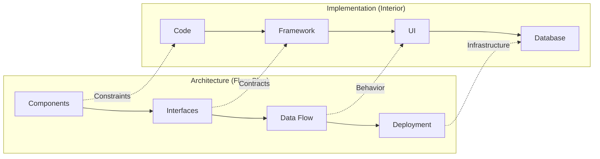

# What Is Software Architecture?

> The high-level structure of a software system — the decisions that shape how components interact, how data flows, and how the system evolves over time.

> **Related:** [Architecture Styles](architecture-styles.md) | [SOLID Principles](solid-principles.md)

---

## What Is It?

Software architecture is the set of **structural decisions** that are hardest to change later. It's the blueprint:

- Which **components** exist (modules, services, layers)
- How they **communicate** (API calls, events, shared database)
- Which **patterns** they follow (layered, hexagonal, event-driven)
- What **quality attributes** they prioritize (performance, security, maintainability)

Architecture is not the framework, the database, or the deployment platform — those are implementation details. Architecture survives those choices.

## Why Does It Exist?

Without architecture, code becomes **unmanageable** as the system grows:

- **Communication** — A shared mental model so the team knows where things go
- **Constraints** — Rules that prevent chaos (e.g., "the UI layer never calls the database directly")
- **Quality attributes** — Tradeoffs are explicit: "we chose eventual consistency for faster writes"
- **Change management** — Architecture makes it safe to change one part without breaking everything

## Mental Model

Think of software architecture like the **floor plan of a building**:

- The **floor plan** is the architecture — where rooms are, how they connect, where load-bearing walls are
- The **interior design** is the implementation — furniture, paint colors, decor
- If the floor plan is wrong, no amount of nice furniture fixes it. You'd need to knock down walls.



## When Should I Think About Architecture?

**Always, but the depth changes:**

| Stage | Architecture Effort |
|-------|-------------------|
| Prototype / MVP | Minimal — a rough sketch. Expect to throw it away. |
| Early product | Light structure — modules, layering, basic patterns. |
| Growing product | Formalize — ADRs, defined boundaries, documented decisions. |
| Large / critical | Rigorous — hexagonal architecture, DDD, event-driven, CQRS. |

> **Warning:** Over-architecting a prototype wastes time. Under-architecting a critical system causes painful rewrites. Match the effort to the risk.

## Quality Attributes (The "-ilities")

Architecture is about **trading off** these attributes:

| Attribute | What It Means | Trade-off |
|-----------|--------------|-----------|
| Maintainability | Easy to change without breaking things | May add abstraction overhead |
| Scalability | Handles more load gracefully | Often adds complexity |
| Performance | Fast response times | May hurt maintainability |
| Security | Protected from attacks | Adds friction for legitimate users |
| Reliability | Works correctly despite failures | Requires redundancy |
| Testability | Easy to write automated tests | May need dependency injection |
| Deployability | Easy to ship changes | Monoliths are simpler to deploy |

## Cheat Sheet

```
Architecture = Components + Interactions + Constraints

Always ask: "What makes this system hard to change?"
Then design to make that easy.
```

## Common Mistakes

| Mistake | Problem | Solution |
|---------|---------|----------|
| No architecture | Every change is risky, code is tangled | Define boundaries early |
| Over-engineering | Abstracting things that don't change yet | Start concrete, extract when patterns emerge |
| Framework-driven architecture | The framework dictates the structure, not the domain | Framework is a detail — keep it behind interfaces |
| Ignoring tradeoffs | Picking "best" pattern without context | Document why you chose X over Y |
| Architecture by accident | Structure emerges from random choices | Write ADRs, review architecture regularly |

## Related Topics

- [SOLID Principles](solid-principles.md) — The fundamentals of clean component design
- [Architecture Styles](architecture-styles.md) — Monolith vs Microservices vs beyond
- [Architecture Decision Records](architecture-decision-records.md) — How to document decisions

## Further Learning

- *Fundamentals of Software Architecture* — Richards & Ford
- *Clean Architecture* — Robert C. Martin
- [The Architecture of Open Source Applications](https://aosabook.org/) — Real-world architecture case studies

---

> **Next:** [SOLID Principles](solid-principles.md) | **Previous:** [Software Architecture README](README.md)
