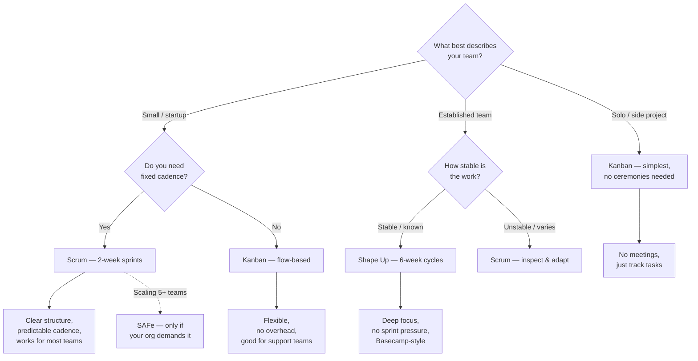

# Project Management

> How to plan, track, and deliver software projects — from agile ceremonies to estimation, retrospectives, and keeping distributed teams aligned.

---

## Prerequisites

- Some experience working on a team (solo is fine too)
- No formal project management knowledge required — this section covers everything from scratch

---

## Pages in This Section

| Page | Description |
|------|-------------|
| [What Is Project Management?](what-is-project-management.md) | Mental model, why it matters, methodologies at a glance |
| [Agile Fundamentals](agile-fundamentals.md) | Agile Manifesto, principles, agile vs waterfall |
| [Scrum](scrum.md) | Roles, ceremonies, artifacts, sprint lifecycle |
| [Kanban](kanban.md) | Boards, WIP limits, cycle time, flow metrics |
| [User Stories](user-stories.md) | Format, INVEST, acceptance criteria, splitting |
| [Estimation & Planning](estimation-and-planning.md) | Story points, planning poker, velocity, capacity |
| [Sprint Execution](sprint-execution.md) | Standups, burndown charts, tracking, handling interruptions |
| [Retrospectives](retrospectives.md) | Formats, facilitation, turning insights into actions |
| [Release Planning](release-planning.md) | Roadmapping, milestones, MVP scoping, dependencies |
| [Remote & Async Teams](remote-and-async-teams.md) | Distributed practices, async communication, tools |
| [Troubleshooting](troubleshooting.md) | Common problems — missed deadlines, scope creep, team conflict |

---

## Decision Tree: Which Methodology Should I Use?

**Rule of thumb:** Start with Scrum (2-week sprints). Switch to Kanban if your work is interrupt-driven. Try Shape Up if sprints feel rushed. Avoid SAFe unless you have 100+ people and an org mandate.

---

## Quick Reference

| Concept | What It Is |
|---------|-----------|
| Sprint | A timeboxed iteration (usually 2 weeks) |
| Backlog | Prioritized list of work to do |
| User Story | A feature described from the user's perspective |
| Story Points | Relative effort estimation (1, 2, 3, 5, 8, 13) |
| Velocity | Story points completed per sprint |
| WIP Limit | Max items allowed in a column at once |
| Cycle Time | Time from start to finish for an item |
| Retrospective | Team reflection and process improvement |
| ADR | Architecture Decision Record (from Architecture section) |
| Definition of Done | Shared understanding of "complete" |

> **Full reference:** [Project Management Cheat Sheet](../18-cheat-sheets/pm-quick-reference.md)

---

> **Next:** [What Is Project Management?](what-is-project-management.md) | **Previous:** [Software Architecture](../10-software-architecture/README.md)
