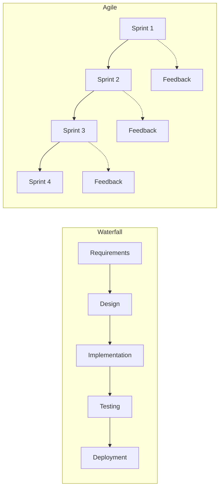

# Agile Fundamentals

> The principles and mindset behind iterative, people-focused software development — and how they differ from traditional project management.

> **Related:** [Scrum](scrum.md) | [What Is Project Management?](what-is-project-management.md)

---

## What Is It?

Agile is a **mindset** defined by four values and twelve principles. It's not a methodology — it's the foundation that methodologies like Scrum, Kanban, and XP are built on.

## The Agile Manifesto (2001)

| Value | More emphasis on | Less emphasis on |
|-------|-----------------|-----------------|
| **Individuals and interactions** | People, collaboration, communication | Processes, tools, strict roles |
| **Working software** | Delivering value frequently | Comprehensive documentation |
| **Customer collaboration** | Involving stakeholders continuously | Contract negotiation |
| **Responding to change** | Adapting to new information | Following a plan |

> **Remember:** The right side still matters. The left side matters **more.**

## The Twelve Principles

### 1-4: Customer & Delivery

1. **Satisfy the customer** through early and continuous delivery
2. **Welcome changing requirements** — harness change for competitive advantage
3. **Deliver working software frequently** — weeks over months
4. **Business and developers work together** daily

### 5-8: People & Process

5. **Build projects around motivated individuals** — give them support and trust
6. **Face-to-face conversation** is the most efficient communication
7. **Working software is the primary measure of progress**
8. **Sustainable pace** — the team should be able to maintain its pace indefinitely

### 9-12: Technical & Reflection

9. **Continuous attention to technical excellence** and good design
10. **Simplicity** — maximize the amount of work not done
11. **Self-organizing teams** — the best architectures emerge from empowered teams
12. **Regular reflection** on how to become more effective (retrospectives)

## Agile vs Waterfall

| Dimension | Waterfall | Agile |
|-----------|-----------|-------|
| Requirements | Defined upfront, change is expensive | Emergent, change is welcome |
| Delivery | One big release at the end | Small, frequent releases |
| Team involvement | Handoffs between specialists | Cross-functional, self-organizing |
| Risk | Discovered late (integration, testing) | Discovered early (each iteration) |
| Customer | Involved at requirements and delivery | Involved throughout |
| When it works | Fixed scope, known solution, low uncertainty | Evolving scope, discovery needed, high uncertainty |

## When Agile Doesn't Fit

Agile is not a silver bullet. It can struggle when:

- **Fixed-price contracts** — Scope is locked before work begins
- **Regulatory compliance** — Requirements must be proven and audited upfront
- **Distributed teams with no overlap** — Async communication reduces the feedback loop
- **No stakeholder availability** — Agile requires regular stakeholder involvement
- **Team doesn't buy in** — Imposed agile is worse than waterfall

In these cases, adapt agile practices to the constraint rather than abandoning them entirely. For example: still do iterations, but define scope in the contract as a "scope bank" of prioritized stories.

## Common Mistakes

| Mistake | Problem | Solution |
|---------|---------|----------|
| "Doing agile" without the mindset | Ceremonies without thinking | Focus on principles, not practices |
| No retrospectives | Same problems every iteration | Retro every sprint, even if short |
| Waterfall masquerading as agile | 3 months of "sprints" before showing anything | Deliver something real each iteration |
| Agile = no planning | "We're agile so we don't plan" | Agile plans continuously, not once |

## Related Topics

- [Scrum](scrum.md) — The most common agile methodology
- [Kanban](kanban.md) — Continuous flow without fixed iterations
- [Retrospectives](retrospectives.md) — Principle 12 in practice

## Further Learning

- [Agile Manifesto](https://agilemanifesto.org/) — The original document
- *Agile Estimating and Planning* — Mike Cohn

---

> **Next:** [Scrum](scrum.md) | **Previous:** [What Is Project Management?](what-is-project-management.md)
