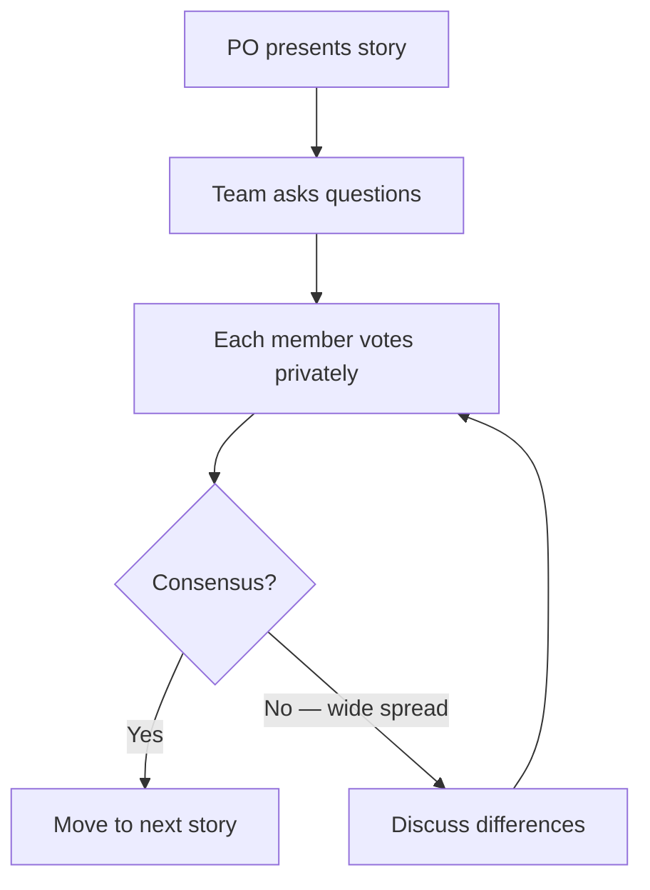

# Estimation & Planning

> How to predict how long work will take — without fooling yourself or the team.

> **Related:** [User Stories](user-stories.md) | [Scrum](scrum.md) | [Sprint Execution](sprint-execution.md)

---

## What Is It?

Estimation is the practice of **predicting effort** for work items. Planning is deciding **what to commit to** based on those predictions. Both are imprecise by nature — the goal is to be **directionally right**, not perfectly accurate.

## Why Estimate?

| Reason | But |
|--------|-----|
| Capacity planning — "can we ship this by March?" | Estimates are wrong |
| Prioritization — "is this $5000 worth of work or $500?" | People are bad at estimating |
| Commitment — "we can deliver these 5 stories" | Unknowns emerge |
| Improvement — "are we getting faster?" | Velocity fluctuates |

> **Tip:** Estimate for **decisions**, not for accountability. If you use estimates to punish people for being wrong, you'll get padded estimates that mean nothing.

## Story Points

Relative estimation using a modified Fibonacci sequence:

| Points | Rough Time | Meaning |
|--------|-----------|---------|
| 1 | Hours | Trivial, well-understood |
| 2 | Half day | Small, mostly known |
| 3 | 1 day | Medium, some unknowns |
| 5 | 2-3 days | Large, multiple steps |
| 8 | ~1 week | Very large, needs splitting |
| 13 | 2+ weeks | Epic — must split |
| 21+ | Too big | Decompose immediately |

### Why Points Instead of Hours

| Hours | Story Points |
|-------|-------------|
| False precision — "that will take 17.5 hours" | Explicitly fuzzy — "that's a 5" |
| Changes with skill level | Relative — same across team |
| Used for pressure — "you said 4 hours" | Used for planning — "we can do 25 points" |
| Hard to compare across teams | Abstract — compares across teams |

> **Remember:** Story points measure **relative effort**, not time. A 5 is twice as much as a 3, regardless of whether it takes 2 days or 3.

## Planning Poker

The most common estimation technique:



| Card | Meaning |
|------|---------|
| 0 | Trivial, already done |
| 1/2 | Smaller than a 1 |
| 1, 2, 3, 5, 8, 13 | Standard estimates |
| ? | Not enough information |
| Coffee | "I need a break" (signal frustration) |

**Rule:** The highest and lowest estimators explain their reasoning. The whole team learns from the discussion.

## Velocity

The total story points completed per sprint.

```
Velocity = (Points sprint 1 + Points sprint 2 + Points sprint 3) / Number of sprints
```

### How to Use Velocity

| Use | How |
|-----|-----|
| Sprint commitment | Take the average of the last 3-5 sprints |
| Release forecasting | Total points remaining / velocity = sprints needed |
| Trend tracking | Is velocity stable, growing, or shrinking? |

### Velocity Gotchas

- **Don't compare across teams** — A "5" on one team is different on another
- **Don't use velocity for performance reviews** — Leads to inflated estimates
- **Velocity will dip** — New team members, tech debt, holidays. That's normal.

## Capacity Planning

Adjust velocity for real-world availability:

```python
# Team of 4, 2-week sprint
total_hours = 4 * 10  # 10 working days
focus_factor = 0.6    # meetings, email, context switching
effective_capacity = total_hours * focus_factor  # 24 hours

# Or just track velocity and let it naturally account for capacity
```

| Factor | Adjustment |
|--------|------------|
| Vacation | Subtract person-weeks |
| Meetings | Reduce focus factor |
| New hire | Count as 50% for first sprint |
| On-call / support | Reduce capacity by 20-30% |
| Holidays | Plan shorter sprints or reduce scope |

## Other Estimation Techniques

| Technique | How | Best For |
|-----------|-----|----------|
| **T-shirt sizing** | XS / S / M / L / XL | Quick backlog triage |
| **Affinity mapping** | Group stories by size together | Large backlog sorting |
| **Three-point** | (Optimistic + 4×Most Likely + Pessimistic) / 6 | High-uncertainty tasks |
| **Timeboxing** | Fixed time, variable scope (spike) | Research, unknowns |
| **No estimates** | Ship small items continuously, don't estimate | Kanban teams doing small work |

## Shape Up Estimating ("Appetite")

Instead of asking "how long will this take?", Shape Up asks **"how much time are we willing to risk?"**

```
Appetite: 2 weeks (small batch) or 6 weeks (big batch)

The team designs a solution that fits within the appetite.
If it doesn't fit, scope is cut.
```

This flips the question from **"when will it be done?"** to **"what can we fit in the time we have?"**

## Common Mistakes

| Mistake | Problem | Solution |
|---------|---------|----------|
| Estimating in hours | False precision, stressful | Use story points |
| Velocity as a target | Team inflates estimates to look good | Use velocity only for planning |
| No buffer | Every sprint runs to the wire | Capacity accounts for reality |
| Comparing across teams | Different scales, meaningless | Each team owns its scale |
| Estimating everything | Backlog of 500 estimated items | Estimate only the next few sprints |
| Punishing misses | Team hides bad news | Investigate, don't blame |

## Related Topics

- [User Stories](user-stories.md) — Stories are what you estimate
- [Sprint Execution](sprint-execution.md) — How estimates are tracked during the sprint
- [Release Planning](release-planning.md) — Using estimates for roadmap decisions

## Further Learning

- *Agile Estimating and Planning* — Mike Cohn
- *Shape Up* — Ryan Singer (basecamp.com/shapeup)

---

> **Next:** [Sprint Execution](sprint-execution.md) | **Previous:** [User Stories](user-stories.md)
