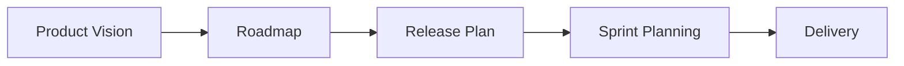

# Release Planning

> Deciding what to ship, when, and how — turning a vision into a roadmap with realistic milestones.

> **Related:** [Estimation & Planning](estimation-and-planning.md) | [Scrum](scrum.md) | [What Is Project Management?](what-is-project-management.md)

---

## What Is It?

Release planning is the process of **mapping product goals to timeboxes** — deciding which features ship in which release, and when each release goes out.

It sits between long-term strategy (the product roadmap) and short-term execution (sprint planning).



## Roadmap

A roadmap communicates **direction and priorities**, not exact dates.

| Good Roadmap | Bad Roadmap |
|-------------|-------------|
| Themes: "Improve onboarding" | Features: "Add social login, add SSO" |
| Time horizons: "Q1, Q2, Q3" | Dates: "March 15, June 1" |
| Goals: "Reduce sign-up time by 50%" | Output: "Ship 20 stories" |
| High-level: 3-5 themes per quarter | Low-level: 30 features per quarter |

### Roadmap Format

```
                    Now              Next Quarter          Future
                    ═══════════════  ═══════════════════  ═══════════════
    Onboarding      ● SSO login      ● Team management   ● Invite flow
    Performance     ● Reduce p95     ● CDN integration   ● Edge caching
    Analytics       ● Health API     ● Custom dashboards ● AI insights
```

> **Tip:** Use "Now / Next / Future" buckets instead of fixed dates. This signals priority without implying commitment.

## Release Planning Steps

### Step 1: Define the Release Goal

What problem does this release solve? One sentence:

```
Q2 Release: "Reduce time-to-value for new users from 5 minutes to 30 seconds."
```

### Step 2: Size the Backlog

Estimate all candidate stories for the release (use t-shirt sizes for speed).

| Size | Count | Total Points (Estimated) |
|------|-------|-------------------------|
| S (2pts) | 8 | 16 |
| M (5pts) | 5 | 25 |
| L (8pts) | 3 | 24 |
| XL (13pts) | 1 | 13 |
| **Total** | 17 | **78** |

### Step 3: Calculate Velocity

Use the last 3-5 sprints' average velocity.

```
Sprint velocities: 18, 22, 20, 17, 23
Average velocity: 20
```

### Step 4: Estimate Sprints Needed

```
Sprints needed = Total points / Velocity
               = 78 / 20
               = ~4 sprints (= ~8 weeks for 2-week sprints)
```

> **Warning:** This is a rough estimate. Add 20-30% buffer for unknowns, bugs, and support work.

### Step 5: Identify MVP

What's the **minimum** set of features that delivers value?

```mermaid
graph LR
    subgraph "Full Scope (78 pts)"
        A[Must-have: 45 pts]
        B[Should-have: 20 pts]
        C[Nice-to-have: 13 pts]
    end

    A --> D["MVP<br/>(3 sprints)"]
    A + B --> E["V1<br/>(4 sprints)"]
    A + B + C --> F["V2<br/>(5 sprints)"]
```

### Step 6: Map Milestones

```
Sprint 1-2: Core auth + basic onboarding (MVP)
Sprint 3:   Team features + first dashboard
Sprint 4:   Advanced features, polish, buffer
           → Release to 10% of users
Sprint 5:   Bug fixes from early access
           → Full release
```

### Step 7: Identify Risks and Dependencies

| Risk | Mitigation |
|------|-----------|
| Third-party API might not be ready | Build a mock, work in parallel |
| New team member needs ramp-up | Pair with senior, assign smaller stories |
| Design isn't finalized | Start backend work, defer UI until design is locked |
| Integration complexity | Spike early, add buffer sprint |

## Stakeholder Communication

| When | What to Say |
|------|------------|
| After release planning | "Here's what we're targeting for Q2 and why." |
| Midway through | "We're on track for 80% of scope. Here's what might slip." |
| 2 sprints before release | "Current forecast: X date. Risks: Y and Z." |
| When something slips | "We had to cut feature X to make the date. Here's the tradeoff." |

> **Tip:** Always present tradeoffs, not surprises. "We can have X by March with Y scope, or Z scope by June. Which do you prefer?"

## MVP vs MMF vs Full Release

| Term | What | Why |
|------|------|-----|
| **MVP** | Minimum Viable Product — smallest thing that delivers value | Validate assumptions, get feedback |
| **MMF** | Minimum Marketable Feature — smallest thing worth shipping | Actually ship something useful |
| **Full Release** | All planned features | The big launch |

**Shape Up approach:** The whole team works toward a single 6-week cycle with a fixed appetite. If scope doesn't fit, **cut scope** — don't extend time.

## Common Mistakes

| Mistake | Problem | Solution |
|---------|---------|----------|
| Fixed date + fixed scope | Quality suffers, team burns out | Pick one: fixed date (flex scope) or fixed scope (flex date) |
| No buffer | One unexpected issue blows the whole plan | Add 20-30% buffer |
| Planning too far ahead | Plans become irrelevant as you learn | Detailed for next 2 sprints, rough beyond |
| Stakeholder surprises | Trust erodes | Communicate early and often |
| Feature-based roadmap | You measure output, not outcomes | Use goal-based roadmap ("reduce churn by 20%") |

## Related Topics

- [Estimation & Planning](estimation-and-planning.md) — How to estimate the work
- [Scrum](scrum.md) — Sprints are the building blocks of releases
- [What Is Project Management?](what-is-project-management.md) — The big picture

## Further Learning

- *Escaping the Build Trap* — Melissa Perri
- *Inspired* — Marty Cagan
- *Shape Up* — Ryan Singer (basecamp.com/shapeup)

---

> **Next:** [Remote & Async Teams](remote-and-async-teams.md) | **Previous:** [Retrospectives](retrospectives.md)
