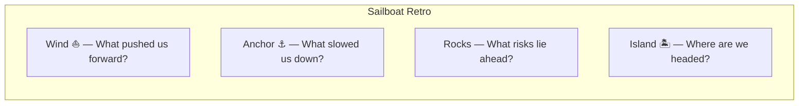

# Retrospectives

> The most important meeting in agile — a structured pause to reflect on how the team works and decide what to change.

> **Related:** [Sprint Execution](sprint-execution.md) | [Scrum](scrum.md) | [Troubleshooting](troubleshooting.md)

---

## What Is It?

A retrospective (retro) is a **regular team meeting** where you look back at the last sprint/cycle and ask: "What went well? What went wrong? What should we change?"

It's the **12th principle of the Agile Manifesto** in practice:

> *"At regular intervals, the team reflects on how to become more effective, then tunes and adjusts its behavior accordingly."*

## Why Do It?

| Without Retros | With Retros |
|---------------|-------------|
| Same problems every sprint | Problems are surfaced and addressed |
| Team grumbles but doesn't change | Team owns its improvement |
| Decisions made by one person | Improvements come from the whole team |
| No process evolution | Process adapts to the team's needs |

> **Tip:** If you "don't have time" for a retro, you don't have time to stop making the same mistakes. A 30-minute retro saves hours of future pain.

## The Retro Structure (5 Phases)

Most retros follow this format from *Agile Retrospectives* (Larsen & Derby):

### Phase 1: Set the Stage (5-10 min)

Goal: Create psychological safety. Let people arrive mentally.

**Activities:**
- **Check-in** — Each person shares one word for how they're feeling
- **Working agreements** — "What's said in retro stays in retro"
- **The retro prime directive** — *"Regardless of what we discover, we understand and truly believe that everyone did the best job they could, given what they knew at the time, their skills and abilities, the resources available, and the situation at hand."*

### Phase 2: Gather Data (10-15 min)

Goal: Build a shared picture of what happened.

**Activities:**

| Activity | How | Best For |
|----------|-----|----------|
| **Timeline** | Create a visual timeline of the sprint. Add sticky notes for events, feelings | Full picture of the sprint |
| **Glad / Sad / Mad** | Each person writes things they were glad about, sad about, and mad about | Emotional safety |
| **Keep / Drop / Try** | What should we keep doing? Drop? Try next sprint? | Quick and structured |
| **Sailboat** | Wind (what pushed us forward), Anchor (what slowed us), Rocks (risks), Island (goal) | Visual and engaging |

### Phase 3: Generate Insights (10-20 min)

Goal: Go deeper — **why** did things happen?

**Activities:**
- **5 Whys** — Pick a problem and ask "why" five times to find the root cause
- **Dot voting** — Everyone votes on the top items from phase 2 to discuss
- **Brainstorming** — "How might we solve X?"

### Phase 4: Decide Actions (10-15 min)

Goal: Leave with **concrete, achievable action items**.

**Rules for actions:**

| Rule | Why |
|------|-----|
| **1-3 actions max** | More than 3 won't get done |
| **Owned by one person** | "We" means no one |
| **SMART** | Specific, Measurable, Achievable, Relevant, Time-bound |
| **Tracked** | Reviewed at the next retro |

**Good vs Bad actions:**

| ❌ Bad | ✅ Good |
|--------|---------|
| "Improve testing" | "Alice adds linting to CI by Friday" |
| "Communicate better" | "Bob posts daily standup summary in Slack by 10am" |
| "Fix the build process" | "Carol schedules a 30-min session Wednesday to simplify the CI script" |

### Phase 5: Close (5 min)

Goal: End on a positive note, confirm next steps.

**Activities:**
- **One word** — How are you feeling now?
- **Appreciations** — Thank a teammate for something specific
- **Rate the retro** — "On a scale of 1-5, how valuable was this retro?"

## Retro Formats

### Start / Stop / Continue

| Column | Question |
|--------|----------|
| **Start** | What should we begin doing? |
| **Stop** | What should we stop doing? |
| **Continue** | What's working and should continue? |

**Best for:** Quick retros (15-30 min), teams new to retros

### Glad / Sad / Mad

Everyone writes cards for things they're glad/sad/mad about. The team groups and votes on them.

**Best for:** Emotional safety, surfacing unspoken issues, teams that know each other well

### 4Ls

| Column | Question |
|--------|----------|
| **Liked** | What did we enjoy? |
| **Learned** | What did we learn? |
| **Lacked** | What was missing? |
| **Longed for** | What did we wish we had? |

**Best for:** Deeper reflection, retrospectives of longer periods

### Sailboat



**Best for:** Visual teams, remote retros (great for Miro/Mural)

### The 5 Whys

Pick one problem and ask "Why?" five times:

```
Problem: Deployment failed on Friday

Why? → The staging database had wrong credentials
Why? → The .env file was overwritten during deploy
Why? → The deploy script doesn't back up environment files
Why? → We never documented the deployment process
Why? → We don't have a deployment checklist
```

**Best for:** Root cause analysis, recurring problems

## Running Retros Remotely

| Challenge | Solution |
|-----------|----------|
| No physical board | Miro, Mural, or a shared Google Doc |
| People don't speak up | Anonymous voting, written contributions first |
| Time zones | Async retros over 24-48 hours |
| Low energy | Use more visual/playful formats (Sailboat, Timeline) |
| Camera-off culture | Encourage cameras. If not, voice participation. |

## Common Mistakes

| Mistake | Problem | Solution |
|---------|---------|----------|
| No action items | Same problems every sprint | Leave with at least 1 concrete action |
| Blame culture | People hide problems | Enforce the prime directive |
| Too many action items | None get done | 1-3 actions, each with an owner |
| Skipping retros | Team stops improving | Short retros are better than none |
| Same format every time | Stale, boring | Rotate formats every 3-4 sprints |
| Manager attends | Team won't speak freely | Retros are team-only (SM facilitates, doesn't manage) |

## Related Topics

- [Sprint Execution](sprint-execution.md) — What you're retrospecting
- [Scrum](scrum.md) — Where retros fit in the framework
- [Troubleshooting](troubleshooting.md) — Common problems you'll retro

## Further Learning

- *Agile Retrospectives: Making Good Teams Great* — Esther Derby & Diana Larsen
- *Retrospective Formats* — Retromat.org (curated collection)

---

> **Next:** [Release Planning](release-planning.md) | **Previous:** [Sprint Execution](sprint-execution.md)
