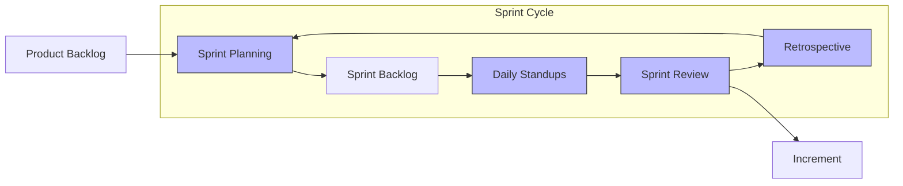

# Scrum

> A lightweight agile framework for delivering value incrementally through fixed-length iterations called sprints.

> **Related:** [Agile Fundamentals](agile-fundamentals.md) | [Sprint Execution](sprint-execution.md) | [Kanban](kanban.md)

---

## What Is It?

Scrum is the most widely used agile framework. It structures work into **sprints** (timeboxes, usually 2 weeks) with defined roles, ceremonies, and artifacts.

## Roles

### Product Owner

| Responsibility | What It Means |
|--------------|---------------|
| Owns the product backlog | Prioritizes work based on business value |
| Defines acceptance criteria | Clarifies what "done" means for each story |
| Stakeholder liaison | Brings customer feedback into the team |
| Answers questions | Available to the team during the sprint |

> **Tip:** The PO makes decisions about **what** to build. The team decides **how** to build it.

### Scrum Master

| Responsibility | What It Means |
|--------------|---------------|
| Coaches the team | Helps them improve their Scrum practice |
| Removes blockers | Unblocks anything slowing the team down |
| Facilitates ceremonies | Keeps meetings focused and productive |
| Protects the team | Shields them from interruptions during a sprint |

> **Note:** The Scrum Master is a **servant leader**, not a manager. They don't assign tasks or evaluate performance.

### Developers

| Responsibility | What It Means |
|--------------|---------------|
| Self-organize | Decide how to complete the sprint work |
| Own quality | Testing, code review, definition of done |
| Estimate work | Provide effort estimates for backlog items |
| Deliver the increment | Produce a potentially shippable product each sprint |

## Ceremonies

### Sprint Planning (2 hours for 2-week sprint)

**Attendees:** Entire team

**Agenda:**

| Time | Activity |
|------|----------|
| First half | PO presents top-priority backlog items. Team asks questions. |
| Second half | Team selects items for the sprint and creates tasks. |

**Output:** A **Sprint Goal** (the "why") and a **Sprint Backlog** (the "what").

### Daily Standup (15 minutes)

**Attendees:** Developers (PO and SM optional)

Three questions:

| Question | Purpose |
|----------|---------|
| What did I do yesterday? | Progress update |
| What will I do today? | Commitment for the day |
| What blockers do I have? | Surface problems early |

> **Tip:** Standups are for **coordination**, not status reporting. If someone says "I was blocked all day", that's a problem that should have been raised earlier.

### Sprint Review (1 hour for 2-week sprint)

**Attendees:** Entire team + stakeholders

| Time | Activity |
|------|----------|
| First half | Team demos completed work (live demo, not slides) |
| Second half | Stakeholders give feedback. Backlog may be updated. |

**Output:** Feedback that feeds into the next sprint's backlog.

### Sprint Retrospective (1 hour for 2-week sprint)

**Attendees:** Entire team (no stakeholders)

| Time | Activity |
|------|----------|
| 10 min | Set the stage — what are we trying to achieve? |
| 20 min | Gather data — what happened? (see formats) |
| 15 min | Generate insights — why did it happen? |
| 15 min | Decide actions — what will we change? |

**Output:** Concrete action items for the next sprint.

## Artifacts

| Artifact | What It Is | Who Owns It |
|----------|-----------|-------------|
| **Product Backlog** | Ordered list of everything that might be needed | Product Owner |
| **Sprint Backlog** | Selected items for the current sprint + plan to deliver | Developers |
| **Increment** | The sum of all completed items, meeting the Definition of Done | Developers |

## Sprint Length

| Length | Best For | Trade-off |
|--------|----------|-----------|
| 1 week | Fast feedback, stable teams | More ceremony overhead |
| 2 weeks | Most teams (recommended) | Good balance |
| 3-4 weeks | Complex work, large teams | Slower feedback, higher risk |

> **Recommendation:** Start with 2-week sprints. Adjust after 3-4 sprints based on team feedback.

## Shape Up (Basecamp Alternative)

Shape Up is a different approach from Basecamp that challenges Scrum's assumptions:

| Dimension | Scrum | Shape Up |
|-----------|-------|----------|
| **Cycle** | 2-week sprints | 6-week cycles |
| **Scope** | Velocity-based (story points) | Appetite-based (fixed time, variable scope) |
| **Planning** | Continuous backlog refinement | Betting table every 6 weeks |
| **Cool-down** | None | 2 weeks (breather, bugs, exploration) |
| **Estimation** | Story points | "Appetite" — how much time is the team willing to risk? |

Shape Up works well when:
- You have a clear product vision
- The team can work without constant priority changes
- You want deep, uninterrupted focus

> **Tip:** Try Shape Up when sprints feel too rushed and you want longer stretches of focused work.

## SAFe (Scaled Agile Framework)

SAFe extends Scrum to large organizations. Approach with caution:

| Pro | Con |
|-----|-----|
| Provides structure for 100+ people | Heavy ceremony overhead |
| Aligns multiple teams around shared milestones | Can become bureaucratic |
| Enterprise-friendly language | Often feels like waterfall in agile clothing |

> **Warning:** SAFe is controversial. Many agile practitioners consider it too rigid. Only adopt it if your organization genuinely needs to coordinate 5+ teams and has the discipline to make it work.

## Common Mistakes

| Mistake | Problem | Solution |
|---------|---------|----------|
| No sprint goal | Random assortment of work | Define one goal per sprint |
| Changing scope mid-sprint | Never finishing anything | Only the PO can cancel a sprint (rarely) |
| Standup as status report | Reading from a script | Focus on coordination and blockers |
| Retro without actions | Same problems every sprint | Leave with at least 1 concrete action |
| PO is unavailable | Team waits on decisions | PO should be available daily |
| Scrum Master as manager | Team resists self-organization | SM serves, doesn't direct |

## Related Topics

- [Sprint Execution](sprint-execution.md) — The day-to-day of running a sprint
- [User Stories](user-stories.md) — How backlog items are written
- [Retrospectives](retrospectives.md) — Making retros effective

## Further Learning

- *Scrum Guide* — Ken Schwaber & Jeff Sutherland (free: scrumguides.org)
- *Scrum: The Art of Doing Twice the Work in Half the Time* — Jeff Sutherland
- *Shape Up* — Ryan Singer (free: basecamp.com/shapeup)

---

> **Next:** [Kanban](kanban.md) | **Previous:** [Agile Fundamentals](agile-fundamentals.md)
